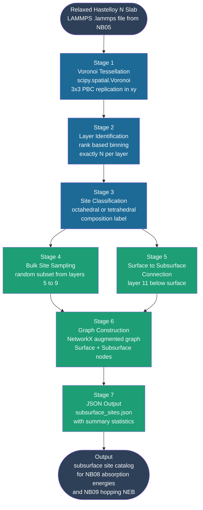
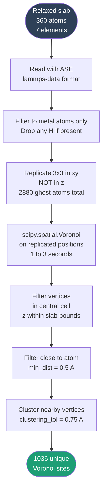
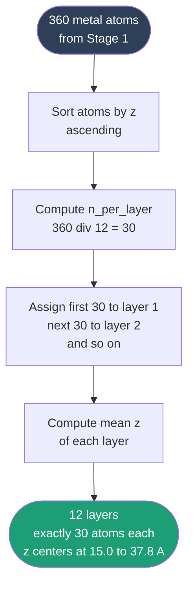
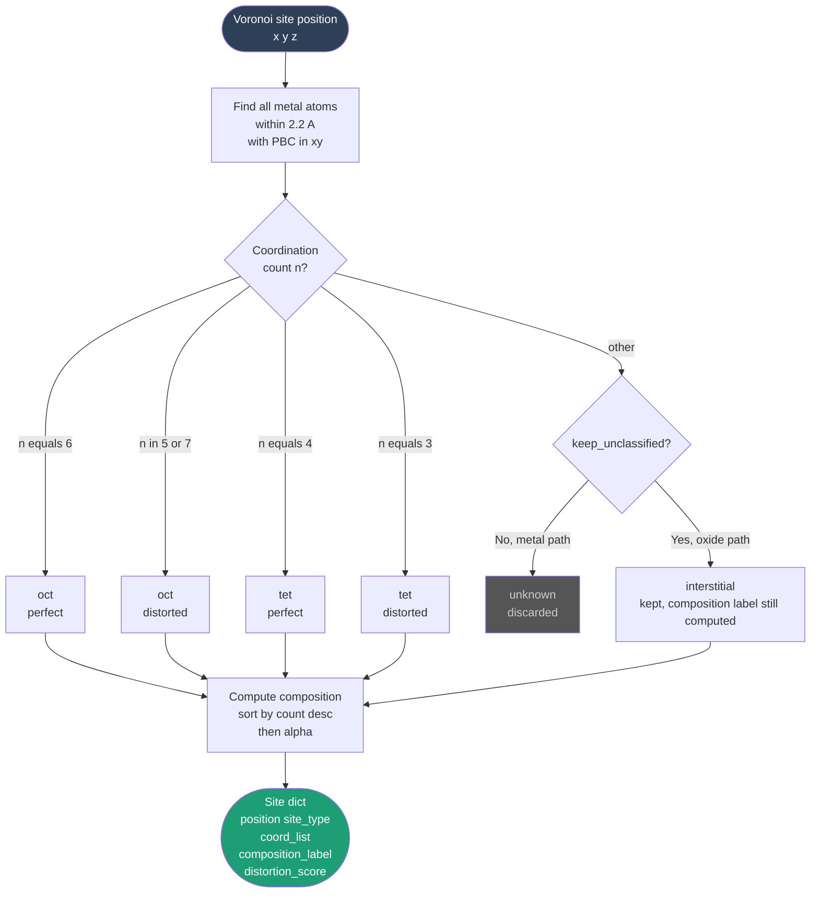
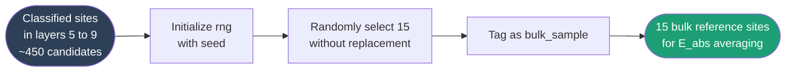
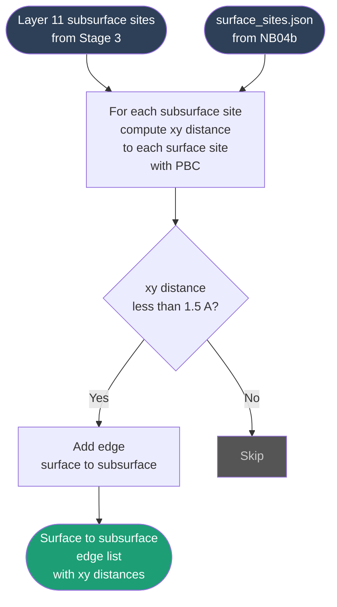
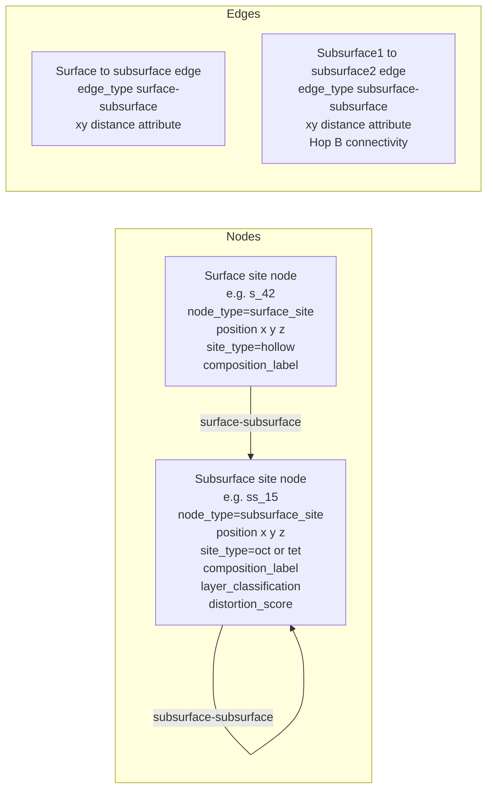

# Project 2 — Graph Based Subsurface Site Mapping for Hastelloy N
## A Plain Language Explanation with Workflows

**Author:** Azeez Akinyemi
**Research Group:** CoMOChEng Lab, Northeastern University
**Advisor:** Prof. Richard West
**Sponsor:** Mitsubishi Heavy Industries

**2026-07-06 update:** `subsurface_graph.py` has changed in four substantive ways since
this document was first written, on top of the NB08-notebook-to-unified-`pipeline.ipynb`
integration described in `Project2_Surface_Graph_Explainer (1).md`'s update note (the same
applies here — `build_subsurface_graph()` is called from `permeation_workflow.py`, once per
metal, `metal_type`-aware): (1) **Bulk site sampling (Stage 4 below) has been removed
entirely** — see the note at Stage 4; (2) layer identification now has an oxide-specific
gap-based mode alongside the original rank-based mode, and the total layer count is
derived from the slab's construction metadata (gap-based detection is only a fallback)
rather than hardcoded; (3) site classification can keep out-of-range
coordination counts as `'interstitial'` sites instead of discarding them, for oxides; (4)
**the Hop B `sub1↔sub2` edges described as a future Stage 7 export are now built directly
into the graph** — see Stage 6.

---

## What Problem Are We Solving?

The surface graph (Project 2, Phase 2) tells us where hydrogen lands when it first hits the Hastelloy N surface. But hydrogen does not stop at the surface. To permeate through the alloy, an H atom must absorb into the lattice, hop from one interstitial site to the next, and eventually emerge on the downstream side. The whole story of permeation lives below the surface.

On a pure FCC nickel crystal, every octahedral pocket between six Ni atoms looks the same, and every tetrahedral pocket between four Ni atoms looks the same. H atoms occupy octahedral sites with a single well known absorption energy. But Hastelloy N is a disordered alloy. The octahedral pocket might be surrounded by 5 Ni + 1 Mo, or 4 Ni + 1 Cr + 1 Fe, or 3 Ni + 2 Mo + 1 Al. Each unique composition has its own absorption energy, and the variance across compositions is large enough to matter for permeation calculations.

**The problem is:** we need a way to enumerate every interstitial site in the subsurface region, classify each one as octahedral or tetrahedral, identify its composition, and connect it to the surface above it. Doing this manually for hundreds of sites per slab is infeasible. Doing it with off the shelf tools (pymatgen Voronoi) is too slow for disordered alloys. We need a purpose built module.

**What we want:** a Python module (`subsurface_graph.py`) that takes a relaxed slab, finds every octahedral and tetrahedral interstitial site in the subsurface and bulk regions, labels each by its surrounding atoms, and outputs a NetworkX graph linking surface and subsurface sites. This feeds directly into NB08 (subsurface H absorption energy) and ultimately the L6 permeation model.

Beyond just labeling, the graph representation lets us ask "which surface sites sit directly above which subsurface sites?" — the geometric question at the heart of surface to subsurface H hopping (NB09).

---

## The Big Picture — Full subsurface_graph.py Workflow



**Plain language summary of each stage:**

| Stage | What it does | Status |
|-------|-------------|--------|
| 1 | Builds a Voronoi tessellation of metal atoms to find every interstitial pocket | ✅ Done |
| 2 | Assigns each atom and site to one of 12 z layers using rank based binning | ✅ Done |
| 3 | Classifies each pocket as octahedral or tetrahedral and labels by composition | ✅ Done |
| 4 | Randomly samples 15 sites from bulk like layers (5 to 9) for the bulk E_abs reference | ✅ Done |
| 5 | Connects each layer 11 subsurface site to surface sites directly above (xy proximity) | ✅ Done |
| 6 | Builds a single NetworkX graph combining surface and subsurface nodes | ✅ Done |
| 7 | Saves subsurface_sites.json with site catalog and summary statistics | ✅ Done |

---

## Stage 1 — Voronoi Tessellation

### What is happening and why

A **Voronoi tessellation** partitions space such that every point in the cell is associated with the nearest atom. The vertices of this tessellation (where three or more Voronoi cells meet) are by construction the points in space that are locally farthest from any atom. These are exactly the candidate interstitial sites.

The geometric intuition is simple. Imagine each metal atom is a center of a circular region that includes everything closer to it than to any other atom. The boundaries between these regions form polygons (in 2D) or polyhedra (in 3D). The corners of these polyhedra are the Voronoi vertices, and they are where extra atoms (like H interstitials) naturally want to sit because they are maximally far from the host atoms.

### Why scipy, not pymatgen

We initially tried `pymatgen.analysis.defects.generators.VoronoiInterstitialGenerator`. It hung indefinitely on the 360 atom Hastelloy N slab because pymatgen runs symmetry analysis first, which is prohibitively slow on a disordered seven element alloy where no two atoms have the same local environment.

`scipy.spatial.Voronoi` runs in 1 to 3 seconds for the same slab because it does pure geometry with no symmetry checks. Since we do our own classification anyway, we do not need symmetry information from the Voronoi step.

### Sub workflow



### Explanation

**Why 3x3 replication in xy:** the slab has periodic boundary conditions in x and y but not in z (it has vacuum above and below). A naive Voronoi on the bare atoms would create spurious vertices at the cell edges. By replicating the atoms in a 3x3 grid in xy and then keeping only Voronoi vertices that fall inside the central cell, we get the correct periodic geometry.

**Why not 3x3 in z:** the slab is finite in z. There are no metal atoms above the surface or below the bottom layer, so vertices there would be in vacuum.

**clustering_tol = 0.75 A:** in some regions the Voronoi tessellation produces multiple nearby vertices that all correspond to the same physical interstitial site. We merge any vertices within 0.75 A of each other to get unique sites.

**min_dist = 0.5 A:** vertices very close to atoms are numerical artifacts of the tessellation, not real interstitial pockets. We drop them.

**For seed 7 the result is 1036 unique Voronoi sites** spanning the entire slab. Most of these are in the bulk and frozen layers and will be filtered out by Stage 2.

**Reference:** Computational Geometry: Algorithms and Applications, M. de Berg et al., 3rd ed., Springer (2008), Ch. 7 on Voronoi diagrams.

---

## Stage 2 — Layer Identification

### What is happening and why

The slab has 12 nominal layers stacked along z, with 30 atoms per layer (360 atoms total). We need to know which layer each atom and each Voronoi site belongs to so we can:

- Skip frozen layers 1 to 4 (atoms cannot relax, sites there are not physically meaningful)
- Enumerate all sites in layers 10 and 11 (the subsurface region just below the surface)
- Sample a subset of sites from layers 5 to 9 (bulk like region for E_abs reference)
- Skip layer 12 (already handled by the surface graph in NB04b)

**The trick is that the slab is disordered and buckled.** Atoms of different elements have different equilibrium z positions even within the same nominal layer. In our seed 7 slab the intra layer z scatter is up to 1.4 A, while the interlayer z spacing is about 2.0 A. These two ranges overlap, which makes simple gap finding unreliable.

### Why rank based binning

The first attempt used a z tolerance parameter (any two atoms within z_tol of each other belong to the same layer). This failed because z_tol large enough to merge a layer's buckled atoms also merged adjacent layers, and z_tol small enough to keep layers separated split single layers into sub layers.

The second attempt found the N minus 1 largest gaps in sorted z and used those as layer boundaries. This worked better but still failed on the frozen layers, which sit close enough to each other that the gap between them was not one of the 11 largest.

The third attempt, which works, is **rank based binning** (`_identify_layers`). Since we know each layer has exactly 30 atoms (the slab is constructed that way), we sort all 360 atoms by z and assign the bottom 30 to layer 1, the next 30 to layer 2, and so on. This is deterministic, parameter free, and gives exactly 30 atoms per layer regardless of buckling.

**Update — a second, gap-based mode now exists for oxides.** Rank-based binning assumes every layer has the same atom count, which is true for the constructed alloy/pure metal slabs but false for oxide slabs (e.g. an O₃ plane and a Cr plane in corundum Cr₂O₃ have different atom counts). `subsurface_graph.py` now has `_identify_layers_by_gaps(positions, gap_tol=0.5)` — the same gap-detection idea the second attempt above tried and abandoned for metals, but it works fine for oxides because oxide interlayer gaps don't have the frozen-layer collision problem that broke it for Hastelloy N. `find_voronoi_sites(..., layer_mode='rank'|'gaps')` and `build_subsurface_graph(..., metal_type='alloy'|'oxide')` select between the two: `metal_type='alloy'`/`'pure'` still uses rank-based binning exactly as described below; `metal_type='oxide'` uses gap-based binning end-to-end.

**Update — the total layer count is no longer a hardcoded constant.** `build_subsurface_graph()`'s `n_layers_total` parameter defaults to `None`, in which case the total layer count `N` is derived from the slab's construction metadata: `_n_layers_from_metadata()` reads `surface_sites.json` and returns `n_atoms_total // n_atoms_surface` (for the standard 360-atom slab with 30 atoms per layer, that is 12). Gap-based clustering (`_identify_layers_by_gaps()`) is kept only as a *fallback* when the metadata is unavailable — and as the primary counter on the oxide path — because on a relaxed/rumpled metal slab the interlayer gaps over-split the layers (it counted a 12-layer slab as 17). The atom→layer assignment on the alloy/pure path still re-bins by rank once `N` is known. The frozen-bottom fraction, `subsurface_1`, and `subsurface_2` layer numbers are then all derived from `N` rather than hardcoded to 12/11/10 — see the updated Stage 5 below.

### Sub workflow



### Explanation

**Buckled atoms still get assigned to a layer by rank.** If a Mo atom in layer 4 buckles up by 1.5 A so its z position is closer to a Ni atom in layer 5 than to other layer 4 atoms, rank based binning still puts the Mo in layer 4 because that is where its z rank falls. This is the correct behavior because for the purpose of finding interstitial sites, what matters is which atoms are geometrically the neighbors, and rank preserves this even under buckling.

**For seed 7 the result is 12 layers with z centers at:**

| Layer | z center | Atoms |
|-------|----------|-------|
| 1 | 14.88 A | 30 |
| 2 | 16.88 A | 30 |
| 3 | 19.04 A | 30 |
| 4 | 21.22 A | 30 |
| 5 | 23.30 A | 30 |
| 6 | 25.37 A | 30 |
| 7 | 27.50 A | 30 |
| 8 | 29.60 A | 30 |
| 9 | 31.63 A | 30 |
| 10 | 33.73 A | 30 |
| 11 | 35.74 A | 30 |
| 12 | 37.78 A | 30 |

The interlayer spacing is approximately 2.0 A, consistent with the FCC(111) d spacing for Ni based alloys.

---

## Stage 3 — Site Classification

### What is happening and why

Each Voronoi vertex is a candidate interstitial site. We need to determine:

1. **Is it octahedral or tetrahedral?** In FCC crystals there are two natural interstitial sites: octahedral (six neighbors) and tetrahedral (four neighbors). H prefers octahedral in Ni and most FCC metals because the larger pocket reduces lattice strain.

2. **What is the composition of its first coordination shell?** A `Ni6_oct` site is energetically very different from a `Mo2Ni4_oct` site because Mo has a much larger atomic radius and different electronic structure than Ni.

3. **How distorted is the pocket?** In a disordered alloy, perfectly symmetric octahedra and tetrahedra are rare. Most sites are distorted to some degree. We compute a distortion score and tag the site accordingly.

### Sub workflow



### Explanation

**Coordination cutoff 2.2 A:** the first nearest neighbor distance in FCC Ni is 2.49 A (atom to atom). The site to atom distance for a perfect octahedral site is half that diagonal, about 1.76 A. For tetrahedral it is about 1.52 A. A cutoff of 2.2 A captures both with margin while excluding second nearest neighbors at 3.52 A.

**Update — `keep_unclassified` for oxides:** `classify_site(..., keep_unclassified=False)` is the parameter behind the branch added above. Oxide interstitial pockets don't follow the FCC oct/tet coordination-count rules (6/5/7 → oct, 4/3 → tet) at all — a coordination count outside that set is the *normal* case for an oxide lattice, not a rare edge case. `build_subsurface_graph(..., metal_type='oxide')` passes `keep_unclassified=True`, so an out-of-range count becomes `site_type='interstitial'` with a real composition label (via the same count-desc/alpha-tiebreak logic as oct/tet) instead of being discarded as `'unknown'`. The alloy/pure path leaves `keep_unclassified=False`, so its behavior — discard anything that isn't a clean 3/4/5/6/7-coordinate oct or tet site — is unchanged.

**Composition label format:** elements sorted by count descending, ties broken alphabetically. Examples:

- `Ni6_oct` — perfect octahedral pocket surrounded by 6 Ni atoms
- `Ni5Cr_oct` — five Ni and one Cr substituent
- `Ni4_tet` — perfect tetrahedral pocket surrounded by 4 Ni atoms
- `Ni3Cr_tet` — three Ni and one Cr in a tetrahedral pocket
- `Mo2Ni2_tet` — distorted tetrahedron with two Mo and two Ni

This labeling is parallel to how the surface graph labels sites (`MoMoNi_hollow_hcp` etc.) but uses `_oct` and `_tet` suffixes for subsurface.

**Distortion score:** computed as (max distance minus min distance) divided by mean distance across the coordinating atoms. A perfect octahedron with six equidistant Ni atoms has distortion_score = 0. A heavily distorted site with one neighbor much closer than others has distortion_score > 0.2. This is useful for filtering during E_abs analysis — heavily distorted sites are outliers.

**For seed 7 the result across subsurface and bulk:**

| Quantity | Value |
|----------|-------|
| Total classified sites | 200 |
| Octahedral | 82 |
| Tetrahedral | 118 |
| Top compositions | Ni3Cr_tet (28), Ni4_tet (23), Ni3Mo_tet (12), Ni5Cr_oct (8) |

The 3 to 2 tetrahedral to octahedral ratio is consistent with the FCC lattice geometry — there are twice as many tetrahedral sites as octahedral sites per unit cell.

**References:**
- Wipf, H. Solubility and Diffusion of Hydrogen in Pure Metals and Alloys. *Phys. Scr.* **T94**, 43 (2001).
- Fukai, Y. The Metal Hydrogen System: Basic Bulk Properties. Springer (2005), Ch. 2 on interstitial sites.

---

## Stage 4 — Bulk Site Sampling ❌ Removed

**Update — this stage no longer exists in `build_subsurface_graph()`.** There is no
`sample_bulk_sites()` function, no `bulk_sample_layers` parameter, and no `'bulk_sample'`
layer-classification tag in the current `subsurface_graph.py` — the orchestrator only
produces `subsurface_1`/`subsurface_2` sites now. The `seed` parameter of
`build_subsurface_graph()` is kept purely for API/reproducibility compatibility; its
docstring says it "no longer consumes randomness now that bulk sampling has been removed."
The original design rationale is preserved below for historical reference, but treat every
mention of `bulk_sample` sites in this document (Stages 6/7, the Module API list, and the
Design Decisions Log) as describing removed functionality, not current output.

### What is happening and why (historical — describes removed functionality)

The bulk reference absorption energy E_abs(bulk) is needed to compute the standard heat of solution ΔH_sol, which feeds into Sievert's law and the permeability coefficient Φ in NB13. To estimate E_abs(bulk) reliably we need multiple samples (statistical average over local environments), but enumerating every interstitial site in the bulk (layers 5 to 9) would give around 450 sites — far more than necessary.

We randomly sample 15 sites from the bulk region to get a representative average without wasting compute on excess redundancy. The random selection uses the seed parameter so the same slab always gives the same bulk samples (reproducible across reruns).

### Sub workflow



### Explanation

**Why 15:** with 15 samples we capture the dominant compositions (Ni rich oct and tet sites) and get a reasonable estimate of the variance in E_abs without exceeding 1 day of cluster compute per seed. This number can be increased if statistical convergence is insufficient.

**Why layers 5 to 9:** these are the central layers of the slab, far enough from the frozen bottom (layers 1 to 4) that atoms have relaxed properly, and far enough from the surface (layers 10 to 12) that they represent bulk like environments. The mean z for layer 7 is 27.50 A, near the geometric center of the slab.

**Why seed parameter:** if we run the pipeline multiple times (debugging, reruns after parameter changes), we want the same bulk samples each time so results are comparable. Hardcoding random.seed(seed) inside the sampling function guarantees this.

**For seed 7 the result is 15 sites** distributed across layers 5 through 9.

---

## Stage 5 — Surface to Subsurface Connection

### What is happening and why

For Hop A (the surface-to-subsurface NEB calculation, `neb_subsurface.py::orchestrate_hopa_neb`), we need to know which surface site is directly above each subsurface_1 site. This is the geometric path an H atom would take when hopping from the surface into the lattice.

We define "directly above" as xy proximity within a tolerance. For each subsurface_1 site we scan every surface site from `surface_sites.json` and record any that fall within 1.5 A in the xy plane (using periodic boundary conditions).

**Update — the layer number is no longer hardcoded to 11.** As described in Stage 2, `build_subsurface_graph()` now derives `subsurface_1`/`subsurface_2` as `N-1`/`N-2` from the slab's total layer count `N` — itself derived from the construction metadata (`n_atoms_total // n_atoms_surface`), or explicitly passed. So the concrete numbers below (layer 11 for a 12-layer slab) are the specific case for the standard slab thickness, not a fixed constant in the code.

### Sub workflow



### Explanation

**Why xy_tol = 1.5 A:** the in plane spacing between neighboring surface atoms on a Ni FCC(111) surface is about 2.49 A. A surface site (atop, bridge, or hollow) is centered above or between these atoms. The "directly below" condition for a subsurface site means it sits roughly under the surface site, with at most 1.5 A xy offset. This captures the immediate neighborhood while excluding sites that are clearly under a different surface region.

**Position lookup quirk:** `surface_sites.json` stores positions in a nested structure (`site['level1']['position']` rather than `site['position']`). The helper function `_get_surface_site_position` handles this gracefully with fallbacks for compatibility.

**One subsurface site may connect to multiple surface sites:** a single octahedral pocket in layer 11 typically has 6 to 12 surface sites in its xy neighborhood (atop directly above plus several bridges and hollows nearby). Hop A uses just the nearest one, but recording all of them keeps options open for analysis.

**For seed 7 the result is 862 surface to subsurface edges** across 99 layer 11 subsurface sites and 171 surface sites. The mean is about 8.7 surface sites per subsurface site.

---

## Stage 6 — Graph Construction

### What is happening and why

NetworkX gives us a clean data structure to hold all the information we have generated: nodes for surface and subsurface sites, edges for spatial connections. The graph is then ready to use for any downstream analysis — shortest path queries, neighbor lookups, visualization, or input to a graph neural network model.

### The two node types and two edge types

**Update — there are now two edge types, not one.** The original implementation only built
`surface-subsurface` edges (subsurface_1 ↔ surface). This left Hop B (subsurface_1 →
subsurface_2) with no connectivity to walk at all: `neb_subsurface.py`'s
`find_sub2_neighbor()` looks for a `subsurface_2` neighbor of a `subsurface_1` node via
`G.neighbors(...)`, and with no `subsurface-subsurface` edges in the graph every Hop B job
silently found zero neighbors and was skipped — for every metal, not just oxides. This has
been fixed: `build_subsurface_graph()` now also adds `subsurface-subsurface` edges between
every `subsurface_1` site and any `subsurface_2` site within `xy_tol` (periodic xy
proximity, same tolerance as the surface connection above); if a `subsurface_1` site has no
`subsurface_2` site within tolerance, it falls back to connecting to its single nearest
`subsurface_2` site so Hop B always has at least one candidate path.



### Explanation

**Why combine surface and subsurface in one graph:** Hop A/B need to compute graph distances between surface and subsurface sites to filter pathway candidates. Having both node types in one graph means a single `nx.shortest_path` call gives the answer. Keeping them separate would require pasting two graphs together at query time, which is error prone.

**Why `ss_` prefix for subsurface site IDs:** surface site IDs start with `s_` (e.g. `s_42`). Using `ss_` for subsurface site IDs prevents accidental collisions when both kinds of nodes live in the same graph.

**For seed 7 the graph had (historical numbers, computed before bulk-sampling removal — see
Stage 4 — so `Subsurface nodes` below includes 15 bulk-sample sites no longer produced;
current runs will have fewer subsurface nodes and will additionally report
`subsurface-subsurface` edge counts from the Hop B fix above):**

| Quantity | Value |
|----------|-------|
| Subsurface nodes | 200 |
| Surface nodes | 171 |
| Total nodes | 371 |
| Surface to subsurface edges | 862 |
| Total edges (pre-Hop-B-fix) | 862 |

---

## Stage 7 — JSON Output

### What is happening and why

NetworkX graphs are not portable across notebook sessions. To preserve the catalog of subsurface sites for downstream notebooks (NB08, NB09, NB13), we save a JSON file with all the relevant information. The format mirrors `surface_sites.json` from NB04b for consistency.

### Output structure

```
results/notebook08-subsurface-energy/{SEED}/subsurface_sites.json
```

```json
{
  "seed": 7,
  "n_sites": 185,
  "metadata": {...},
  "sites": [
    {
      "site_id": "ss_0",
      "position": [3.45, 7.12, 35.74],
      "layer_number": 11,
      "layer_classification": "subsurface_1",
      "site_type": "oct",
      "coord_count": 6,
      "composition_label": "Ni5Cr_oct",
      "distortion_score": 0.041,
      "is_distorted": false,
      "coord_list": [
        {"atom_index": 134, "element": "Ni", "distance": 1.73},
        ...
      ]
    },
    ...
  ],
  "summary": {
    "by_layer_classification": {
      "subsurface_1": 99,
      "subsurface_2": 86
    },
    "by_site_type": {"oct": 82, "tet": 118},
    "by_composition_top10": {...}
  }
}
```

**Update:** the `"bulk_sample": 15` entry above is what this file *used* to contain before
Stage 4 was removed (see the note there) — `n_sites` and `by_layer_classification` no
longer include a `bulk_sample` count at all. The `185` in `n_sites` above is illustrative
(99 + 86, the seed-7 subsurface_1/subsurface_2 counts with the 15 bulk samples subtracted
out), not a re-measured value.

### Explanation

**Layer classification tags:**

| Tag | Layer | Treatment |
|-----|-------|-----------|
| `subsurface_1` | N-1 (11 for a 12-layer slab) | All sites enumerated, immediate subsurface |
| `subsurface_2` | N-2 (10 for a 12-layer slab) | All sites enumerated, second subsurface, now connected to subsurface_1 via Hop B edges (Stage 6) |
| ~~`bulk_sample`~~ | ~~5 to 9 (random 15)~~ | **Removed** — see Stage 4 |

Frozen bottom layers (`round(N/3)`) and the surface layer (layer N, in surface_sites.json) are excluded from this file.

**Why summary statistics:** the summary block in the JSON allows quick inspection of what was generated without having to parse the full sites list. For comparing seeds (7 vs 42 vs 12345), the summary block alone often tells us if the slab is statistically equivalent.

---

## Module API

The functions exposed in `subsurface_graph.py` for use by NB08 step by step:

```python
from subsurface_graph import (
    # Geometry
    find_voronoi_sites,              # Stage 1 — layer_mode='rank'|'gaps'
    _identify_layers,                # Stage 2 — rank-based (alloy/pure)
    _identify_layers_by_gaps,        # Stage 2 — gap-based (oxide)
    classify_site,                   # Stage 3 — keep_unclassified=True|False
    connect_to_surface,              # Stage 5

    # Orchestration
    build_subsurface_graph,          # Stages 1-2-3-5-6 in one call (metal_type-aware;
                                      # no Stage 4 — bulk sampling removed)

    # I/O
    save_subsurface_sites,           # Stage 7
)
```

**Update:** `sample_bulk_sites` is gone from this list (Stage 4 removed). `metal_type` is
now a parameter of `build_subsurface_graph()` itself, not a separate imported function.

**One shot mode (recommended for production):**

```python
G, sites = build_subsurface_graph(
    slab_path="slabs/{stem}/phase2_relax/relaxed_slab.lammps",
    surface_sites_json_path="slabs/{stem}/phase3_sites/surface_sites.json",
    seed=7,
    metal_type='alloy',   # or 'pure' / 'oxide' — see Stage 2/3 updates above
)
save_subsurface_sites(sites, "results/{stem}/subsurface_sites.json", seed=7)
```

**Step by step mode (for debugging and exploration):**

```python
# Stage 1 (layer_mode='rank' for alloy/pure, 'gaps' for oxide)
sites_cart, _, atoms = find_voronoi_sites(slab_path, layer_mode='rank', n_layers=12)

# Stage 2
metal_positions = atoms.get_positions()
metal_elements = atoms.get_chemical_symbols()
layer_map, layer_z = _identify_layers(metal_positions, n_layers=12)      # alloy/pure
# layer_map, layer_z = _identify_layers_by_gaps(metal_positions)         # oxide

# Stage 3 (for one site; keep_unclassified=True for oxide)
cell = atoms.cell.diagonal()
clf = classify_site(sites_cart[0], metal_positions, metal_elements, cell,
                     keep_unclassified=False)

# Stage 5 (Stage 4 — bulk sampling — has been removed, see note above)
import json
with open(surface_json_path) as f:
    surface_data = json.load(f)
connections = connect_to_surface(subsurface_sites, surface_data, cell)
```

---

## Design Decisions Log

A record of the key choices made during development of `subsurface_graph.py`:

| Decision | Choice | Rationale |
|----------|--------|-----------|
| Module coupling | Path C (standalone) | Does not import from `surface_graph.py` — avoids breaking the working surface pipeline. Reads `surface_sites.json` as the interface file. |
| Voronoi backend | scipy not pymatgen | pymatgen hung on disordered alloy due to symmetry analysis. scipy runs in 1 to 3 seconds. |
| PBC handling | Manual 3x3 in xy | scipy.spatial.Voronoi does not handle PBC. Replication is simple and correct. |
| Layer identification | Rank based binning (alloy/pure); gap based (oxide, `_identify_layers_by_gaps`) | Rank binning is deterministic, parameter free, robust to buckling — but assumes equal atom counts per layer, which is false for oxides. Gap based binning handles unequal-count oxide planes; it still fails on the metal frozen layers, so it's only used where rank binning cannot apply. |
| Total layer count | Derived from slab metadata (`n_atoms_total // n_atoms_surface`) when `n_layers_total=None`; gap clustering only as a fallback | Removes the hardcoded assumption of exactly 12 layers; `subsurface_1`/`subsurface_2` are derived as `N-1`/`N-2` from whatever `N` is derived or passed in. Metadata is used instead of gap clustering because gap detection over-split a relaxed 12-layer slab (counted it as 17). |
| Coordination cutoff | 2.2 A | Captures both oct (~1.76 A) and tet (~1.52 A) first neighbors with margin, excludes second neighbors. |
| Site classification | Loose (5,6,7 = oct, 3,4 = tet); `keep_unclassified=True` keeps out-of-range counts as `'interstitial'` for oxides | Reflects the reality of disordered alloys where perfect symmetry is rare. Oxide interstitials routinely fall outside FCC oct/tet coordination counts — discarding them (as `'unknown'`) would leave oxides with almost no subsurface sites. Distortion score quantifies deviation for both paths. |
| Composition label | Count desc then alpha (Ni3Cr_tet) | Consistent with surface graph format, deterministic. |
| Bulk sampling | **Removed** — was 15 random from layers 5 to 9 | Originally: statistical estimate of E_abs(bulk) without exceeding 1 day of compute per seed. Removed from `build_subsurface_graph()`; see Stage 4. |
| Surface connection tolerance | xy_tol = 1.5 A | Captures the immediate xy neighborhood, excludes sites under different surface regions. |
| Hop B connectivity | `subsurface-subsurface` edges added by the same xy-proximity rule as surface connection, with nearest-neighbor fallback | The original graph had no subsurface_1↔subsurface_2 edges at all, so `find_sub2_neighbor()` (Hop B) always found zero neighbors and every Hop B job was silently skipped, for every metal. The fallback (nearest sub2 if none within `xy_tol`) guarantees Hop B always has a path to try. |
| Site ID prefix | `ss_` for subsurface | Avoids collision with surface `s_` IDs in the combined graph. |
| Output location | `results/{stem}/subsurface_sites.json` | Parallel to `surface_sites.json`. Called once per metal from `permeation_workflow.py`, keyed by structure stem rather than a notebook-local seed folder. |

---

## References

1. **Voronoi geometry:** de Berg, M., Cheong, O., van Kreveld, M., Overmars, M. Computational Geometry: Algorithms and Applications. 3rd ed., Springer (2008). Ch. 7.

2. **scipy.spatial:** Virtanen, P. et al. SciPy 1.0: fundamental algorithms for scientific computing in Python. *Nat. Methods* **17**, 261 (2020). https://doi.org/10.1038/s41592-019-0686-2

3. **NetworkX:** Hagberg, A.A., Schult, D.A., Swart, P.J. Exploring network structure, dynamics, and function using NetworkX. *Proc. 7th Python in Science Conf.* (2008) 11-15.

4. **ASE:** Larsen, A.H. et al. The atomic simulation environment, a Python library for working with atoms. *J. Phys.: Condens. Matter* **29**, 273002 (2017). https://doi.org/10.1088/1361-648X/aa680e

5. **Hydrogen in FCC metals:** Wipf, H. Solubility and Diffusion of Hydrogen in Pure Metals and Alloys. *Phys. Scr.* **T94**, 43 (2001).

6. **The Metal Hydrogen System:** Fukai, Y. The Metal Hydrogen System: Basic Bulk Properties. 2nd ed., Springer (2005). Ch. 2 on interstitial sites.

7. **Sieverts law for permeation:** San Marchi, C., Somerday, B.P. Technical Reference for Hydrogen Compatibility of Materials. Sandia National Laboratories (2012). SAND2012-7321.

8. **Hastelloy N composition and properties:** McCoy, H.E. Status of Materials Development for Molten Salt Reactors. Oak Ridge National Laboratory (1978). ORNL/TM-5920.

---

*Document generated as part of PhD research at CoMOChEng Lab, Northeastern University.*
*Sponsor: Mitsubishi Heavy Industries. Advisor: Prof. Richard West.*

---

## Implementation Status

**2026-07-06 note:** the test numbers in Phase 1 below predate the bulk-sampling removal,
the oxide `metal_type` support, and the Hop B `subsurface-subsurface` edge fix described
throughout this document — they are historical validation results for the original
rank-based-only, bulk-sampling-included implementation, not a current benchmark. Phases 2–4
below describe a plan to build a standalone NB08 notebook; that plan was superseded —
`subsurface_graph.py` is instead called directly from `permeation_workflow.py`'s Phase 1
(Hop A NEB) inside the unified per-metal `permeation_run_{stem}.py`, with no separate NB08
notebook. See `Project2_surface_labeling/multiscale_permeation_plan.md` Section 5 for how
Hop A/B actually run today.

### Phase 1 — Module Development (Complete)

**Module:** `Project2_surface_labeling/subsurface_graph.py`

**Status:** ✅ Implemented, tested, and validated for seed 7

**Build process (summary):**

1. Initial design with pymatgen VoronoiInterstitialGenerator
2. Hung on disordered alloy — replaced with scipy.spatial.Voronoi and manual 3x3 PBC replication
3. First layer identification used z_tol parameter — failed (found 14 layers due to buckling)
4. Second attempt used gap based binning (N minus 1 largest gaps) — still failed (60 atoms in layer 1, 1 atom in layer 4)
5. Third attempt used rank based binning — works (exactly 30 atoms per layer)
6. Surface to subsurface connection initially returned 0 edges — fixed after discovering `surface_sites.json` stores position at nested `level1.position` key

**Test results for seed 7:**

| Quantity | Value |
|----------|-------|
| Voronoi sites found | 1036 |
| Layers identified | 12 (30 atoms each) |
| Sites in target layers (5 to 11) | 639 |
| Subsurface_1 sites (layer 11) | 99 |
| Subsurface_2 sites (layer 10) | 86 |
| Bulk samples (layers 5 to 9) | 15 |
| Total NB08 sites | 200 |
| Octahedral | 82 |
| Tetrahedral | 118 |
| Surface to subsurface edges | 862 |
| Graph nodes total | 371 |
| Graph edges total | 862 |
| Runtime | ~5 seconds |

**Top compositions for seed 7:**

| Composition | Count |
|-------------|-------|
| Ni3Cr_tet | 28 |
| Ni4_tet | 23 |
| Ni3Mo_tet | 12 |
| Ni5Cr_oct | 8 |
| Ni2CrMo_tet | 8 |
| Ni4Cr2_oct | 6 |
| Cr2Ni2_tet | 6 |
| Mo2Ni2_tet | 6 |
| Ni3B_tet | 5 |
| Ni3Al_tet | 5 |

---

### Phase 2 — NB08 Notebook (Pending)

**Scope:** Build NB08 (subsurface H absorption energy notebook) that uses `subsurface_graph.py` step by step.

**Structure (planned, mirroring NB04b):**

```
NB08
  Cell 3.1  Imports and parameters, load slab and surface_sites.json
  Cell 3.2  Run find_voronoi_sites, inspect results
  Cell 3.3  Run _identify_layers, verify 12 clean layers
  Cell 3.4  Filter to target layers, classify each site, build subsurface_sites list
  Cell 3.5  Run sample_bulk_sites for the 15 bulk samples
  Cell 3.6  Build the combined graph with connect_to_surface
  Cell 3.7  Save subsurface_sites.json
  Cell 3.8  Build 200 LAMMPS minimization scripts (1 H atom at each subsurface site)
  Cell 3.9  Write and submit SLURM array (0 to 199 percent 8 max 8 concurrent)
  Cell 3.10 Parse 200 logs, compute E_abs for each site
  Cell 3.11 Plot E_abs by composition, by layer
  Cell 3.12 Save subsurface_sites.json with E_abs values appended
  Cell 3.13 Unified decision cell
```

**Status:** 🔲 Pending. Subsurface_graph.py is ready, surface_sites.json from NB04b for seed 7 is available. NB08 can be built whenever NB06b finishes (or in parallel since they do not depend on each other).

---

### Phase 3 — Multi Seed Execution (Pending)

**Scope:** Run NB08 for all three seeds (7, 42, 12345). Compare statistics across seeds to assess slab construction reproducibility.

**Status:** 🔲 Pending.

**Expected outputs per seed:**
- ~200 E_abs values
- Distribution by composition and layer
- Bulk reference E_abs(bulk) for Sievert's law in NB13

---

### Phase 4 — Connection to L6 (Pending)

**Scope:** Feed E_abs values into the surface kinetics + bulk diffusion model in NB13 to produce a fully ab initio permeability coefficient Φ for Hastelloy N.

**Status:** 🔲 Pending. Requires NB08, NB09, NB10, NB11, NB12 to be complete first.

---

*Phase 1 complete. Phases 2 to 4 planned for execution in the coming weeks.*
