# Project 2 — Graph-Based Surface Site Mapping for Hastelloy N
## A Plain-Language Explanation with Workflows

**Author:** Azeez Akinyemi
**Research Group:** CoMOChEng Lab, Northeastern University
**Advisor:** Prof. Richard West
**Sponsor:** Mitsubishi Heavy Industries

**2026-07-06 update:** `surface_graph.py` no longer runs only as a standalone notebook step (the NB03–NB09 notebook sequence referenced below is archived under `old_notebooks/`). `build_surface_graph()` is now called directly from `models/neb_workflow.py`'s `run_phase3_site_enumeration()` / `orchestrate_slab_prep()`, as Phase A of the unified multi-metal `pipeline.ipynb` — one call per material in `INPUT_STRUCTURES`, with `metal_type` (`'alloy'`/`'pure'`/`'oxide'`) and `slab_seed` passed in per structure rather than a single hardcoded seed. See `Project2_surface_labeling/PIPELINE_GUIDE.md` and `multiscale_permeation_plan.md` for that surrounding pipeline; this document still accurately describes what `surface_graph.py` itself does internally, now updated for the rank-based layer selection and oxide-site enumeration added since the sections below were first written.

---

## What Problem Are We Solving?

When hydrogen interacts with the surface of Hastelloy N (a nickel-based alloy used in nuclear reactors), it can sit on top of a surface atom, sit between two atoms, or sit in a pocket between three atoms. Each of these positions is called an **adsorption site**.

On a pure nickel surface, every site of the same type looks identical. But Hastelloy N contains Ni, Mo, Cr, Fe, Al, B, and C atoms all mixed together randomly. This means every single site on the surface is chemically unique. A hollow site surrounded by two Ni and one Mo atom behaves differently from one surrounded by three Ni atoms.

**The problem is:** when we run molecular dynamics simulations (NEB calculations), we place hydrogen at a site we call "top_ni" or "bridge" — but after the structure relaxes, the hydrogen atom has moved to a completely different location. The label we gave it is now wrong.

**What we want:** a system that can look at any relaxed structure and tell us exactly which site the hydrogen ended up at, described by the actual atoms surrounding it — for example `MoMoNi_hollow_hcp` or `NiNi_bridge`.

Beyond just labeling, we also want to represent the entire surface as a **graph** — a mathematical structure where atoms and sites are nodes, and bonds and neighbor relationships are edges. This graph lets us ask questions like "what sites are neighbors of this site?" and "how far apart are two sites on the surface?" which is essential for understanding hydrogen diffusion and the permeation model.

---

## The Big Picture — Full Project 2 Workflow

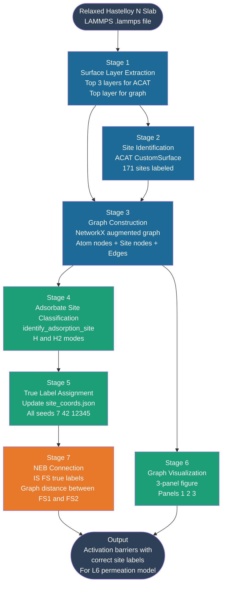

**Plain language summary of each stage:**

| Stage | What it does | Status |
|-------|-------------|--------|
| 1 | Cuts the slab to keep only the surface atoms we care about | ✅ Done |
| 2 | Finds every possible adsorption site and labels it by its neighboring atoms | ✅ Done |
| 3 | Builds a mathematical graph connecting atoms and sites | ✅ Done |
| 4 | Looks at a relaxed structure with H on it and identifies the true site | ✅ Done |
| 5 | Runs the classifier on all NB05/NB06 structures and saves true labels | ✅ Done (seed 7) |
| 6 | Produces the three-panel visualization figure | ✅ Done |
| 7 | Connects true labels to NEB results — captured inside NB06b and NB06a | ✅ Done |

---

## Stage 1 — Surface Layer Extraction

### What is happening and why

The full Hastelloy N slab has 360 atoms spread across roughly 9 layers. If we give all 360 atoms to the site identification code (ACAT), it takes forever and gets confused — it does not know which atoms are on the surface and which are buried deep inside the material.

So we cut the slab vertically: we keep only the top 3 layers (90 atoms) for site identification because a site on the surface is defined by the top layer atom and the one or two atoms just below it. We keep only the top 1 layer (30 atoms) for the graph and visualization because those are the atoms the adsorbate actually sees.

**Update — layer selection is now rank-based, not z-threshold-based.** The original implementation (described below in the original sub-workflow diagram) picked layers by an absolute z cutoff: "keep every atom with z above some threshold." After the four-phase surface relaxation (min → anneal → NVT → quench) was added to `neb_workflow.py`, thermal displacement during the anneal/NVT phases meant a single elevated or depressed atom could push `z_max` up or down enough to either exclude a real top-layer atom or include a layer-2 atom — the z-threshold approach is not robust to that. `models/surface_graph.py::build_surface_graph()` now selects layers **by rank** instead: sort all atoms by z, and take exactly the top `n_atoms_per_layer = len(atoms) // n_layers_total` atoms for the top layer, and the top `3 * n_atoms_per_layer` for the ACAT sub-slab. This always returns exactly one layer's worth of atoms regardless of how much any individual atom has thermally displaced.

### Sub-workflow (original z-threshold approach — superseded, kept for the geometric intuition)

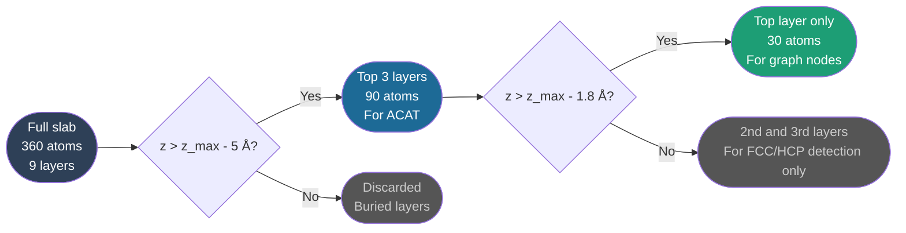

### Current sub-workflow (rank-based)

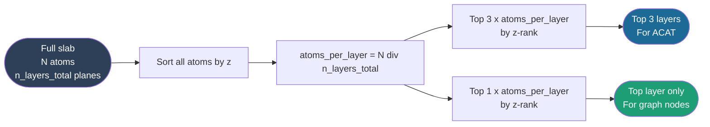

### Explanation

**z_max** is now defined as the *mean* z of the rank-selected top layer, not the z of the single highest atom — this is what makes it immune to one outlier atom. For seed 7 (illustrative, pre-dating the rank-based fix): z_max ≈ 38.12 Å, top layer composition 22 Ni, 4 Mo, 1 Cr, 1 Fe, 1 C, 1 B — 30 atoms, matching what you see looking down at the surface in OVITO. The exact numeric example still holds approximately; only the *selection mechanism* changed, not the physical layers it picks out for a well-behaved slab.

**Why do we need the 2nd and 3rd layers at all?** To distinguish FCC from HCP hollow sites. An FCC hollow has no atom directly below it in the second layer. An HCP hollow has an atom directly below it. Without the subsurface layers we cannot make this distinction. [Ref: Henkelman et al., J. Chem. Phys. 2000]

**`n_layers_total`** is a parameter to `build_surface_graph()` (default 12, matching the standard slab thickness) — it must match the slab's real total layer count for the rank-based split to land on the correct atoms-per-layer. It is threaded through from `pipeline.ipynb`'s `LAYERS` variable via `neb_workflow.py::run_phase3_site_enumeration()`.

---

## Stage 2 — Site Identification with ACAT

### What is happening and why

ACAT (Alloy Catalysis Automated Toolkit) is a Python library developed at DTU that automatically finds all adsorption sites on a metal surface [Ref: Han et al., npj Comput. Mater. 2023]. It uses Delaunay triangulation — a mathematical method that connects surface atoms into triangles — to find all the gaps and edges between atoms where an adsorbate could sit.

For Hastelloy N we use `CustomSurface` mode because:

1. ACAT has built-in support for ordered surfaces like pure FCC(111), but our surface is disordered
2. `CustomSurface` bypasses the ordered-lattice assumption and uses the actual atomic positions directly
3. It handles B and C impurities correctly without crashing, unlike the `fcc111` mode

### Sub-workflow

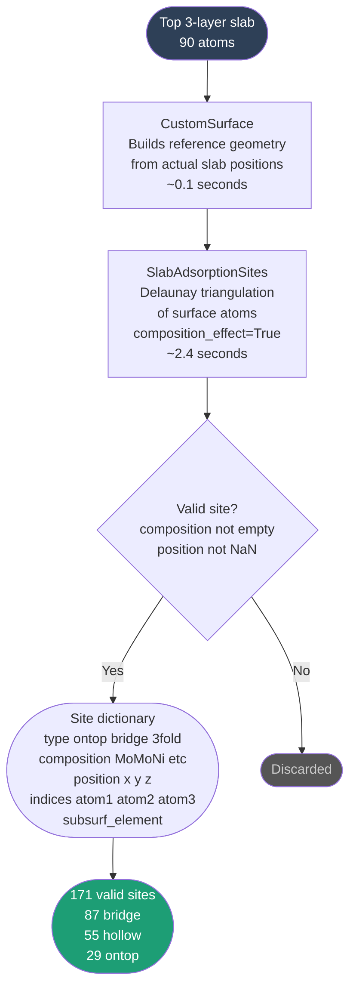

### Explanation

**Delaunay triangulation** sounds complicated but the idea is simple. Imagine you draw dots on paper for each surface atom. Delaunay triangulation connects these dots into triangles such that no dot is inside any triangle. The center of each triangle is a hollow site. The midpoint of each edge is a bridge site. Each dot itself is an atop site.

For Hastelloy N the 30 top-layer atoms produce:

- **29 atop sites** — one per surface atom (Ni_atop, Mo_atop, Cr_atop etc.)
- **87 bridge sites** — between pairs of adjacent atoms (NiNi_bridge, MoNi_bridge etc.)
- **55 hollow (3fold) sites** — in the pocket between three atoms (NiNiNi_hollow, MoNiNi_hollow etc.)

**composition_effect=True** means ACAT distinguishes sites by which elements form them. `NiNi_bridge` and `MoNi_bridge` are treated as different site types even though both are bridge sites geometrically.

**The label format** we use is: `{sorted elements}_{site type}_{hollow type}`. For example:
- `MoMoNi_hollow_hcp` — hollow site formed by two Mo and one Ni, HCP type
- `NiNi_bridge` — bridge site between two Ni atoms
- `Cr_atop` — atop site on a Cr atom

**Why ACAT found all hollows as FCC initially:** ACAT uses its own HCP/FCC detection based on the surrogate metal geometry, which did not work reliably for our disordered alloy. We replaced this with our own subsurface atom check in Stage 4.

**Which slab to use for ACAT:** the current pipeline always feeds ACAT the output of the four-phase surface relaxation (CG min → anneal → NVT → quench, see `neb_workflow.py`'s Phase A) — i.e. a thermally relaxed *and* re-minimised structure, which historically was the only one of three slab variants (unrelaxed, NVT-only, re-minimised) that gave ACAT correct results: an unrelaxed slab has perfectly flat layers that make Delaunay triangulation fail outright, and an NVT-only slab (with residual thermal rumpling and no final quench) confuses ACAT's own layer detection. The Phase-4 quench step exists specifically to remove that rumpling before Phase B/ACAT ever runs.

**Update — the `n_layers=1..10` trial loop described in earlier versions of this document is gone.** ACAT's `CustomSurface` requires its internal plane count to be exactly divisible by the `n_layers` you pass it, and thermal rumpling used to make that unpredictable — the original workaround was to try `n_layers=1` through `10` and keep the first value that both passed ACAT's internal assertion and returned at least 20 hollow sites. `build_surface_graph()` now sidesteps this entirely with **z-snapping**: after the rank-based top-3-layers sub-slab is cut out (see Stage 1 above), each atom's z-coordinate is snapped to its own layer's mean z (three flat planes, by construction). ACAT is then always called with a fixed `CustomSurface(acat_slab, n_layers=3)` — no trial loop, no assertion failures — because z-snapping guarantees exactly 3 clean planes every time, regardless of how much the atoms in each plane have thermally displaced from each other in x/y or z. The un-snapped, real atomic positions (`top3_slab`, distinct from the snapped `acat_slab` used only for ACAT) are what get mapped back onto the final site positions, so no accuracy is lost by snapping.

**Reference:** Han, S., Lysgaard, S., Vegge, T. et al. Rapid mapping of alloy surface phase diagrams via Bayesian evolutionary multitasking. npj Comput. Mater. 9, 139 (2023). https://doi.org/10.1038/s41524-023-01087-4

---

## Stage 2b — Oxide Surfaces: Geometric Site Enumeration (no ACAT)

### What is happening and why

Everything in Stage 2 assumes a close-packed metal surface — ACAT's Delaunay triangulation needs a reasonably dense, roughly co-planar set of surface atoms to find sensible hollow/bridge/atop sites. Oxide surfaces (Cr₂O₃, NiO) don't fit that assumption: they have a much sparser, more open surface with metal and oxygen atoms at very different heights, and ACAT has no oxide-surface mode at all. Rather than force an ill-fitting tool onto oxide geometry, `build_surface_graph(..., metal_type='oxide')` enumerates sites geometrically instead of calling ACAT.

### Sub-workflow

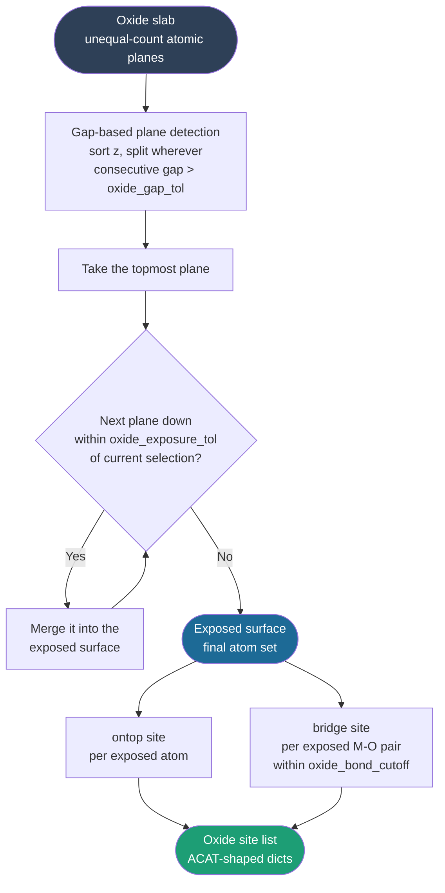

### Explanation

**Gap-based plane detection (`_z_plane_clusters`)** replaces both the rank-based selection used for metals (Stage 1) and ACAT's own layer detection. It sorts all atoms by z and starts a new plane whenever the gap to the next atom exceeds `oxide_gap_tol` (default 0.5 Å). This makes no assumption about how many atoms are in each plane — necessary because oxide planes are chemically unequal (e.g. an O₃ plane sitting above a Cr plane in corundum Cr₂O₃(0001), not the equal-count metal planes rank-based selection expects).

**Composite terminations (`oxide_exposure_tol`)**: some oxide surfaces expose more than one atomic plane as a single chemical termination — e.g. Cr₂O₃(0001)'s O₃/Cr termination, where a Cr plane sits less than 1 Å below the terminal O₃ plane and is chemically part of the same exposed surface. Starting from the topmost detected plane, `build_surface_graph()` merges the next plane down whenever the gap between their mean z values is smaller than `oxide_exposure_tol` (default 1.0 Å), repeating until it hits a real gap.

**Site types are deliberately narrower than the metal path** — no hollow sites, because Delaunay-style triangulation of a sparse, chemically heterogeneous oxide surface doesn't produce physically meaningful 3-fold pockets the way it does for a close-packed metal:
- **ontop** — one site per exposed-plane atom (both metal and O atoms get one), composition = that atom's element symbol.
- **bridge** — the midpoint of every exposed metal–O pair within `oxide_bond_cutoff` (default 2.6 Å, periodic min-image in xy). Composition is written metal-first (e.g. `CrO`, not `OCr`) since these are the M–O pairs across which H₂ dissociates heterolytically on an oxide.

If a real slab produces zero bridge sites, `build_surface_graph()` prints a warning — it usually means the exposed termination is O-only beyond `oxide_bond_cutoff` (no metal atom close enough to any O to form a bridge), which is a legitimate physical outcome for some terminations, not a bug.

**Everything downstream is unchanged**: oxide sites are returned in the same dict shape ACAT sites use (`site`, `composition`, `position`, `indices`), already carry full-slab atom indices (no reindexing step needed, unlike the ACAT sub-slab path), and flow into the same atom/site/edge-building code in Stage 3 below. The label format also matches: `'{composition}_atop'` / `'{composition}_bridge'` (e.g. `Cr_atop`, `CrO_bridge`) using the exact same label logic as the metal path.

---

## Stage 3 — Graph Construction

### What is happening and why

A **graph** in mathematics is a set of nodes (points) connected by edges (lines). We build a graph of the surface where:

- Every surface atom is a node
- Every adsorption site is also a node
- Bonds between atoms are edges
- Connections between sites and their constituent atoms are edges
- Connections between neighboring sites are edges

This representation is powerful because it encodes not just where atoms are, but how they relate to each other. You can then ask questions like "what is the local chemical environment of this site?" just by traversing the graph.

### The three node types and three edge types

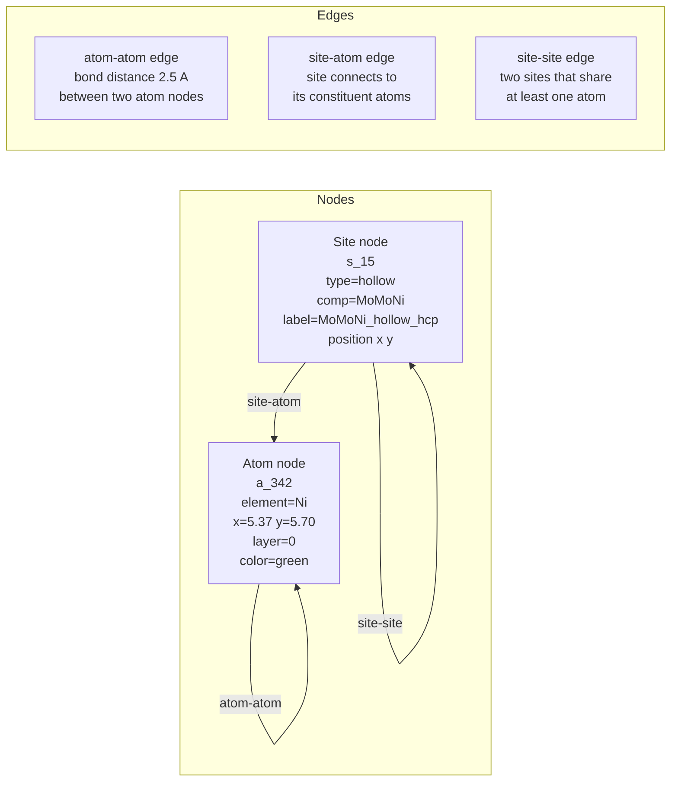

### Sub-workflow

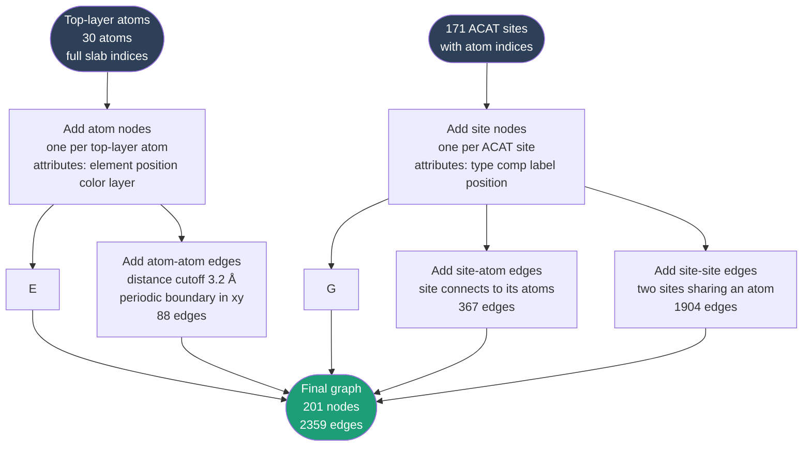

### Explanation

**Why 201 nodes?** 30 atom nodes + 171 site nodes = 201 nodes.

**Why 2359 edges?** 88 atom-atom + 367 site-atom + 1904 site-site = 2359 edges.

**The 1904 site-site edges** seem like a lot, but on a disordered FCC(111) surface each hollow site shares atoms with many neighboring bridge and hollow sites. Think of it this way: if two sites share an atom, an adsorbate at one site and an adsorbate at the other site would be very close together. The site-site edges encode this proximity directly.

**Periodic boundary conditions** — the Hastelloy N slab is periodic in x and y (it repeats infinitely in those directions, simulating a large surface). When we compute atom-atom bonds, we use the minimum image convention: if two atoms appear far apart in the simulation box but are actually close across the periodic boundary, we still connect them. Mathematically: `d_x = d_x - cell_x * round(d_x / cell_x)`.

**Atom indices** — we use the full slab atom indices (0 to 359) as node identifiers (`a_342`, `a_330` etc.) rather than the reindexed top-layer indices. This is critical: if we used reindexed indices, the graph would not match the original LAMMPS structures and we could not look up which atom is which.

**Visualization iterations:** The three-panel figure went through three rounds of improvement before reaching the final version:

- **Iteration 1:** Panel 1 showed 119 atoms (3 layers) instead of 30 — fixed by restricting atom nodes to top layer only using `top_layer_tol=1.8 Å`
- **Iteration 2:** Panel 3 had overlapping labels, axis bleeding outside the unit cell, and too many site-site edges — fixed by removing site-site edges from Panel 3, clamping axis to unit cell, and showing labels only for selected site and 1st shell
- **Iteration 3:** Panel 3 still had crowded 1st shell labels — fixed by using shortened label format (`_hollow_fcc` → `_hol_fcc`, `_bridge` → `_br`) and placing labels below markers with dark background boxes

**Reference:** NetworkX: Hagberg, A., Swart, P., Chult, D. Exploring network structure, dynamics, and function using NetworkX. Proceedings of the 7th Python in Science Conference, 2008.

---

## Stage 4 — Adsorbate Site Classification

### What is happening and why

When we relax a structure with hydrogen on it, the hydrogen moves from where we placed it to the nearest energy minimum. The question is: which site did it end up at?

We cannot use ACAT's coverage detection reliably here because it gets confused by the reindexed subslab (we saw this — it returned `NiNiNi_fcc` when the true site was `MoMoNi`). Instead we use a direct physical approach: find the surface atoms nearest to the hydrogen atom in 3D space, count how many are within bonding distance, and classify based on that count.

We also need to handle two physically different cases:
- **Chemisorbed** — H is bonded to the surface (z_above < 2.5 Å)
- **Physisorbed** — H₂ is hovering above the surface (z_above > 2.5 Å)

### Sub-workflow for `identify_adsorption_site()`

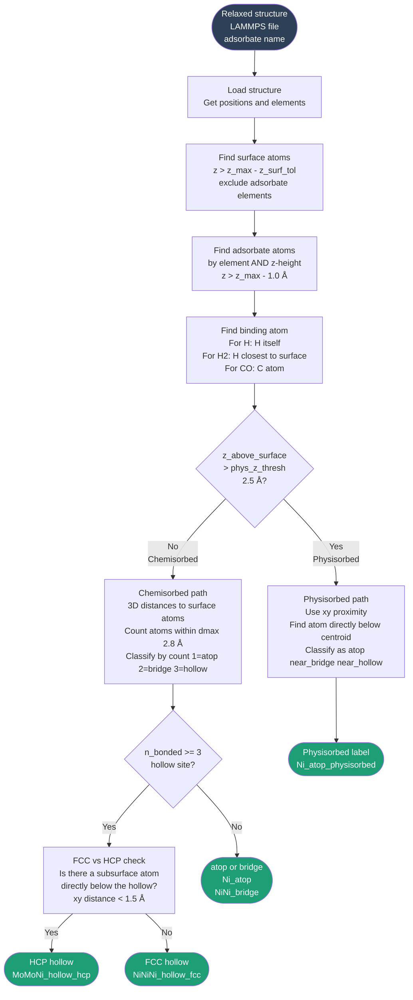

### Results for seed 7

| Nominal site | True label | Mode | Physical meaning |
|-------------|-----------|------|-----------------|
| top_ni | MoMoNi_hollow_hcp | chemisorbed | H drifted from atop Ni to hollow between 1 Ni + 2 Mo |
| top_mo | MoMoNi_hollow_hcp | chemisorbed | H drifted to same type of hollow |
| top_cr | CrNiNi_hollow_hcp | chemisorbed | H drifted to hollow between 1 Cr + 2 Ni |
| top_fe | FeNiNi_hollow_hcp | chemisorbed | H drifted to hollow between 1 Fe + 2 Ni |
| top_c | CrNiNi_hollow_hcp | chemisorbed | Same physical site as top_cr |
| top_b | BCMo_bridge | chemisorbed | H trapped between B-C impurity pair and Mo |
| bridge | MoNiNi_hollow_hcp | chemisorbed | H drifted from bridge to hollow |
| fcc_hollow | NiNiNi_hollow_hcp | chemisorbed | Pure Ni hollow, HCP type |
| hcp_hollow | MoNiNi_hollow_hcp | chemisorbed | Hollow between 2 Ni + 1 Mo |

For H₂ in NB05 all sites are physisorbed (z_above = 2.5-3.6 Å), correctly classified as `Ni_atop_physisorbed`, `Mo_atop_physisorbed` etc.

**Key insight:** Every H atom except top_b drifted to a 3-fold hollow site after relaxation. None stayed at their nominal atop position. This is physically meaningful — on transition metal surfaces hollow sites are generally the most stable for atomic hydrogen [Ref: Christmann, Surf. Sci. Rep. 1988].

**Caveat on physisorbed classification:** The H2 physisorbed labels are approximately correct but `fcc_hollow` was visually confirmed in OVITO to look more like a bridge position than an atop position. The `identify_adsorption_site()` physisorbed path currently uses xy proximity to the nearest surface atom to decide the label. For `fcc_hollow` the H2 centroid is equidistant from two atoms and should be classified as `NiNi_near_bridge_physisorbed` rather than `Ni_atop_physisorbed`. Threshold tuning for the physisorbed classifier is pending.

**Reference:** Christmann, K. Interaction of hydrogen with solid surfaces. Surf. Sci. Rep. 9, 1 (1988). https://doi.org/10.1016/0167-5729(88)90009-X

---

## Stage 5 (ACAT) — Why We Use ACAT's Site List But Not Its Coverage

This is an important design decision worth explaining.

**We use ACAT for:** enumerating all 171 possible adsorption sites on the clean surface (Stage 2). ACAT's Delaunay triangulation correctly identifies where all the ontop, bridge, and hollow positions are geometrically.

**We do NOT use ACAT for:** identifying which site a relaxed adsorbate is on. ACAT's `SlabAdsorbateCoverage` got confused by the reindexed subslab and returned the wrong answer (`NiNiNi_fcc` instead of `MoMoNi`).

**Instead we use:** our own `identify_adsorption_site()` function which works directly on the full slab with original indices and uses simple 3D nearest-neighbor distances. This is more robust for a disordered alloy surface.

---

## Stage 6 — Graph Visualization

### What each panel shows

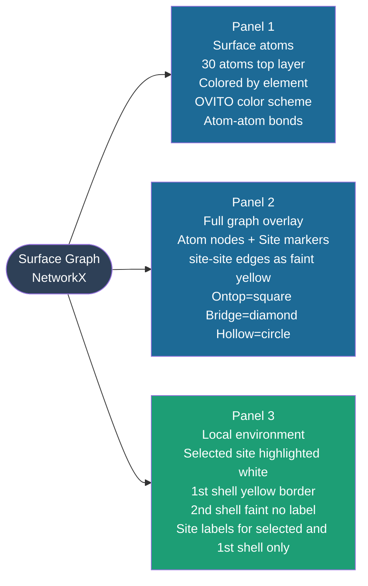

### Color scheme (matching OVITO)

| Element | Color | Hex |
|---------|-------|-----|
| Ni | Green | #00C000 |
| Mo | Light green | #B8D898 |
| Cr | Blue/purple | #8B9DC3 |
| Fe | Orange/red | #E07040 |
| B | Pink | #FFB3B3 |
| C | Gray | #808080 |
| Al | Tan/brown | #C2956B |

| Site type | Marker | Color |
|-----------|--------|-------|
| Ontop | Square | #E8782A (orange) |
| Bridge | Diamond | #378ADD (blue) |
| Hollow | Circle | #1D9E75 (green) |

---

## Next Steps — Stages 5, 7 (Not Yet Implemented)

---

## Stage 5 — True Label Assignment ✅ Done (seed 7)

### What was done

Stage 5 adds true label identification to the existing NB05 and NB06 notebooks as two targeted additions — one new cell in NB05 and one replacement block in NB06. No existing logic was changed. The true labels are saved to separate JSON files so the existing `site_coords.json` is untouched.

This was implemented as Phase 1 (see the Implementation section below). The full results for seed 7 are documented there including all 9 H2 physisorbed labels and all 9 H* chemisorbed labels.

### Sub-workflow

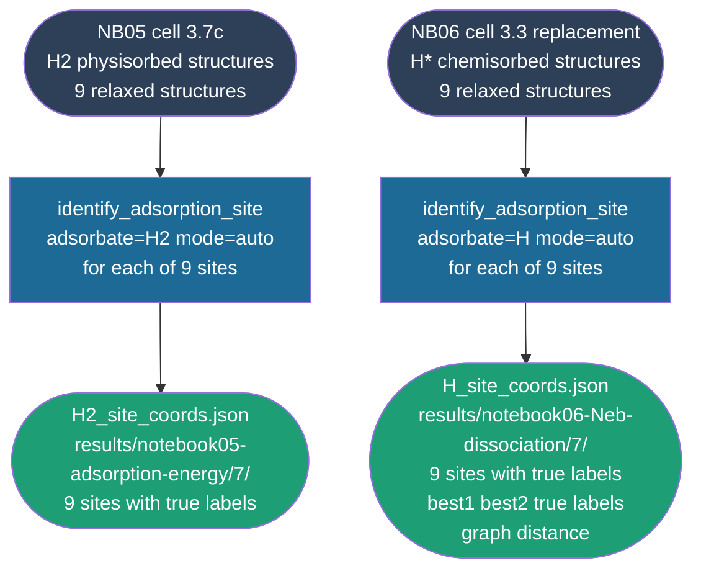

**Status for seeds 42 and 12345:** Pending cluster availability. The same two cells will run without modification once those seed structures are available.

---

## Stage 7 — Connection to NEB Results ✅ Captured in NB06b and NB06a

### What was done

Stage 7 is not a separate implementation — it is the output of running NB06b and NB06a. Both notebooks automatically report:
1. The true label of the IS site (H2 physisorbed) from `H2_site_coords.json`
2. The true labels of FS1 and FS2 (two chemisorbed H atoms) from `identify_adsorption_site()`
3. The graph distance between FS1 and FS2 from the surface graph
4. Whether FS1 and FS2 are 1st-shell neighbors (sharing a surface atom) or further apart

For seed 7 using the 9 nominal sites: best1 = `MoMoNi_hollow_hcp`, best2 = `MoMoNi_hollow_hcp`, graph distance = 1 (1st shell neighbors sharing Mo idx=346).

The graph distance check is also embedded in NB06a Cell A as a filter — FS pairs with graph distance < 2 are rejected before any NEB is run.

### Sub-workflow

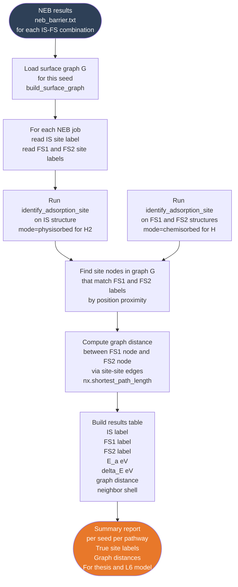

### How to implement

```python
import networkx as nx
from site_identifier import identify_adsorption_site
from surface_graph import build_surface_graph
import numpy as np

def find_nearest_site_node(G, xy_pos, site_type=None):
    """Find the site node in G closest to a given xy position."""
    best_node, best_dist = None, np.inf
    for n, d in G.nodes(data=True):
        if d['node_type'] != 'site':
            continue
        if site_type and d['site_type'] != site_type:
            continue
        dist = np.sqrt((d['x'] - xy_pos[0])**2 + (d['y'] - xy_pos[1])**2)
        if dist < best_dist:
            best_dist, best_node = dist, n
    return best_node, best_dist

def get_graph_distance(G, site_node1, site_node2):
    """Shortest path between two site nodes via site-site edges."""
    site_graph = nx.Graph()
    for u, v, d in G.edges(data=True):
        if d['edge_type'] == 'site-site':
            site_graph.add_edge(u, v)
    try:
        return nx.shortest_path_length(site_graph, site_node1, site_node2)
    except nx.NetworkXNoPath:
        return -1   # disconnected

# Usage
G, slab, top3, sites = build_surface_graph(SLAB_PATH)

# For a given NEB FS pair
fs1_result = identify_adsorption_site(fs1_path, adsorbate='H')
fs2_result = identify_adsorption_site(fs2_path, adsorbate='H')

fs1_xy = fs1_result[0]['binding_atom_pos'][:2]
fs2_xy = fs2_result[0]['binding_atom_pos'][:2]

node1, _ = find_nearest_site_node(G, fs1_xy, site_type='hollow')
node2, _ = find_nearest_site_node(G, fs2_xy, site_type='hollow')

dist = get_graph_distance(G, node1, node2)
print(f'FS1: {fs1_result[0]["label"]}')
print(f'FS2: {fs2_result[0]["label"]}')
print(f'Graph distance: {dist} hops')
print(f'Neighbor shell: {"1st" if dist==1 else "2nd" if dist==2 else f"{dist}th"}')
```

---

## Summary of All Files Produced

| File | Purpose | Stage |
|------|---------|-------|
| `surface_graph.py` | Builds graph, traversal, visualization | 3, 6 |
| `site_identifier.py` | Identifies true site for any adsorbate | 4 |
| `test_acat_custom.py` | Tests ACAT CustomSurface on seed 7 | 2 |
| `04b_surface_relaxation_7.ipynb` | Clean slab relaxation + surface site mapping | Phase 2 |
| `05b_adsorption_energy_7.ipynb` | H2 adsorption at all 171 ACAT sites | Phase 2 |
| `06b_dissociation_neb_7.ipynb` | H* adsorption + NEB at all 171 ACAT sites | Phase 2 |
| `06a_multi_pathway_neb_seed7.ipynb` | Multi-pathway NEB with true labels | Phase 1+2 |

---

## Key References

1. **ACAT:** Han, S., Lysgaard, S., Vegge, T. et al. Rapid mapping of alloy surface phase diagrams via Bayesian evolutionary multitasking. *npj Comput. Mater.* **9**, 139 (2023). https://doi.org/10.1038/s41524-023-01087-4

2. **NetworkX:** Hagberg, A., Swart, P., Chult, D. Exploring network structure, dynamics, and function using NetworkX. *Proceedings of the 7th Python in Science Conference*, 2008.

3. **ASE:** Larsen, A.H. et al. The atomic simulation environment — a Python library for working with atoms. *J. Phys.: Condens. Matter* **29**, 273002 (2017). https://doi.org/10.1088/1361-648X/aa680e

4. **Hydrogen on metal surfaces:** Christmann, K. Interaction of hydrogen with solid surfaces. *Surf. Sci. Rep.* **9**, 1 (1988). https://doi.org/10.1016/0167-5729(88)90009-X

5. **FCC vs HCP hollow sites:** Henkelman, G., Arnaldsson, A., Jonsson, H. Theoretical calculations of CH4 and H2 associative desorption from Ni(111): could subsurface hydrogen play an important role? *J. Chem. Phys.* **124**, 044706 (2006).

6. **Delaunay triangulation for surface sites:** Montoya, J.H., Persson, K.A. A fast and robust algorithm for Bader decomposition of charge density. *npj Comput. Mater.* **3**, 14 (2017).

7. **NEB method:** Henkelman, G., Uberuaga, B.P., Jonsson, H. A climbing image nudged elastic band method for finding saddle points and minimum energy paths. *J. Chem. Phys.* **113**, 9901 (2000). https://doi.org/10.1063/1.1329672

8. **Hastelloy N composition:** Was, G.S. et al. Materials for future nuclear energy systems. *JOM* **71**, 2787 (2019).

---

*Document generated as part of PhD research at CoMOChEng Lab, Northeastern University.*
*Sponsor: Mitsubishi Heavy Industries. Advisor: Prof. Richard West.*

---

## Implementation — Phase 1 and Phase 2

**Implementation status summary:**

| Item | Status |
|------|--------|
| Phase 1 — NB05 cell 3.7c | ✅ Implemented and executed (seed 7) |
| Phase 1 — NB06 cell 3.3 replacement | ✅ Implemented and executed (seed 7) |
| Phase 2 — NB04b | ✅ Implemented and executed (seed 7) |
| Phase 2 — NB05b | ✅ Implemented, execution pending (cluster) |
| Phase 2 — NB06b | ✅ Implemented, execution pending (cluster) |
| Phase 2 — NB03b | ✅ Identical to NB03, no changes needed |
| All phases — seeds 42 and 12345 | 🔲 Pending cluster availability |
| Physisorbed threshold fix | 🔲 Pending (fcc_hollow misclassified as atop) |

---

## Phase 1 — Add True Labels to Existing Notebooks

### What Problem Phase 1 Solves

The existing notebooks (NB05 and NB06) place hydrogen at nominal positions like `top_ni` or `bridge` and label the results using those same nominal names. After relaxation the hydrogen moves to a different location — the nominal label is now physically wrong.

Phase 1 adds true label identification to the existing notebooks without changing any of their existing logic. It is a pure addition — two new cells that run after the existing calculations finish and save the true labels to separate JSON files.

### Phase 1 Workflow

```mermaid
flowchart TD
    A([NB05 relaxed H2 structures\nads_{site}_relaxed.lammps\n9 structures]) --> B
    C([NB06 relaxed H* structures\nh_atom_{site}_relaxed.lammps\n9 structures]) --> D

    B[NB05 cell 3.7c\nidentify_adsorption_site\nadsorbate=H2 mode=auto\nfor each of 9 sites]

    D[NB06 cell 3.3 replacement\nidentify_adsorption_site\nadsorbate=H mode=auto\nfor each of 9 sites]

    B --> E([H2_site_coords.json\nresults/notebook05-adsorption-energy/7/\nnominal label true label\nmode z_above_surface neighbors])

    D --> F([H_site_coords.json\nresults/notebook06-Neb-dissociation/7/\nnominal label true label\nbest1 best2 true labels\nH-H separation neighbors])

    style A fill:#2E4057,color:#fff
    style C fill:#2E4057,color:#fff
    style E fill:#1D9E75,color:#fff
    style F fill:#1D9E75,color:#fff
    style B fill:#1D6A96,color:#fff
    style D fill:#1D6A96,color:#fff
```

### What Each Addition Does

**NB05 cell 3.7c** runs after the existing cell 3.7b which already writes relaxed coordinates to `site_coords.json`. It loops over all 9 sites in `SITE_COORDS_FILTERED`, loads each relaxed structure, and calls `identify_adsorption_site()` in `auto` mode. It saves results to a completely separate file so the existing `site_coords.json` is untouched.

**NB06 cell 3.3 replacement** replaces only the old `describe_site()` print block at the end of cell 3.3. Everything before it stays exactly as it was — the ranking, the SITE_COORDS update, and the best1/best2 selection. It loops over all 9 sites in `H_ATOM_SITES`, loads each relaxed structure, and calls `identify_adsorption_site()` in `auto` mode. It also reports the true labels for best1 and best2 specifically.

**Requirement:** `site_identifier.py` must be in the project root (`MHI_Nickel/`) for both cells to find it.

### Phase 1 Results — Seed 7

**H2 physisorbed sites (NB05):**

| Nominal site | True label | Mode | z above surface (Å) |
|-------------|-----------|------|---------------------|
| top_ni | Ni_atop_physisorbed | physisorbed | 3.45 |
| top_mo | Mo_atop_physisorbed | physisorbed | 2.51 |
| top_cr | Cr_atop_physisorbed | physisorbed | 3.47 |
| top_fe | Fe_atop_physisorbed | physisorbed | 3.17 |
| top_c | Ni_atop_physisorbed | physisorbed | 3.20 |
| top_b | Mo_atop_physisorbed | physisorbed | 3.30 |
| bridge | Ni_atop_physisorbed | physisorbed | 3.20 |
| fcc_hollow | Ni_atop_physisorbed | physisorbed | 3.60 |
| hcp_hollow | Ni_atop_physisorbed | physisorbed | 3.36 |

All 9 H2 structures are physisorbed at 2.5 to 3.6 Å above the surface. This is physically correct — H2 does not chemisorb on Hastelloy N at these sites. Note: `fcc_hollow` was visually confirmed in OVITO to look more like a bridge position than atop. The physisorbed threshold tuning is pending.

**H* chemisorbed sites (NB06):**

| Nominal site | True label | Mode | Physical meaning |
|-------------|-----------|------|-----------------|
| top_ni | MoMoNi_hollow_hcp | chemisorbed | Drifted from atop Ni to hollow |
| top_mo | MoMoNi_hollow_hcp | chemisorbed | Drifted from atop Mo to hollow |
| top_cr | CrNiNi_hollow_hcp | chemisorbed | Drifted to Cr-Ni-Ni hollow |
| top_fe | FeNiNi_hollow_hcp | chemisorbed | Drifted to Fe-Ni-Ni hollow |
| top_c | CrNiNi_hollow_hcp | chemisorbed | Same site as top_cr |
| top_b | BCMo_bridge | chemisorbed | Trapped at B-C-Mo bridge |
| bridge | MoNiNi_hollow_hcp | chemisorbed | Drifted from bridge to hollow |
| fcc_hollow | NiNiNi_hollow_hcp | chemisorbed | Pure Ni hollow |
| hcp_hollow | MoNiNi_hollow_hcp | chemisorbed | Mo-Ni-Ni hollow |

Every H* site except `top_b` drifted to a 3-fold hollow after relaxation. None stayed at their nominal atop position. This confirms that hollow sites are the most stable for atomic hydrogen on transition metal surfaces [Ref: Christmann, Surf. Sci. Rep. 1988].

**FS pair for seed 7:**

| | Value |
|-|-------|
| best1 nominal | top_mo |
| best1 true label | MoMoNi_hollow_hcp |
| best1 E_ads | -0.7956 eV |
| best2 nominal | top_ni |
| best2 true label | MoMoNi_hollow_hcp |
| best2 E_ads | -0.6488 eV |
| H-H separation | 2.6802 Å |
| Shared atom | Mo idx=346 |
| Graph distance | 1 (1st shell neighbors) |

Both FS sites share Mo idx=346 — they are first-shell neighbors on the surface graph. This means the two H atoms sit in adjacent hollow pockets separated by one shared Mo atom, which is the physically correct minimum energy configuration for a dissociated H2 on this surface.

---

## Phase 2 — New Notebooks from Scratch

### What Problem Phase 2 Solves

Phase 1 added true labels to 9 hand-picked nominal sites. But the correct scientific approach is to sample all possible sites on the surface, not just 9. Phase 2 rebuilds NB04, NB05, and NB06 from scratch using all 171 ACAT-identified sites as the foundation.

The key insight that justifies using all 171 sites rather than a subset is that on a disordered alloy like Hastelloy N, two sites with the same composition label (e.g. two `MoMoNi_hollow_hcp` sites) are not equivalent if their second-shell neighbors differ. The full 171-site landscape is needed to capture this chemical diversity. [Ref: Sanchez et al., cluster expansion, Physica A 1984; Batatia et al., MACE, NeurIPS 2022]

### Phase 2 Workflow

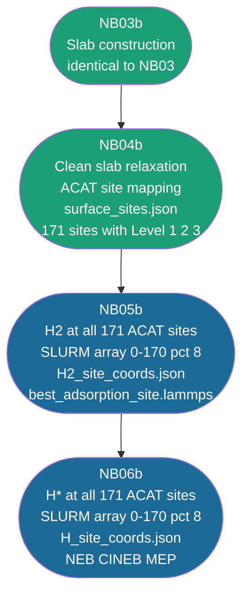

---

### NB03b — Slab Construction

Identical to NB03. No changes needed. The slab construction does not depend on ACAT or site identification.

**Status: ✅ Complete (same as NB03)**

---

### NB04b — Clean Slab Relaxation + Surface Site Mapping

#### What is happening and why

NB04b does everything NB04 does — it relaxes the clean slab with LAMMPS using a two-step protocol (CG minimization then NVT at 300 K). After the relaxation completes, NB04b adds a new section that runs ACAT on the slab and builds the full surface graph with Level 1, 2, and 3 environments for all 171 sites.

**Critical design decision — which slab to use for ACAT:**

We tested three different slabs:

| Slab | n_layers ACAT accepts | Hollows found | Verdict |
|------|----------------------|---------------|---------|
| NB03 unrelaxed | n/a — IndexError | n/a | Too flat — triangulation fails |
| NB04 NVT relaxed | 4 | 53 | Too rumpled — thermal disorder confuses ACAT |
| NB05 re-minimized | 3 | 55 | Correct — minimized geometry, no thermal noise |

We use `clean_slab_reminimized.lammps` from NB05 (the same slab minimized at 0 K without NVT). This gives the correct 171 sites with 55 hollows.

**Critical implementation detail — n_layers trial loop:**

ACAT's `CustomSurface` requires that its internal plane count is exactly divisible by `n_layers`. The correct value cannot be predicted in advance because the relaxed slab has surface rumpling. We find it by trial — trying `n_layers=1` through `n_layers=10` and accepting the first value that:
1. Does not raise `AssertionError`
2. Produces at least 20 hollow sites (validates the result is physically correct, since `n_layers=1` sometimes passes the assertion but gives wrong results)

#### NB04b Cell Structure

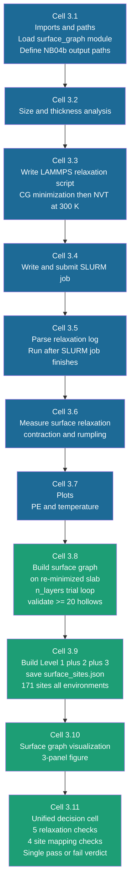

#### NB04b Results — Seed 7

| Check | Result |
|-------|--------|
| Input slab exists (NB03) | ✅ |
| Relaxation log exists | ✅ |
| Relaxed slab written | ✅ |
| Surface contraction physically ok | ✅ |
| Temperature reached 300 K | ✅ 298.5 K |
| surface_sites.json saved | ✅ |
| Sites identified (n > 0) | ✅ 171 sites |
| Surface graph figure saved | ✅ |

**Surface graph summary:**

| Quantity | Value |
|----------|-------|
| Atom nodes | 30 (top layer only) |
| Site nodes | 171 |
| Atom-atom edges | 88 |
| Site-atom edges | 367 |
| Site-site edges | 1904 |
| Total nodes | 201 |
| Total edges | 2359 |
| Hollow sites | 55 |
| Bridge sites | 87 |
| Atop sites | 29 |
| n_layers used | 3 |

**Status: ✅ Implemented and executed for seed 7**

---

### NB05b — H2 Adsorption at All 171 ACAT Sites

#### What is happening and why

NB05 placed H2 at 9 hand-picked nominal positions. NB05b reads the 171 ACAT site positions from `surface_sites.json` and places H2 at every one of them. This gives a complete picture of the H2 adsorption energy landscape across the entire disordered surface.

After minimization, every relaxed structure is classified as intact (H-H < 1.2 Å, valid IS candidate), dissociated (H-H > 2.5 Å, spontaneous dissociation), or ambiguous (1.2 to 2.5 Å, requires inspection). Only intact structures are used for IS selection.

#### NB05b Cell Structure

```mermaid
flowchart TD
    A[Cell 3.1
Imports and parameters
Load relaxed slab
Load surface_sites.json]
    B[Cell 3.2
Load 171 ACAT sites
and their positions]
    C[Cell 3.3
Build H2 gas reference
15x15x15 A vacuum box]
    D[Cell 3.4
Build 171 slab plus H2 structures
H2 parallel to surface
2.5 A above top layer]
    E[Cell 3.5
Write 173 LAMMPS scripts
171 ACAT sites plus clean_slab plus h2_gas]
    F[Cell 3.6
Write and submit SLURM array
0-170 pct 8 max 8 concurrent
plus 2 reference jobs]
    G[Cell 3.7
Parse 173 logs
Set E_CLEAN_SLAB and E_H2_GAS
Run after all jobs finish]
    H[Cell 3.8
H2 geometry audit
Intact H-H less than 1.2 A
Dissociated H-H greater than 2.5 A
Ambiguous 1.2 to 2.5 A]
    I[Cell 3.9
Compute E_ads for all 171 sites
Rank intact sites only]
    J[Cell 3.10
True H2 site identification
identify_adsorption_site auto mode
Save H2_site_coords.json]
    K[Cell 3.11
Plot E_ads bar chart
All 171 intact sites
Colored by site type]
    L[Cell 3.12
Save best IS structure
best_adsorption_site.lammps]
    M[Cell 3.13
Unified decision cell]

    A --> B --> C --> D --> E --> F --> G --> H --> I --> J --> K --> L --> M

    style A fill:#1D6A96,color:#fff
    style B fill:#1D6A96,color:#fff
    style C fill:#1D6A96,color:#fff
    style D fill:#1D6A96,color:#fff
    style E fill:#1D6A96,color:#fff
    style F fill:#1D6A96,color:#fff
    style G fill:#1D6A96,color:#fff
    style H fill:#1D9E75,color:#fff
    style I fill:#1D9E75,color:#fff
    style J fill:#1D9E75,color:#fff
    style K fill:#1D9E75,color:#fff
    style L fill:#1D9E75,color:#fff
    style M fill:#1D9E75,color:#fff
```

**Key differences from NB05:**
- Site positions read from `surface_sites.json` not manually defined coordinates
- 173 total jobs submitted as SLURM array (171 sites + clean_slab + h2_gas)
- H2 geometry audit separates intact from dissociated before ranking
- True site identification runs on all 171 relaxed structures

**Status: ✅ Implemented, execution pending (cluster)**

---

### NB06b — H* Adsorption at All 171 ACAT Sites + NEB

#### What is happening and why

NB06b does for single H* what NB05b does for H2 — it places one H atom at all 171 ACAT sites and minimizes. After ranking by E_ads(H*), it selects best1 and best2 for the NEB final state using two criteria together:

**Criterion 1 — Physical separation:** H-H distance > 2.5 Å ensures the two H atoms are far enough apart to be independent and not repelling each other.

**Criterion 2 — Graph distance >= 2:** Two sites that are graph distance 1 apart share a surface atom. An H atom at each of those sites would both be bonded to the same metal atom, which is physically unrealistic for a stable 2H* final state. Graph distance >= 2 guarantees the two sites are truly independent in the surface network.

Using both criteria together is more rigorous than either alone. Physical separation alone can miss cases where two sites are spatially separated but share a surface atom. Graph distance alone can miss cases where two sites are graph-far but physically close due to surface distortion.

After selecting best1 and best2, NB06b runs the full NEB workflow identical to NB06 — IS/FS build, verification, MDMin + CINEB, MEP plot, and decision cell.

#### NB06b Cell Structure

```mermaid
flowchart TD
    A[Cell 3.1
Imports and parameters
Load surface_sites.json
Build surface graph for graph distance
Read NB05b energies]
    B[Cell 3.2
Build 171 single-H structures
Write SLURM array
0-170 pct 8 max 8 concurrent]
    C[Cell 3.3
Parse 171 logs
Rank all sites by E_ads H star
Update coords from relaxed positions
Pick best1 and best2
Criterion 1 H-H greater than 2.5 A
Criterion 2 graph distance >= 2]
    D[Cell 3.3b
True site identification
identify_adsorption_site auto mode
Save H_site_coords.json
Report best1 and best2 true labels]
    E[Cell 3.3c
Plot E_ads bar chart
171 sites colored by site type
FS pair highlighted]
    F[Cell 3.4
Build IS from NB05b best site
Build FS from best1 plus best2
Submit FS minimization]
    G[Cell 3.5
Verify IS and FS
H-H molecular in IS
H-H dissociated in FS
delta E less than 0]
    H[Cell 3.7
Write ASE CINEB script
IDPP interpolation
Phase 1 MDMin regular NEB
Phase 2 CINEB climbing image]
    I[Cell 3.8
Submit NEB job
1 A100 GPU 1 to 2 hours]
    J[Cell 3.9
Parse NEB results
E_a delta_E fmax converged]
    K[Cell 3.10
Plot minimum energy path]
    L[Cell 3.11
Unified decision cell
All checks before NB07]

    A --> B --> C --> D --> E --> F --> G --> H --> I --> J --> K --> L

    style A fill:#1D6A96,color:#fff
    style B fill:#1D6A96,color:#fff
    style C fill:#1D9E75,color:#fff
    style D fill:#1D9E75,color:#fff
    style E fill:#1D9E75,color:#fff
    style F fill:#1D6A96,color:#fff
    style G fill:#1D6A96,color:#fff
    style H fill:#1D6A96,color:#fff
    style I fill:#1D6A96,color:#fff
    style J fill:#1D9E75,color:#fff
    style K fill:#1D9E75,color:#fff
    style L fill:#1D9E75,color:#fff
```

**Key differences from NB06:**
- 171 single-H jobs submitted as SLURM array
- best1/best2 selection uses H-H > 2.5 Å AND graph distance >= 2
- True site identification on all 171 relaxed structures
- Multi-pathway NEB is handled separately in NB06a not here

**Status: ✅ Implemented, execution pending (cluster)**

---

### Build Order and File Dependencies

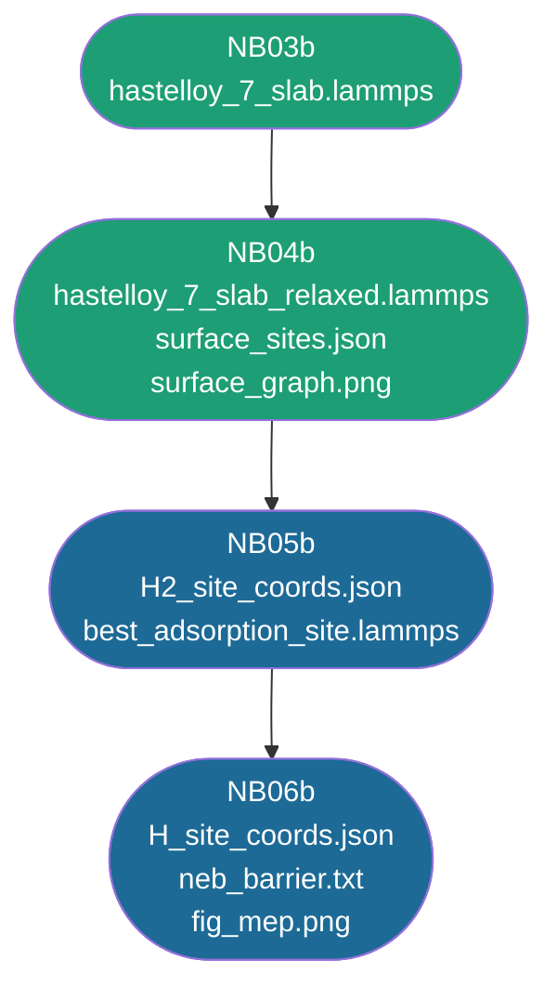

| File | Written by | Read by | Path |
|------|-----------|---------|------|
| `hastelloy_7_slab.lammps` | NB03 | NB04b | `structures/notebook03-Slab-generation/7/` |
| `hastelloy_7_slab_relaxed.lammps` | NB04 | NB05b, NB06b | `structures/notebook04-surface-relaxation/7/` |
| `clean_slab_reminimized.lammps` | NB05 | NB04b (ACAT only) | `structures/notebook05-adsorption-energy/7/` |
| `surface_sites.json` | NB04b | NB05b, NB06b | `results/notebook04b-surface-relaxation/7/` |
| `best_adsorption_site.lammps` | NB05b | NB06b | `structures/notebook05b-adsorption-energy/7/` |
| `H2_site_coords.json` (9 sites) | NB05 Phase 1 | NB06a | `results/notebook05-adsorption-energy/7/` |
| `H2_site_coords.json` (171 sites) | NB05b | NB06b | `results/notebook05b-adsorption-energy/7/` |
| `H_site_coords.json` (9 sites) | NB06 Phase 1 | NB06a | `results/notebook06-Neb-dissociation/7/` |
| `H_site_coords.json` (171 sites) | NB06b | NB07 | `results/notebook06b-Neb-dissociation/7/` |
| `neb_barrier.txt` | NB06b | NB07 | `results/notebook06b-Neb-dissociation/7/` |

---

### Pending Items

| Item | Blocked by |
|------|-----------|
| Run NB05b for seed 7 | Cluster availability |
| Run NB06b for seed 7 | NB05b completion |
| Phase 1 and Phase 2 for seeds 42 and 12345 | Cluster availability |
| Fix physisorbed classification thresholds | Threshold tuning (fcc_hollow classified as Ni_atop, visually confirmed as bridge) |
| Write full explanation section for Phase 1 and Phase 2 | Implementation complete but explanation deferred |

---

*Implementation complete for seed 7. Execution pending for seeds 42 and 12345.*
*Document: CoMOChEng Lab, Northeastern University. Sponsor: Mitsubishi Heavy Industries. Advisor: Prof. Richard West.*
