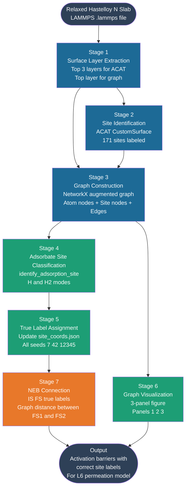
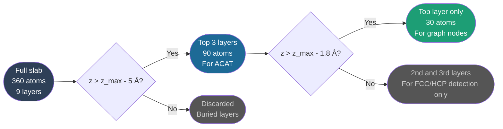
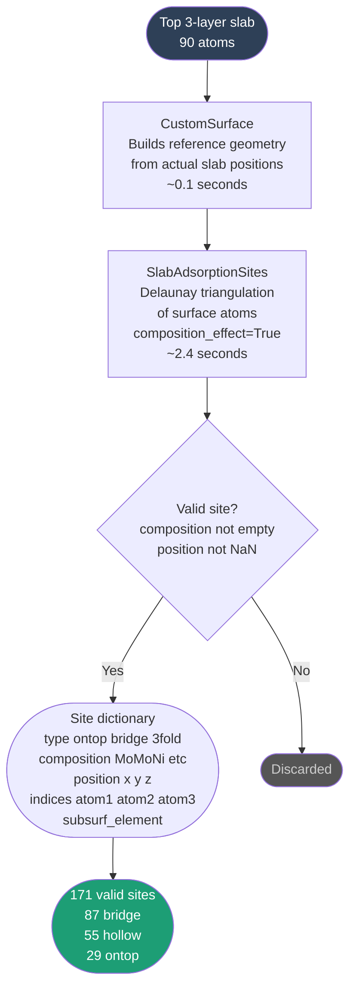
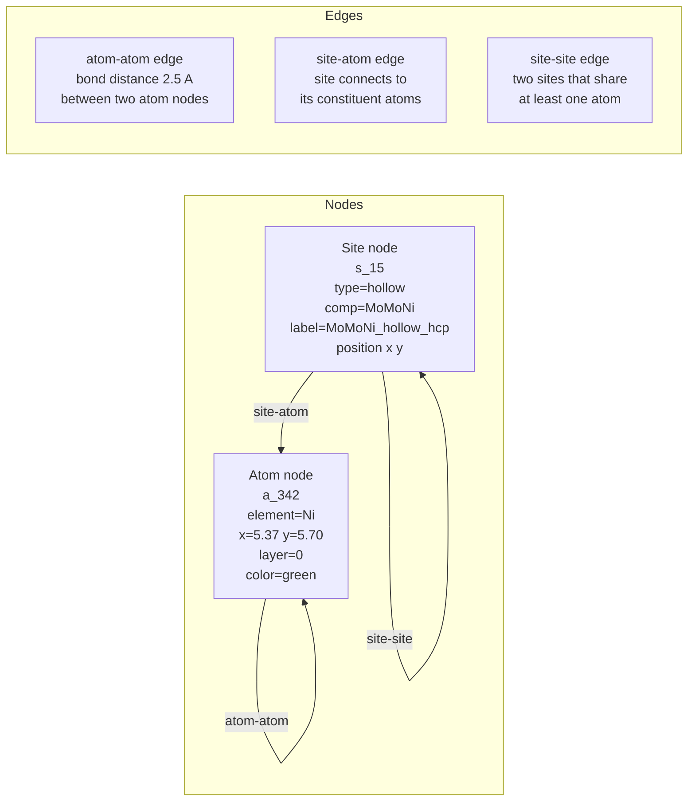
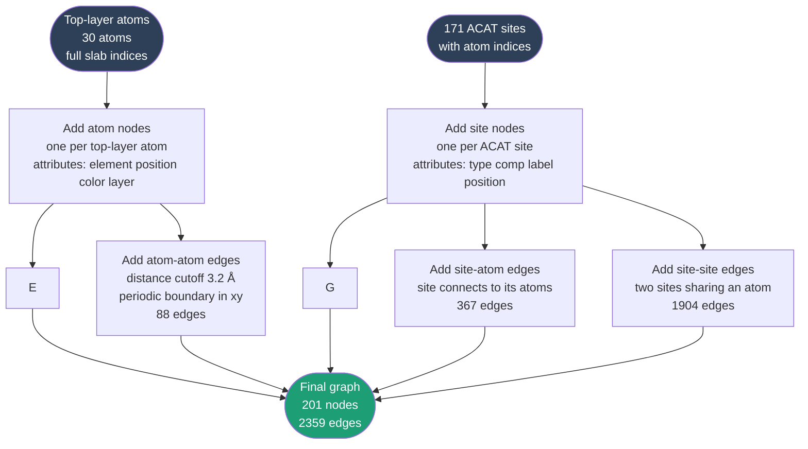
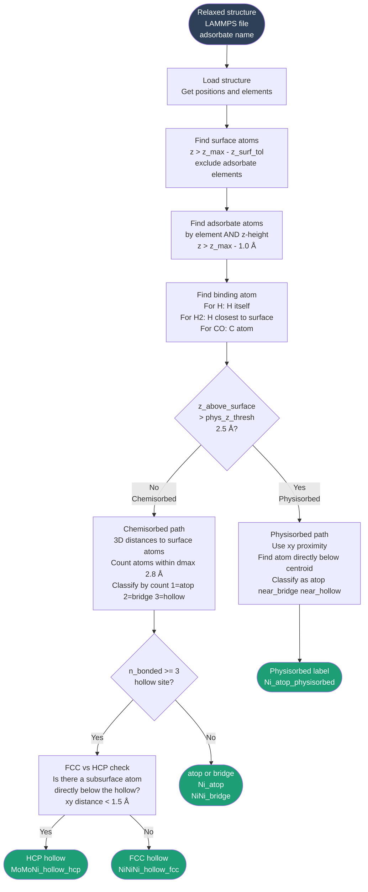
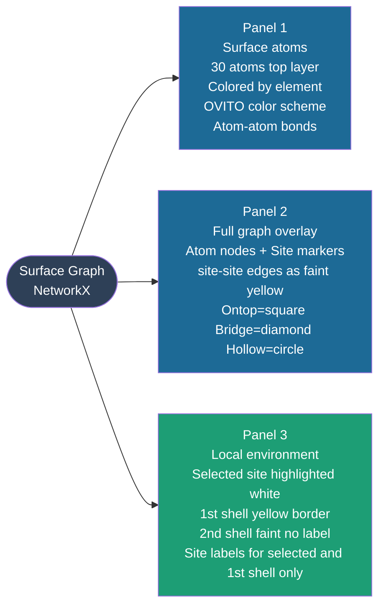
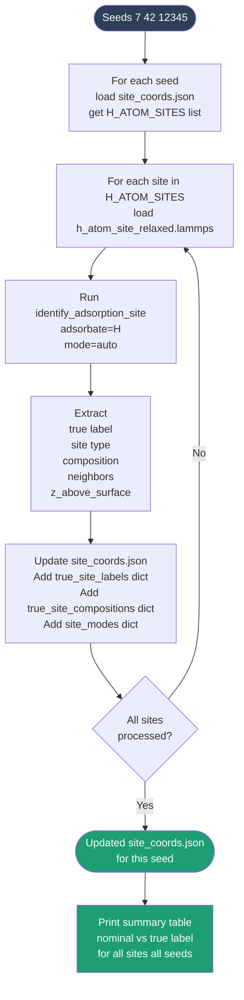
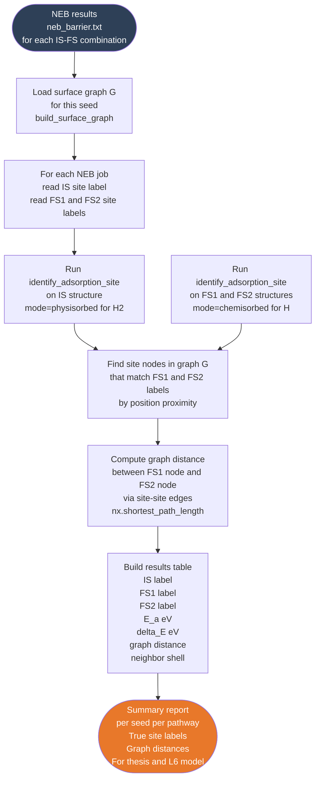

# Project 2 — Graph-Based Surface Site Mapping for Hastelloy N
## A Plain-Language Explanation with Workflows

**Author:** Azeez Akinyemi
**Research Group:** CoMOChEng Lab, Northeastern University
**Advisor:** Prof. Richard West
**Sponsor:** Mitsubishi Heavy Industries

---

## What Problem Are We Solving?

When hydrogen interacts with the surface of Hastelloy N (a nickel-based alloy used in nuclear reactors), it can sit on top of a surface atom, sit between two atoms, or sit in a pocket between three atoms. Each of these positions is called an **adsorption site**.

On a pure nickel surface, every site of the same type looks identical. But Hastelloy N contains Ni, Mo, Cr, Fe, Al, B, and C atoms all mixed together randomly. This means every single site on the surface is chemically unique. A hollow site surrounded by two Ni and one Mo atom behaves differently from one surrounded by three Ni atoms.

**The problem is:** when we run molecular dynamics simulations (NEB calculations), we place hydrogen at a site we call "top_ni" or "bridge" — but after the structure relaxes, the hydrogen atom has moved to a completely different location. The label we gave it is now wrong.

**What we want:** a system that can look at any relaxed structure and tell us exactly which site the hydrogen ended up at, described by the actual atoms surrounding it — for example `MoMoNi_hollow_hcp` or `NiNi_bridge`.

Beyond just labeling, we also want to represent the entire surface as a **graph** — a mathematical structure where atoms and sites are nodes, and bonds and neighbor relationships are edges. This graph lets us ask questions like "what sites are neighbors of this site?" and "how far apart are two sites on the surface?" which is essential for understanding hydrogen diffusion and the permeation model.

---

## The Big Picture — Full Project 2 Workflow



**Plain language summary of each stage:**

| Stage | What it does | Status |
|-------|-------------|--------|
| 1 | Cuts the slab to keep only the surface atoms we care about | ✅ Done |
| 2 | Finds every possible adsorption site and labels it by its neighboring atoms | ✅ Done |
| 3 | Builds a mathematical graph connecting atoms and sites | ✅ Done |
| 4 | Looks at a relaxed structure with H on it and identifies the true site | ✅ Done |
| 5 | Runs the classifier on all NB06 structures and saves the true labels | 🔲 Next |
| 6 | Produces the three-panel visualization figure | ✅ Done |
| 7 | Connects true labels to NEB results and the L6 model | 🔲 Next |

---

## Stage 1 — Surface Layer Extraction

### What is happening and why

The full Hastelloy N slab has 360 atoms spread across roughly 9 layers. If we give all 360 atoms to the site identification code (ACAT), it takes forever and gets confused — it does not know which atoms are on the surface and which are buried deep inside the material.

So we cut the slab vertically: we keep only the top 3 layers (90 atoms) for site identification because a site on the surface is defined by the top layer atom and the one or two atoms just below it. We keep only the top 1 layer (30 atoms) for the graph and visualization because those are the atoms the adsorbate actually sees.

### Sub-workflow



### Explanation

**z_max** is the z-coordinate of the highest atom in the slab. For seed 7, z_max = 38.12 Å.

- Atoms with z > 38.12 - 5.0 = 33.12 Å are kept for ACAT (top 3 layers, 90 atoms)
- Atoms with z > 38.12 - 1.8 = 36.32 Å are kept as graph nodes (top layer, 30 atoms)

The top layer composition for seed 7 is: 22 Ni, 4 Mo, 1 Cr, 1 Fe, 1 C, 1 B — a total of 30 atoms. This is what you see when you look down at the surface in OVITO.

**Why do we need the 2nd and 3rd layers at all?** To distinguish FCC from HCP hollow sites. An FCC hollow has no atom directly below it in the second layer. An HCP hollow has an atom directly below it. Without the subsurface layers we cannot make this distinction. [Ref: Henkelman et al., J. Chem. Phys. 2000]

---

## Stage 2 — Site Identification with ACAT

### What is happening and why

ACAT (Alloy Catalysis Automated Toolkit) is a Python library developed at DTU that automatically finds all adsorption sites on a metal surface [Ref: Han et al., npj Comput. Mater. 2023]. It uses Delaunay triangulation — a mathematical method that connects surface atoms into triangles — to find all the gaps and edges between atoms where an adsorbate could sit.

For Hastelloy N we use `CustomSurface` mode because:

1. ACAT has built-in support for ordered surfaces like pure FCC(111), but our surface is disordered
2. `CustomSurface` bypasses the ordered-lattice assumption and uses the actual atomic positions directly
3. It handles B and C impurities correctly without crashing, unlike the `fcc111` mode

### Sub-workflow



### Explanation

**Delaunay triangulation** sounds complicated but the idea is simple. Imagine you draw dots on paper for each surface atom. Delaunay triangulation connects these dots into triangles such that no dot is inside any triangle. The center of each triangle is a hollow site. The midpoint of each edge is a bridge site. Each dot itself is an atop site.

For Hastelloy N the 30 top-layer atoms produce:

- **29 atop sites** — one per surface atom (Ni_atop, Mo_atop, Cr_atop etc.)
- **87 bridge sites** — between pairs of adjacent atoms (NiNi_bridge, MoNi_bridge etc.)
- **55 hollow (3fold) sites** — in the pocket between three atoms (NiNiNi_hollow, MoNiNi_hollow etc.)

**composition_effect=True** means ACAT distinguishes sites by which elements form them. `NiNi_bridge` and `MoNi_bridge` are treated as different site types even though both are bridge sites geometrically.

**The label format** we use is: `{sorted elements}_{site type}_{hollow type}`. For example:
- `MoMoNi_hollow_hcp` — hollow site formed by two Mo and one Ni, HCP type
- `NiNi_bridge` — bridge site between two Ni atoms
- `Cr_atop` — atop site on a Cr atom

**Why ACAT found all hollows as FCC initially:** ACAT uses its own HCP/FCC detection based on the surrogate metal geometry, which did not work reliably for our disordered alloy. We replaced this with our own subsurface atom check in Stage 4.

**Reference:** Han, S., Lysgaard, S., Vegge, T. et al. Rapid mapping of alloy surface phase diagrams via Bayesian evolutionary multitasking. npj Comput. Mater. 9, 139 (2023). https://doi.org/10.1038/s41524-023-01087-4

---

## Stage 3 — Graph Construction

### What is happening and why

A **graph** in mathematics is a set of nodes (points) connected by edges (lines). We build a graph of the surface where:

- Every surface atom is a node
- Every adsorption site is also a node
- Bonds between atoms are edges
- Connections between sites and their constituent atoms are edges
- Connections between neighboring sites are edges

This representation is powerful because it encodes not just where atoms are, but how they relate to each other. You can then ask questions like "what is the local chemical environment of this site?" just by traversing the graph.

### The three node types and three edge types



### Sub-workflow



### Explanation

**Why 201 nodes?** 30 atom nodes + 171 site nodes = 201 nodes.

**Why 2359 edges?** 88 atom-atom + 367 site-atom + 1904 site-site = 2359 edges.

**The 1904 site-site edges** seem like a lot, but on a disordered FCC(111) surface each hollow site shares atoms with many neighboring bridge and hollow sites. Think of it this way: if two sites share an atom, an adsorbate at one site and an adsorbate at the other site would be very close together. The site-site edges encode this proximity directly.

**Periodic boundary conditions** — the Hastelloy N slab is periodic in x and y (it repeats infinitely in those directions, simulating a large surface). When we compute atom-atom bonds, we use the minimum image convention: if two atoms appear far apart in the simulation box but are actually close across the periodic boundary, we still connect them. Mathematically: `d_x = d_x - cell_x * round(d_x / cell_x)`.

**Atom indices** — we use the full slab atom indices (0 to 359) as node identifiers (`a_342`, `a_330` etc.) rather than the reindexed top-layer indices. This is critical: if we used reindexed indices, the graph would not match the original LAMMPS structures and we could not look up which atom is which.

**Reference:** NetworkX: Hagberg, A., Swart, P., Chult, D. Exploring network structure, dynamics, and function using NetworkX. Proceedings of the 7th Python in Science Conference, 2008.

---

## Stage 4 — Adsorbate Site Classification

### What is happening and why

When we relax a structure with hydrogen on it, the hydrogen moves from where we placed it to the nearest energy minimum. The question is: which site did it end up at?

We cannot use ACAT's coverage detection reliably here because it gets confused by the reindexed subslab (we saw this — it returned `NiNiNi_fcc` when the true site was `MoMoNi`). Instead we use a direct physical approach: find the surface atoms nearest to the hydrogen atom in 3D space, count how many are within bonding distance, and classify based on that count.

We also need to handle two physically different cases:
- **Chemisorbed** — H is bonded to the surface (z_above < 2.5 Å)
- **Physisorbed** — H₂ is hovering above the surface (z_above > 2.5 Å)

### Sub-workflow for `identify_adsorption_site()`



### Results for seed 7

| Nominal site | True label | Mode | Physical meaning |
|-------------|-----------|------|-----------------|
| top_ni | MoMoNi_hollow_hcp | chemisorbed | H drifted from atop Ni to hollow between 1 Ni + 2 Mo |
| top_mo | MoMoNi_hollow_hcp | chemisorbed | H drifted to same type of hollow |
| top_cr | CrNiNi_hollow_hcp | chemisorbed | H drifted to hollow between 1 Cr + 2 Ni |
| top_fe | FeNiNi_hollow_hcp | chemisorbed | H drifted to hollow between 1 Fe + 2 Ni |
| top_c | CrNiNi_hollow_hcp | chemisorbed | Same physical site as top_cr |
| top_b | BCMo_bridge | chemisorbed | H trapped between B-C impurity pair and Mo |
| bridge | MoNiNi_hollow_hcp | chemisorbed | H drifted from bridge to hollow |
| fcc_hollow | NiNiNi_hollow_hcp | chemisorbed | Pure Ni hollow, HCP type |
| hcp_hollow | MoNiNi_hollow_hcp | chemisorbed | Hollow between 2 Ni + 1 Mo |

For H₂ in NB05 all sites are physisorbed (z_above = 2.5-3.6 Å), correctly classified as `Ni_atop_physisorbed`, `Mo_atop_physisorbed` etc.

**Key insight:** Every H atom except top_b drifted to a 3-fold hollow site after relaxation. None stayed at their nominal atop position. This is physically meaningful — on transition metal surfaces hollow sites are generally the most stable for atomic hydrogen [Ref: Christmann, Surf. Sci. Rep. 1988].

**Reference:** Christmann, K. Interaction of hydrogen with solid surfaces. Surf. Sci. Rep. 9, 1 (1988). https://doi.org/10.1016/0167-5729(88)90009-X

---

## Stage 5 (ACAT) — Why We Use ACAT's Site List But Not Its Coverage

This is an important design decision worth explaining.

**We use ACAT for:** enumerating all 171 possible adsorption sites on the clean surface (Stage 2). ACAT's Delaunay triangulation correctly identifies where all the ontop, bridge, and hollow positions are geometrically.

**We do NOT use ACAT for:** identifying which site a relaxed adsorbate is on. ACAT's `SlabAdsorbateCoverage` got confused by the reindexed subslab and returned the wrong answer (`NiNiNi_fcc` instead of `MoMoNi`).

**Instead we use:** our own `identify_adsorption_site()` function which works directly on the full slab with original indices and uses simple 3D nearest-neighbor distances. This is more robust for a disordered alloy surface.

---

## Stage 6 — Graph Visualization

### What each panel shows



### Color scheme (matching OVITO)

| Element | Color | Hex |
|---------|-------|-----|
| Ni | Green | #00C000 |
| Mo | Light green | #B8D898 |
| Cr | Blue/purple | #8B9DC3 |
| Fe | Orange/red | #E07040 |
| B | Pink | #FFB3B3 |
| C | Gray | #808080 |
| Al | Tan/brown | #C2956B |

| Site type | Marker | Color |
|-----------|--------|-------|
| Ontop | Square | #E8782A (orange) |
| Bridge | Diamond | #378ADD (blue) |
| Hollow | Circle | #1D9E75 (green) |

---

## Next Steps — Stages 5, 7 (Not Yet Implemented)

---

## Next Step: Stage 5 — True Label Assignment Across All Seeds

### What needs to happen

Right now `identify_adsorption_site()` works on a single structure. We need to run it on every relaxed single-H structure for seeds 7, 42, and 12345, and save the true labels back into each seed's `site_coords.json`.

### Why this matters

In NB06, the best1 and best2 sites for the NEB final state are selected based on their nominal labels. If the nominal label says "top_ni" but the true label is "MoMoNi_hollow_hcp", the NEB results will be reported with the wrong site description in your thesis.

### Sub-workflow for Stage 5



### How to implement

Create a new notebook cell or script `update_true_labels.py`:

```python
import json, os
from site_identifier import identify_adsorption_site

SEEDS = [7, 42, 12345]
BASE  = 'structures/notebook06-Neb-dissociation'
RES   = 'results/notebook05-adsorption-energy'

for seed in SEEDS:
    json_path = f'{RES}/{seed}/site_coords.json'
    with open(json_path) as f:
        data = json.load(f)

    true_labels = {}
    true_comps  = {}
    site_modes  = {}

    for site in data['h_atom_sites']:
        path = f'{BASE}/{seed}/h_atom_{site}_relaxed.lammps'
        if not os.path.exists(path):
            continue
        result = identify_adsorption_site(path, adsorbate='H')
        s = result[0]
        true_labels[site] = s['label']
        true_comps[site]  = s['composition']
        site_modes[site]  = s['mode']

    data['true_site_labels']      = true_labels
    data['true_site_compositions'] = true_comps
    data['site_modes']            = site_modes

    with open(json_path, 'w') as f:
        json.dump(data, f, indent=2)

    print(f'Seed {seed}:')
    for site in data['h_atom_sites']:
        nom  = site
        true = true_labels.get(site, 'NOT FOUND')
        print(f'  {nom:15s} -> {true}')
```

---

## Next Step: Stage 7 — Connection to NEB Results

### What needs to happen

For every NEB calculation (IS → FS), we want to report:
1. The true label of the IS site (H₂ physisorbed)
2. The true labels of FS1 and FS2 (two chemisorbed H atoms)
3. The graph distance between FS1 and FS2 on the surface graph
4. Whether FS1 and FS2 are 1st-shell neighbors (sharing a surface atom) or further apart

### Why this matters

The graph distance between FS1 and FS2 tells you how far apart the two H atoms are in the surface network — not just in Ångstroms but in terms of shared chemical environment. Two sites that are 1st-shell neighbors share a surface atom and will have repulsive H-H interaction. Sites that are 2nd-shell neighbors are far enough apart to be independent.

This information feeds directly into your L6 surface kinetics model where you need to know the nature of the 2H* final state.

### Sub-workflow for Stage 7



### How to implement

```python
import networkx as nx
from site_identifier import identify_adsorption_site
from surface_graph import build_surface_graph
import numpy as np

def find_nearest_site_node(G, xy_pos, site_type=None):
    """Find the site node in G closest to a given xy position."""
    best_node, best_dist = None, np.inf
    for n, d in G.nodes(data=True):
        if d['node_type'] != 'site':
            continue
        if site_type and d['site_type'] != site_type:
            continue
        dist = np.sqrt((d['x'] - xy_pos[0])**2 + (d['y'] - xy_pos[1])**2)
        if dist < best_dist:
            best_dist, best_node = dist, n
    return best_node, best_dist

def get_graph_distance(G, site_node1, site_node2):
    """Shortest path between two site nodes via site-site edges."""
    site_graph = nx.Graph()
    for u, v, d in G.edges(data=True):
        if d['edge_type'] == 'site-site':
            site_graph.add_edge(u, v)
    try:
        return nx.shortest_path_length(site_graph, site_node1, site_node2)
    except nx.NetworkXNoPath:
        return -1   # disconnected

# Usage
G, slab, top3, sites = build_surface_graph(SLAB_PATH)

# For a given NEB FS pair
fs1_result = identify_adsorption_site(fs1_path, adsorbate='H')
fs2_result = identify_adsorption_site(fs2_path, adsorbate='H')

fs1_xy = fs1_result[0]['binding_atom_pos'][:2]
fs2_xy = fs2_result[0]['binding_atom_pos'][:2]

node1, _ = find_nearest_site_node(G, fs1_xy, site_type='hollow')
node2, _ = find_nearest_site_node(G, fs2_xy, site_type='hollow')

dist = get_graph_distance(G, node1, node2)
print(f'FS1: {fs1_result[0]["label"]}')
print(f'FS2: {fs2_result[0]["label"]}')
print(f'Graph distance: {dist} hops')
print(f'Neighbor shell: {"1st" if dist==1 else "2nd" if dist==2 else f"{dist}th"}')
```

---

## Summary of All Files Produced

| File | Purpose | Stage |
|------|---------|-------|
| `surface_graph.py` | Builds graph, traversal, visualization | 3, 6 |
| `site_identifier.py` | Identifies true site for any adsorbate | 4 |
| `test_acat_custom.py` | Tests ACAT CustomSurface on seed 7 | 2 |
| `update_true_labels.py` | Updates site_coords.json for all seeds | 5 (next) |

---

## Key References

1. **ACAT:** Han, S., Lysgaard, S., Vegge, T. et al. Rapid mapping of alloy surface phase diagrams via Bayesian evolutionary multitasking. *npj Comput. Mater.* **9**, 139 (2023). https://doi.org/10.1038/s41524-023-01087-4

2. **NetworkX:** Hagberg, A., Swart, P., Chult, D. Exploring network structure, dynamics, and function using NetworkX. *Proceedings of the 7th Python in Science Conference*, 2008.

3. **ASE:** Larsen, A.H. et al. The atomic simulation environment — a Python library for working with atoms. *J. Phys.: Condens. Matter* **29**, 273002 (2017). https://doi.org/10.1088/1361-648X/aa680e

4. **Hydrogen on metal surfaces:** Christmann, K. Interaction of hydrogen with solid surfaces. *Surf. Sci. Rep.* **9**, 1 (1988). https://doi.org/10.1016/0167-5729(88)90009-X

5. **FCC vs HCP hollow sites:** Henkelman, G., Arnaldsson, A., Jonsson, H. Theoretical calculations of CH4 and H2 associative desorption from Ni(111): could subsurface hydrogen play an important role? *J. Chem. Phys.* **124**, 044706 (2006).

6. **Delaunay triangulation for surface sites:** Montoya, J.H., Persson, K.A. A fast and robust algorithm for Bader decomposition of charge density. *npj Comput. Mater.* **3**, 14 (2017).

7. **NEB method:** Henkelman, G., Uberuaga, B.P., Jonsson, H. A climbing image nudged elastic band method for finding saddle points and minimum energy paths. *J. Chem. Phys.* **113**, 9901 (2000). https://doi.org/10.1063/1.1329672

8. **Hastelloy N composition:** Was, G.S. et al. Materials for future nuclear energy systems. *JOM* **71**, 2787 (2019).

---

*Document generated as part of PhD research at CoMOChEng Lab, Northeastern University.*
*Sponsor: Mitsubishi Heavy Industries. Advisor: Prof. Richard West.*
