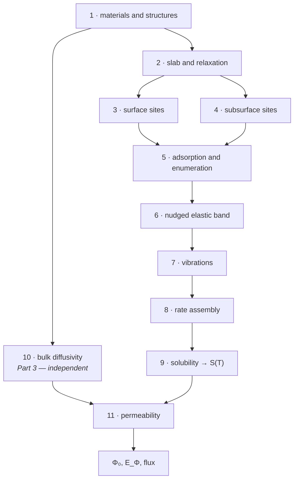

# Part I — Overview

What the workflow computes, how its stages fit together, and what it assumes.

> [!NOTE]
> **Scope.** Method only; no numbers from any real run. Equations are in
> [Part II](02-theory.md); the collapse from many quantities to few is in
> [the aggregation ladder](02b-aggregation.md); each stage is in
> [`03-stages/`](03-stages/).

## Contents

- [1.1 What the workflow answers](#11-what-the-workflow-answers)
- [1.2 Ways of running it](#12-ways-of-running-it)
- [1.3 The pipeline at a glance](#13-the-pipeline-at-a-glance)
- [1.4 Assumptions and limits](#14-assumptions-and-limits)
- [1.5 Software and environment](#15-software-and-environment)

---

## 1.1 What the workflow answers

The question is: **how fast does hydrogen pass through this metal, and why?**

That decomposes into six questions the workflow answers in order.

1. **Where can hydrogen sit** on the surface and in the lattice, and how do
   those places differ from one another? — Stages
   [3](03-stages/03-surface-site-mapping.md) and
   [4](03-stages/04-subsurface-site-mapping.md)
2. **What does it cost** to split a molecule on the surface and move an atom
   into the lattice? — Stages [5](03-stages/05-adsorption-and-enumeration.md)
   and [6](03-stages/06-neb.md)
3. **How often** does each of those steps happen at temperature? — Stages
   [7](03-stages/07-vibrations-phva.md) and
   [8](03-stages/08-tst-rate-assembly.md)
4. **How much hydrogen** does the lattice hold at equilibrium? — Stage
   [9](03-stages/09-solubility.md), giving $S(T)$
5. **How fast does it move** once dissolved? — Stage
   [10](03-stages/10-bulk-diffusivity.md), giving $D(T)$
6. **What permeability** do those two imply? — Stage
   [11](03-stages/11-permeability-assembly.md), giving $\Phi = DS$

Questions 1–4 form one chain and question 5 another. They are independent all
the way down and meet only at question 6.

> [!IMPORTANT]
> The workflow answers "why" as well as "how fast". $E_\Phi = E_D +
> \Delta H_{\mathrm{sol}}$ (T25) splits the permeation barrier into a transport
> part and a dissolution part, so a material can be slow for two quite
> different reasons. A measurement of $\Phi$ alone cannot distinguish them.

## 1.2 Ways of running it

The pipeline is split into **three Parts**, which map onto the stages as:

| Part | stages | produces | depends on |
|---|---|---|---|
| **Part 1** — surface | 1–8, dissociation family | $\Delta H_{\mathrm{diss}}$ and surface rates | — |
| **Part 3** — bulk diffusivity | 1, 10 | $D_0$, $E_D$, and the lattice parameter against temperature | — |
| **Part 2** — permeation | 1–9, 11, hop families | $S(T)$, $\Phi$ | Parts 1 and 3 |

Parts 1 and 3 are independent and can run at the same time. Part 2 needs both.

Four ways to drive them:

| route | runs | use when |
|---|---|---|
| the master notebook | everything, in dependency order | a new material, start to finish |
| the surface notebook | Part 1 alone | iterating on surface chemistry |
| the diffusivity notebook | Part 3 alone | iterating on the molecular dynamics |
| the permeation notebook | Part 2 alone | Parts 1 and 3 are done and current |

> [!IMPORTANT]
> The script **regenerators** are developer tools, not a way to run the
> workflow. They rewrite the generated per-material scripts in place, which is
> what you want after changing a template or patching a bug — not what you want
> as a first step on a new material.

### Re-running and idempotency

Every expensive stage is gated by a marker file, so re-running is cheap and
safe: completed work is skipped and named. Forcing a stage to repeat means
deleting its marker.

> [!IMPORTANT]
> Markers for the dynamics and for its post-processing are **separate**. A
> loading can hold complete trajectories and no fit, in which case re-deriving
> costs seconds while repeating the dynamics costs GPU-days. Check which is
> missing before deleting anything — see
> [Stage 10](03-stages/10-bulk-diffusivity.md#checks-and-failure-modes).

## 1.3 The pipeline at a glance

**Figure 1.** Stage dependencies. Note the two independent descents — the
surface chain through 2–9 and the bulk chain through 10 — meeting only at 11.
A break anywhere in the left chain leaves diffusivity results intact, and the
reverse.

| # | stage | main inputs | main outputs | code |
|---|---|---|---|---|
| 1 | materials and structures | structure files | classified materials, bulk cells with hydrogen | [`materials.py`](../models/materials.py), [`structure.py`](../models/structure.py) |
| 2 | slab and relaxation | bulk cell | relaxed slab, freeze cutoff | [`structure.py`](../models/structure.py) |
| 3 | surface sites | relaxed slab | surface sites with labels | [`surface_graph.py`](../models/surface_graph.py) |
| 4 | subsurface sites | relaxed slab, surface sites | interstitials, labels, layer connections | [`subsurface_graph.py`](../models/subsurface_graph.py) |
| 5 | enumeration | sites | filtered pathway list | [`neb_workflow.py`](../models/neb_workflow.py) |
| 6 | band | pathways | barriers, reaction energies, saddles | [`ase_neb.py`](../models/ase_neb.py) |
| 7 | vibrations | state geometries | frequency lists | [`vibrations.py`](../models/vibrations.py) |
| 8 | rate assembly | barriers, frequencies | rates, prefactors, quality census | [`tst_rates.py`](../models/tst_rates.py) |
| 9 | solubility | reaction energies, lattice parameter | $\Delta H_{\mathrm{sol}}(e)$, $S(T)$ | [`permeation.py`](../models/permeation.py) |
| 10 | bulk diffusivity | bulk cell, loadings, temperatures | $D_0$, $E_D$, $a_0(T)$ | [`diffusivity_workflow.py`](../models/diffusivity_workflow.py) |
| 11 | permeability | $S(T)$, $D_0$, $E_D$ | $\Phi_0$, $E_\Phi$, flux | [`permeation.py`](../models/permeation.py) |

## 1.4 Assumptions and limits

### Physical

| assumption | where it enters | what breaks without it |
|---|---|---|
| harmonic transition-state theory | every rate | rates at temperatures where anharmonicity matters |
| dilute dissolved hydrogen | Sieverts' law, the permeability | solubility and permeability above the dilute regime |
| equilibrium between gas and lattice | the whole solubility construction | any kinetically limited situation |
| diffusion is isotropic and three-dimensional | the Einstein relation | layered or strongly anisotropic transport |
| one elementary step per pathway | every barrier | a path with several maxima |
| the potential describes this chemistry | everything | silently, everywhere |

### Methodological

| limit | consequence |
|---|---|
| the partial Hessian freezes most of the lattice | spurious low and imaginary modes are **expected**; thresholds exist to manage them |
| the alloy slab has no short-range chemical order | the distribution of environments reflects random mixing |
| environment weights are pathway fractions | sampling acts as an implicit weight on the solubility |
| validated for close-packed faces of face-centred-cubic materials | other faces and body-centred-cubic surfaces are untested |
| three temperatures give a one-degree-of-freedom Arrhenius fit | quoted parameter errors are formal and optimistic |

### The one that cannot be designed away

> [!IMPORTANT]
> **No hydrogen loading is both dilute and well sampled.** The dilute limit the
> permeability formulas assume is a single atom; a single atom is exactly the
> case whose mean-squared displacement has no ensemble average and so converges
> worst. Raising the loading buys statistics at the cost of the assumption, and
> lowering it does the reverse. There is no setting that resolves this — only a
> choice, which should be stated alongside any number it affects. See
> [Part II §9.4](02-theory.md#94-validity).

## 1.5 Software and environment

| component | role |
|---|---|
| a machine-learned interatomic potential | every energy and force |
| a molecular-dynamics engine | minimisation, constant-pressure and constant-volume dynamics |
| an atomistic simulation library | band relaxation, vibrations, structure handling |
| a surface-site enumeration library | candidate adsorption sites |
| a scheduler | all expensive stages, as chained array jobs |

Versions this documentation was checked against are recorded in the scope note
of [Part II](02-theory.md), together with the command that re-checks the
equations.

### Where the work runs

The expensive stages — relaxation, bands, vibrations, dynamics — are written as
**standalone generated scripts**, one per material, submitted to a scheduler.
The library in `models/` writes those scripts; it does not run the physics
itself.

This matters for reading the code: a function named for a stage usually
*generates* that stage rather than performing it, and the procedure to follow is
in the generated script's body.

> [!IMPORTANT]
> Paths, partitions and module names in the configuration are specific to one
> cluster. Check them against your environment before running anything; nothing
> validates them, and a wrong path fails at submission rather than at
> configuration.
