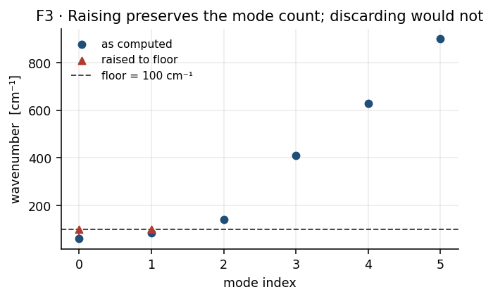
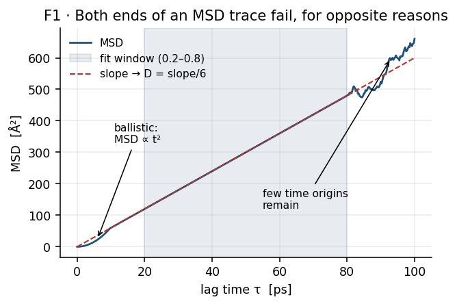
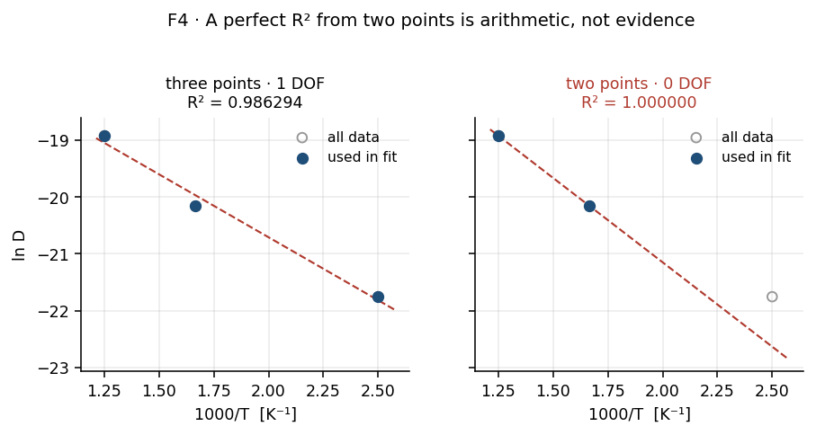

# Part II — Theory

Every equation, definition and invariant the workflow relies on, in one place,
with units. The stage sections in [`03-stages/`](03-stages/) link here by
equation number instead of restating any of this.

> [!NOTE]
> **Scope.** This part describes the method only. It contains no numbers from any
> real calculation; the figures and worked values come from the fictitious system
> in [`figures/example/toy.py`](figures/example/toy.py). Every numbered equation
> below is verified against the code by
> [`figures/check_equations.py`](figures/check_equations.py), which prints one
> `PASS`/`FAIL` line per equation. Checked against ASE 3.26.0, MACE 0.3.8,
> NumPy 1.26.4, SciPy 1.13.1 on 2026-10-09. Re-check with:
>
> ```bash
> ~/anaconda3/envs/mace_env/bin/python docs/figures/check_equations.py
> ```

## Contents

- [1. Conventions](#1-conventions)
- [2. Constants](#2-constants)
- [3. Energetics](#3-energetics)
- [4. Vibrational analysis](#4-vibrational-analysis)
- [5. Transition-state theory](#5-transition-state-theory)
- [6. Gas-phase reference and the surface](#6-gas-phase-reference-and-the-surface)
- [7. Solubility](#7-solubility)
- [8. Diffusion](#8-diffusion)
- [9. Permeability](#9-permeability)
- [10. Uncertainty](#10-uncertainty)
- [11. Invariants](#11-invariants)
- [12. Equation index](#12-equation-index)

---

## 1. Conventions

### 1.1 Symbols

Generic symbols are used throughout. A *state* is one of three stationary points
on a reaction path:

| symbol | name | meaning |
|---|---|---|
| IS | initial state | the reactant minimum |
| TS | transition state | the saddle separating IS from FS |
| FS | final state | the product minimum |

An *environment* $e$ is a class of interstitial site distinguished by its
neighbour shell. Sites in the same environment are treated as equivalent and are
averaged over; environments are kept distinct and summed over with weights. The
distinction matters, and §7.2 is where it takes effect.

### 1.2 Units

Energies are in electronvolts, **not** joules or kJ/mol. Frequencies are
*wavenumbers* in $\mathrm{cm^{-1}}$ as produced by the vibration stage, not
angular frequencies. Lengths are metres in all derived quantities, even though
the structure files use ångström.

| quantity | symbol | unit |
|---|---|---|
| energy, barrier, enthalpy | $E$, $E_a$, $\Delta H$ | $\mathrm{eV}$ |
| wavenumber | $\tilde\nu$ | $\mathrm{cm^{-1}}$ |
| attempt frequency, rate | $\nu^*$, $k$ | $\mathrm{s^{-1}}$ |
| temperature | $T$ | $\mathrm{K}$ |
| lattice parameter, thickness | $a_0$, $L$ | $\mathrm{m}$ |
| diffusivity | $D$ | $\mathrm{m^2\,s^{-1}}$ |
| solubility | $S$ | $\mathrm{mol\,m^{-3}\,Pa^{-1/2}}$ |
| permeability | $\Phi$ | $\mathrm{mol\,m^{-1}\,s^{-1}\,Pa^{-1/2}}$ |
| flux | $J$ | $\mathrm{mol\,m^{-2}\,s^{-1}}$ |
| pressure | $P$ | $\mathrm{Pa}$ |

> [!IMPORTANT]
> The half-power of pressure in $S$ and $\Phi$ is not decorative. It is the
> signature of Sieverts' law — diatomic gas dissolving as atoms — and it means
> those units are implicitly *per* $\sqrt{1\ \mathrm{Pa}}$. A reference pressure
> that is not exactly $1\ \mathrm{Pa}$ changes what the number means without
> changing the number. See §7.3.

### 1.3 Sign conventions

A barrier is always positive and always measured from the state it leaves:

$$E_a = E_{\mathrm{TS}} - E_{\mathrm{IS}} \qquad
  E_{\mathrm{des}} = E_{\mathrm{TS}} - E_{\mathrm{FS}} \tag{T1}$$

A reaction energy is signed, negative for exothermic:

$$\Delta E = E_{\mathrm{FS}} - E_{\mathrm{IS}} \tag{T2}$$

A solution enthalpy $\Delta H_{\mathrm{sol}} > 0$ means dissolution is
endothermic, so occupancy falls as temperature falls.

> [!IMPORTANT]
> Because $E_{\mathrm{des}}$ is referenced to FS and $E_a$ to IS, their
> zero-point corrections use **different** states. Getting this wrong leaves the
> reverse barrier with the forward barrier's correction, which silently cancels
> in $\Delta E$ and is therefore easy to miss. See §4.2 and equation (T6).

---

## 2. Constants

| symbol | value | unit | note |
|---|---|---|---|
| $k_B$ | $8.617333262\times10^{-5}$ | $\mathrm{eV\,K^{-1}}$ | CODATA 2018 |
| $k_B$ | $1.380649\times10^{-23}$ | $\mathrm{J\,K^{-1}}$ | SI form, for the gas terms |
| $h$ | $4.135667696\times10^{-15}$ | $\mathrm{eV\,s}$ | |
| $c$ | $2.99792458\times10^{10}$ | $\mathrm{cm\,s^{-1}}$ | converts $\mathrm{cm^{-1}}$ to $\mathrm{s^{-1}}$ |
| $N_A$ | $6.02214076\times10^{23}$ | $\mathrm{mol^{-1}}$ | |

> [!IMPORTANT]
> One Boltzmann constant, defined once per module, must be identical everywhere.
> It has not always been: two modules once carried a seven-digit truncation,
> which appeared as a $\sim10^{-7}$ relative disagreement in $D(T)$ between
> stages. Physically irrelevant, but it made cross-module agreement untestable
> at tight tolerance. Four checks now pin all definitions together.

### 2.1 Unit conversions

A wavenumber is an energy divided by $hc$, so

$$E[\mathrm{eV}] = h\,c\,\tilde\nu = 1.23984198\times10^{-4}\ \tilde\nu[\mathrm{cm^{-1}}] \tag{T3}$$

Mean-squared displacement is reported in $\mathrm{\mathring A^2}$ against time in
$\mathrm{ps}$, so a slope in $\mathrm{\mathring A^2\,ps^{-1}}$ becomes SI by

$$1\ \mathrm{\mathring A^2\,ps^{-1}} = \frac{(10^{-10})^2\ \mathrm{m^2}}{10^{-12}\ \mathrm{s}} = 10^{-8}\ \mathrm{m^2\,s^{-1}} \tag{T4}$$

---

## 3. Energetics

Binding of $n$ adsorbed atoms, referenced to the clean surface and the gas-phase
diatomic:

$$E_{\mathrm{bind}} = E(\text{slab}+n\mathrm{H}) - E(\text{slab}) - \tfrac{n}{2}E(\mathrm{H_2}) \tag{T5}$$

Barriers and reaction energies are (T1) and (T2). All three are electronic
energies from the potential: no thermal or zero-point contribution yet.

The gas-phase chemical potential sets the pressure reference,

$$\mu = \tfrac12 E(\mathrm{H_2}) + \tfrac12 k_B T \ln\!\left(P/P_0\right) \tag{T5a}$$

used only to convert between a chosen $\mu$ and the pressure it corresponds to.

---

## 4. Vibrational analysis

### 4.1 What is computed

Each stationary point is characterised by a *partial* Hessian: only a chosen
subset of atoms is displaced, the rest held fixed. This is Partial Hessian
Vibrational Analysis (PHVA). It is an approximation made for cost, and it has a
consequence that shapes everything downstream.

> [!IMPORTANT]
> Freezing most of the lattice removes the modes that would otherwise carry
> away pseudo-translation and pseudo-rotation of the mobile fragment. Those
> motions reappear mixed into the lowest frequencies of the partial Hessian, so
> **spurious low-frequency and imaginary modes are expected, not a sign of
> failure**. §4.3 and §5.2 exist to keep them from contaminating the results.

A mode is *real* if its eigenvalue is positive and *imaginary* otherwise.
Imaginary modes are reported as positive magnitudes. A proper minimum has no
imaginary modes; a proper saddle has exactly one.

### 4.2 Zero-point energy

$$\mathrm{ZPE} = \tfrac12 \sum_i h\,c\,\tilde\nu_i \tag{T6}$$

summed over real modes only. A barrier is corrected by the ZPE difference
between its two endpoints — and the endpoints differ by direction:

$$E_a^{\mathrm{ZPE}} = E_a + \left(\mathrm{ZPE_{TS}} - \mathrm{ZPE_{IS}}\right) \tag{T6a}$$

$$E_{\mathrm{des}}^{\mathrm{ZPE}} = E_{\mathrm{des}} + \left(\mathrm{ZPE_{TS}} - \mathrm{ZPE_{FS}}\right) \tag{T6b}$$

(T6b) is the equation that is easy to get wrong. Using $\mathrm{ZPE_{IS}}$ in
the reverse direction makes the correction cancel exactly in
$E_a^{\mathrm{ZPE}} - E_{\mathrm{des}}^{\mathrm{ZPE}}$, leaving the reaction
energy uncorrected while both barriers look corrected.

### 4.3 Quasi-harmonic treatment of low modes

Low frequencies are unreliable, and they enter the prefactor (T8) as a
*product*, where a near-zero denominator mode is unbounded. Two treatments are
possible: discard modes below a cutoff, or raise them to it. The workflow
raises:

$$\tilde\nu_i^{\mathrm{use}} = \max\!\left(\tilde\nu_i,\ \tilde\nu_{\mathrm{floor}}\right) \tag{T7}$$

with $\tilde\nu_{\mathrm{floor}} = 100\ \mathrm{cm^{-1}}$ by default. This is
Truhlar's quasi-harmonic treatment, standard in thermochemistry tooling.

Raising is preferred over discarding for two reasons. It leaves the **mode
counts unchanged**, so the dimensional invariant (I1) remains meaningful without
rebalancing. And it damps the artefact **symmetrically**, since the same floor
applies to both states and the spurious factors largely cancel in the ratio.



**Figure 1.** What the floor does to a mode list. Look at the count: every mode below the floor is moved up to it, and none is removed, so the list is the same length before and after. Discarding would shorten it and break (I1). Fictitious frequencies.

> [!IMPORTANT]
> Three thresholds with different meanings exist, and they once shared a name.
> They are not interchangeable:
>
> | threshold | default | action |
> |---|---|---|
> | quasi-harmonic floor | $100\ \mathrm{cm^{-1}}$ | **raise** modes below it to it |
> | ZPE inclusion | $0\ \mathrm{cm^{-1}}$ | **include** every real mode |
> | imaginary significance | $50\ \mathrm{cm^{-1}}$ | **ignore** imaginary modes below it when judging state quality |
> | partition-function cutoff | $50\ \mathrm{cm^{-1}}$ | **drop** modes below it |

### 4.4 Partition functions

Harmonic vibrational partition function, measured from the zero-point level:

$$q_{\mathrm{vib}}(T) = \prod_i \left[1 - \exp\!\left(-\frac{h c \tilde\nu_i}{k_B T}\right)\right]^{-1} \tag{T9}$$

Each factor exceeds unity, so $q_{\mathrm{vib}} \ge 1$ always. The gas-phase
diatomic reference $q^{\mathrm{gas}}(T,P)$ combines translational, rotational and
vibrational terms; its translational part carries a $1/P$ factor, which is why
the reference pressure propagates into §7.3.

---

## 5. Transition-state theory

### 5.1 Rate

Within harmonic TST a rate is an attempt frequency times a Boltzmann penalty:

$$k(T) = \nu^*\,\exp\!\left(-\frac{E_a^{\mathrm{ZPE}}}{k_B T}\right) \tag{T10}$$

The reverse rate uses the reverse barrier (T6b) **and the reverse prefactor**:

$$k_{\mathrm{rev}}(T) = \nu^*_{\mathrm{rev}}\,\exp\!\left(-\frac{E_{\mathrm{des}}^{\mathrm{ZPE}}}{k_B T}\right) \tag{T10a}$$

Reusing the forward $\nu^*$ in the reverse direction is a second easy error: the
two prefactors are built from different state pairs and are not equal.

### 5.2 Vineyard prefactor

$$\nu^* = c\,\frac{\prod_i \tilde\nu_i^{\mathrm{IS}}}{\prod_j \tilde\nu_j^{\mathrm{TS}}} \tag{T8}$$

with both products taken over the floored frequencies (T7), and the TS product
excluding its single imaginary mode. The reverse prefactor is the same
expression with FS in place of IS.

The factor $c$ carries the units. The IS product has one more factor than the TS
product, leaving one unpaired $\mathrm{cm^{-1}}$ which $c$ converts to
$\mathrm{s^{-1}}$. This is only dimensionally consistent if

$$n_{\mathrm{IS}} = n_{\mathrm{TS}} + 1 \tag{I1}$$

which is invariant (I1) in §11. When it fails, the expression is not a frequency
and no prefactor is returned.

> [!IMPORTANT]
> (I1) fails whenever the two states were computed with **different sets of
> displaced atoms**, because each state's mode count is three times its own
> displaced-atom count. A partial Hessian makes this easy to do by accident, and
> the resulting prefactor can be wrong by many orders of magnitude while
> remaining a finite, plausible-looking number. The fix is to displace the
> *union* of both states' mobile atoms. Refusing to return a value is deliberate.

---

## 6. Gas-phase reference and the surface

The rate at which gas molecules strike unit area is Hertz–Knudsen:

$$\Gamma(T,P) = \frac{P}{\sqrt{2\pi m k_B T}} \tag{T11}$$

with $m$ the molecular mass. Dissociative sticking is treated as a dimensionless
Boltzmann probability rather than a rate; multiplying by (T11) and a site area
gives an adsorption rate.

Balancing adsorption against desorption gives the equilibrium surface coverage

$$\theta_{\mathrm{eq}} = \sqrt{\frac{k_{\mathrm{diss}}\,A_{\mathrm{site}}\,P}{k_{\mathrm{des}}\sqrt{2\pi m k_B T}}} \tag{T12}$$

The square root is the stoichiometry of a diatomic dissociating into two atoms —
the same origin as the half-power in §1.2. The site area for a close-packed
plane is $A_{\mathrm{site}} = a_0^2/2$.

> [!IMPORTANT]
> $k_{\mathrm{des}}$ sits in the **denominator, inside** the square root. It is a
> desorption process leaving from FS, so by §5.1 it takes the *reverse*
> prefactor.

---

## 7. Solubility

### 7.1 Per-environment solution enthalpy

Solubility is an equilibrium property, so it depends on reaction *energies*
along the dissolution path, not on barriers. The path is referenced to the first
subsurface site: half a diatomic dissociates, then one atom moves from the
surface into the first subsurface layer.

$$\Delta H_{\mathrm{sol}}(e) = \tfrac12 \Delta H_{\mathrm{diss}} + \Delta H_{\mathrm{entry}}(e) \tag{T13}$$

where $\Delta H_{\mathrm{entry}}(e)$ is the entry-hop reaction energy, obtained
from its ZPE-corrected barriers as $E_a^{\mathrm{ZPE}} - E_{\mathrm{des}}^{\mathrm{ZPE}}$,
averaged over the pathways belonging to environment $e$.

> [!IMPORTANT]
> Deeper hops are **deliberately excluded** from (T13). Motion beyond the first
> subsurface layer is bulk transport and is carried by $D$ in §8. Including it
> here would count the same physics twice.

### 7.2 Collapsing environments

Environments are not collapsed to a representative. They are summed with
population weights:

$$S(T) = S_0 \sum_{e} w_e \exp\!\left(-\frac{\Delta H_{\mathrm{sol}}(e)}{k_B T}\right), \qquad \sum_e w_e = 1 \tag{T14}$$

The exponential makes this sum strongly non-democratic: an environment several
$k_BT$ more favourable than the others dominates $S$ even when its weight is
small. A single environment reduces (T14) to plain Sieverts,

$$S(T) = S_0 \exp\!\left(-\frac{\Delta H_{\mathrm{sol}}}{k_B T}\right) \tag{T14a}$$

> [!IMPORTANT]
> $w_e$ is the fraction of computed *pathways* in environment $e$, not a
> crystallographic site fraction. This is a deliberate approximation, and it
> means the sampling of pathways acts as an implicit weight on top of the
> Boltzmann factor. A site's influence on $S$ is a product of three things, only
> one of which is physics. See [`02b-aggregation.md`](02b-aggregation.md).

### 7.3 The two prefactor routes

$S_0$ is the solubility at zero solution enthalpy — the ceiling if dissolution
carried no thermodynamic penalty. Two independent constructions are reported.

**Geometric.** Pure site counting. For a face-centred cubic lattice with four
octahedral sites per cubic cell,

$$S_0^{\mathrm{geo}} = \frac{4}{a_0^3 N_A} \tag{T15}$$

**Vibrational.** A partition-function ratio, per dissolved atom:

$$S_0^{\mathrm{vib}} = \rho_{\mathrm{site}}\,\frac{q_{\mathrm{vib}}^{\mathrm{dissolved}}(T)}{\sqrt{q^{\mathrm{gas}}(T,P_{\mathrm{ref}})}} \tag{T16}$$

The square root is again the diatomic stoichiometry. The two routes differ by
orders of magnitude, because (T15) ignores the entropy of the gas reservoir
entirely. They are reported side by side as a bracket, not averaged.

> [!IMPORTANT]
> $P_{\mathrm{ref}}$ must be $1\ \mathrm{Pa}$. (T15) has no pressure term at all,
> while (T16) scales as $\sqrt{P_{\mathrm{ref}}}$. Any other reference moves one
> route and not the other, silently putting them on different footings. The
> operating pressure of the membrane is a separate quantity and enters only in
> §9.

### 7.4 Saturation

(T14) is a dilute-limit expression and is unbounded in principle. Occupancy of a
finite number of sites follows a Langmuir form,

$$\theta = \frac{K\sqrt{P/P_{\mathrm{ref}}}}{1 + K\sqrt{P/P_{\mathrm{ref}}}}, \qquad K = K_0\exp\!\left(-\frac{\Delta H_{\mathrm{sol}}}{k_B T}\right) \tag{T17}$$

and the dissolved concentration cannot exceed the site density $\rho_{\mathrm{site}}$.
Reported solubilities carry a saturating counterpart so the dilute result can be
compared against that ceiling.

### 7.5 Rate-based cross-check

Solubility can also be reconstructed from rates alone, via (T12) and an
entry/exit balance:

$$S^{\mathrm{db}}(T) = \rho_{\mathrm{site}}\,\frac{k_{\mathrm{entry}}}{k_{\mathrm{exit}}}\,\sqrt{\frac{k_{\mathrm{diss}}A_{\mathrm{site}}}{k_{\mathrm{des}}\sqrt{2\pi m k_B T}}} \tag{T18}$$

> [!IMPORTANT]
> (T18) is a **diagnostic, not a reported solubility**. It averages rates over
> pathways, and averaging exponentials of differing barriers is not the same
> operation as (T14)'s weighted Boltzmann sum. Agreement between (T18) and (T14)
> is reassuring; disagreement indicates the averaging artefact, not a physical
> result. Quote (T14).

---

## 8. Diffusion

### 8.1 Mean-squared displacement

$$\mathrm{MSD}(\tau) = \big\langle\,\lvert \mathbf r(t+\tau) - \mathbf r(t)\rvert^2\,\big\rangle_{t,\,\text{atoms}} \tag{T19}$$

averaged over both time origins $t$ and mobile atoms. Trajectories must be
unwrapped through the periodic boundary first, or a crossing registers as a
large spurious displacement.

### 8.2 Einstein relation

For three-dimensional isotropic diffusion in the long-time limit,

$$\mathrm{MSD}(t) = 6 D t + \mathrm{const} \qquad\Longrightarrow\qquad D = \frac{1}{6}\frac{\mathrm d\,\mathrm{MSD}}{\mathrm d t} \tag{T20}$$

The factor is 6 in three dimensions ($2d$ for dimension $d$). The slope is taken
over an interior window of the trace, excluding both the early ballistic region
and the late region where few time origins remain.

### 8.3 Is the slope meaningful?

(T20) holds only once motion is diffusive. The test used is to split the fit
window in half and compare the two slopes:

$$r = \frac{\text{slope over the second half}}{\text{slope over the first half}} \tag{T21}$$

A converged trace gives $r \approx 1$. The accepted band is $0.75 \le r \le 1.25$.



**Figure 2.** Why the slope is taken over an interior window. Look at the two ends: the early region curves upward because motion is still ballistic, and the late region wanders because few time origins remain. Only the shaded middle is a straight line whose slope means anything. Fictitious data.

> [!IMPORTANT]
> A per-temperature $R^2$ does **not** detect this. A visibly curved MSD can fit
> a straight line with $R^2 > 0.99$. Judge convergence by (T21), never by $R^2$.

> [!NOTE]
> **Planned:** the band in (T21) is a chosen tolerance, not a derived one, and no
> source for it is recorded. It decides which points are trustworthy, so it
> deserves either a justification or exposure as a setting.

### 8.4 Temperature dependence

$$D(T) = D_0 \exp\!\left(-\frac{E_D}{k_B T}\right) \tag{T22}$$

fitted as a straight line in $\ln D$ against $1/T$:

$$\ln D = \ln D_0 - \frac{E_D}{k_B}\cdot\frac1T \tag{T22a}$$

optionally weighted by inverse variance, $w_i = (D_i/\sigma_{D_i})^2$.

> [!IMPORTANT]
> (T22a) has $n-2$ degrees of freedom for $n$ temperatures. With two
> temperatures it has none, and the fit reproduces them exactly: $R^2 = 1$ is
> then arithmetic, not evidence. A series that loses points to a non-positive
> $D$ can silently reach this state.



**Figure 3.** The same statistic meaning two different things. Compare the two $R^2$ values: three points leave one degree of freedom and the residuals show, while two points leave none and fit perfectly by construction — note how far the discarded point lies from that line. Fictitious data.

### 8.5 Concentration

Hydrogen content is reported in atomic percent,

$$x_{\mathrm{at\%}} = 100\,\frac{n}{n + N_{\mathrm{host}}} \tag{T23}$$

$D$ depends on $n$; $S$ does not, because (T13) is built from energetics of
isolated states. Consequently every loading dependence of $\Phi$ enters through
$D$ alone.

> [!IMPORTANT]
> A single mobile atom is a single random walker: (T19) then has no ensemble
> average, only a time average, and the variance of $D$ is large. This is a
> property of the loading, not of the material.

---

## 9. Permeability

### 9.1 Definition

Steady-state permeability is the product of the two transport properties:

$$\Phi = D\,S \tag{T24}$$

### 9.2 Arrhenius form

Substituting (T22) and (T14a) into (T24) and collecting terms gives a result
that needs no separate fit:

$$\Phi_0 = D_0 S_0, \qquad E_\Phi = E_D + \Delta H_{\mathrm{sol}} \tag{T25}$$

The permeation activation energy is the diffusion barrier plus the solution
enthalpy. A direct regression of $\ln\Phi$ against $1/T$ is computed as a
**cross-check** on (T25), not as the primary route.

> [!IMPORTANT]
> $D(T)$ in (T24) is evaluated from the fitted parameters (T22), not re-measured
> at the permeation temperatures. The permeation temperature grid and the
> molecular-dynamics temperature grid are independent, and the former may
> interpolate or extrapolate the latter. Any change to which points enter the
> fit (T22a) therefore moves $\Phi$ at **every** temperature.

### 9.3 Flux

For a membrane of thickness $L$ with a diatomic feed, the driving force is a
difference of square roots, not of pressures:

$$J = \frac{\Phi}{L}\left(\sqrt{P_{\mathrm{high}}} - \sqrt{P_{\mathrm{low}}}\right) \tag{T26}$$

The ordinary Fickian form is also available for comparison, in terms of
concentrations rather than pressures:

$$J = D\,\frac{C_{\mathrm{high}} - C_{\mathrm{low}}}{L} \tag{T27}$$

### 9.4 Validity

(T24)–(T26) assume dilute dissolved hydrogen: non-interacting atoms on
independent sites, occupancy far below saturation. Two conditions must be
checked rather than assumed — that the loading is dilute, and that $S$ is below
the ceiling of §7.4.

> [!IMPORTANT]
> There is a tension between this and §8.5, and it cannot be resolved by
> choosing a loading. The dilute limit is a single mobile atom, which is exactly
> the case whose mean-squared displacement is least converged. No loading is
> simultaneously dilute and well sampled; the honest course is to state which
> compromise a given number represents.

---

## 10. Uncertainty

### 10.1 Representation

How an uncertainty should be written depends on how the quantity combines.

| quantity | combines by | represent as | reason |
|---|---|---|---|
| energies: $E_a$, $\Delta H$, $E_D$, $E_\Phi$ | addition (in an exponent) | **absolute** $\sigma$, in eV | absolute errors add in quadrature; symmetric; cannot cross a forbidden bound |
| prefactors: $D_0$, $S_0$, $\Phi_0$ | multiplication | **fractional** $\sigma/x$, or a $\times/\div$ factor | fractional errors add in quadrature; an absolute $\pm$ can go negative |

$$\sigma_{\text{sum}} = \sqrt{\textstyle\sum_i \sigma_i^2} \qquad
  \frac{\sigma_{\text{product}}}{x} = \sqrt{\textstyle\sum_i \left(\frac{\sigma_i}{x_i}\right)^2} \tag{T28}$$

> [!IMPORTANT]
> A prefactor is fitted in log space, $D_0 = \exp(\text{intercept})$, and spans
> orders of magnitude. Reporting it as $x \pm \sigma$ can put the lower bound
> below zero — a negative diffusivity prefactor. The honest statement is
> geometric: $\sigma/x$ as a fraction, equivalently a $\times/\div$ band
> $[x/f,\ x f]$ with $f = \exp(\sigma/x)$.

Applying (T28) to (T25):

$$\sigma_{E_\Phi} = \sqrt{\sigma_{E_D}^2 + \sigma_{\Delta H}^2}, \qquad
  \frac{\sigma_{\Phi_0}}{\Phi_0} = \sqrt{\left(\frac{\sigma_{D_0}}{D_0}\right)^2 + \left(\frac{\sigma_{S_0}}{S_0}\right)^2} \tag{T29}$$

### 10.2 Averages over pathways

Where a quantity is a mean over $n$ pathways, the uncertainty reported is the
standard error of that mean:

$$\sigma_{\bar x} = \frac{s}{\sqrt n}, \qquad s^2 = \frac{1}{n-1}\sum_i (x_i - \bar x)^2 \tag{T30}$$

> [!IMPORTANT]
> (T30) is undefined for $n = 1$ and is recorded as $0$. **Zero here means
> unmeasurable, not precise.** It propagates into (T13) as a zero contribution,
> which can make a composite enthalpy look better determined than it is.

### 10.3 What is not an uncertainty

$R^2$ is a goodness-of-fit statistic. It is not an error bar, and for a quantity
like (T14) — a *sum* of exponentials — curvature is physical, so $R^2 < 1$ is
expected rather than indicative of error. See also §8.3 and §8.4.

---

## 11. Invariants

Properties that must hold. Each is checked.

| # | invariant | consequence if violated |
|---|---|---|
| I1 | $n_{\mathrm{IS}} = n_{\mathrm{TS}} + 1$ for a Vineyard prefactor | (T8) is not a frequency; no prefactor is returned |
| I2 | a minimum has no significant imaginary mode | the state is not a minimum; its ZPE and prefactor are meaningless |
| I3 | a saddle has exactly one significant imaginary mode | the barrier does not describe a single process |
| I4 | $q_{\mathrm{vib}} \ge 1$ | a factor in (T9) was built from a non-real mode |
| I5 | $\sum_e w_e = 1$ | (T14) is not a weighted average |
| I6 | every $\sum_e w_e e^{-\Delta H/k_BT} \le 1$ when all $\Delta H > 0$ | $S$ exceeds its own zero-enthalpy ceiling $S_0$ |
| I7 | one $k_B$ across all modules | stages disagree on the same equation |
| I8 | $P_{\mathrm{ref}} = 1\ \mathrm{Pa}$ | (T15) and (T16) are on different references |
| I9 | $n \ge 3$ points for an Arrhenius fit | zero degrees of freedom; $R^2 = 1$ is arithmetic |

---

## 12. Equation index

Each equation, the function implementing it, and the check that verifies it.

| eq | quantity | implemented in | checked as |
|---|---|---|---|
| T1 | barriers | [`energetics.py`](../models/energetics.py) | — (definition) |
| T2 | reaction energy | [`energetics.py`](../models/energetics.py) | — (definition) |
| T3 | $\mathrm{cm^{-1}}\to\mathrm{eV}$ | [`tst_rates.py`](../models/tst_rates.py) | `unit: cm^-1 -> eV` |
| T4 | $\mathrm{\mathring A^2/ps}\to\mathrm{m^2/s}$ | [`diffusivity_post_processing.py`](../models/diffusivity_post_processing.py) | `unit: A^2/ps -> m^2/s` |
| T5 | binding energy | [`energetics.py`](../models/energetics.py) | — |
| T6a | forward ZPE | [`tst_rates.py`](../models/tst_rates.py) | `ZPE: forward barrier ...` |
| T6b | reverse ZPE, from FS | [`tst_rates.py`](../models/tst_rates.py) | `ZPE: reverse barrier uses FS, not IS` |
| T7 | quasi-harmonic floor | [`tst_rates.py`](../models/tst_rates.py) | `Vineyard: nu* = ...` (floor branch) |
| T8 | Vineyard prefactor | [`tst_rates.py`](../models/tst_rates.py) | `Vineyard: nu* = ...` |
| T9 | $q_{\mathrm{vib}}$ | [`tst_rates.py`](../models/tst_rates.py) | `q_vib = prod ...` |
| T10 | TST rate | [`tst_rates.py`](../models/tst_rates.py) | `k = nu * exp(-Ea / kB T)` |
| T11–T12 | strike rate, coverage | [`permeation.py`](../models/permeation.py) | via T18 |
| T13 | $\Delta H_{\mathrm{sol}}(e)$ | [`permeation.py`](../models/permeation.py) | `dH_sol(...) = 1/2 dH_diss + dH_HopA` |
| T14 | environment sum | [`permeation.py`](../models/permeation.py) | `S(T) = S0 * sum_env ...` |
| T14a | Sieverts limit | [`permeation.py`](../models/permeation.py) | `single environment reduces to Sieverts` |
| T15 | $S_0^{\mathrm{geo}}$ | [`permeation.py`](../models/permeation.py) | `S0 geometric = 4 / (a0^3 N_A)` |
| T16 | $S_0^{\mathrm{vib}}$ | [`permeation.py`](../models/permeation.py) | via T9 |
| T17 | Langmuir | [`permeation.py`](../models/permeation.py) | — |
| T18 | rate-based $S$ | [`permeation.py`](../models/permeation.py) | — (diagnostic) |
| T19 | MSD | [`diffusivity_post_processing.py`](../models/diffusivity_post_processing.py) | — |
| T20 | Einstein | [`diffusivity_post_processing.py`](../models/diffusivity_post_processing.py) | `Einstein: D = slope / 6` |
| T21 | convergence ratio | [`plots/msd_plot.py`](../models/plots/msd_plot.py) | — |
| T22 | $D(T)$ | two modules, **reversed arguments** | `D(T) = ...` (both orders) |
| T22a | Arrhenius fit | [`diffusivity_post_processing.py`](../models/diffusivity_post_processing.py) | `Arrhenius fit recovers D0` / `E_a` |
| T23 | atomic percent | [`plots/diffusivity_plot.py`](../models/plots/diffusivity_plot.py) | — |
| T24 | $\Phi = DS$ | [`permeation.py`](../models/permeation.py) | `Phi = D * S` |
| T25 | $\Phi_0$, $E_\Phi$ | [`permeation.py`](../models/permeation.py) | `Phi0 = D0 * S0`, `E_Phi = E_D + dH_sol` |
| T26 | Richardson flux | [`permeation.py`](../models/permeation.py) | `J = (Phi / L) ...` |
| T27 | Fick flux | [`permeation.py`](../models/permeation.py) | — |
| T28–T30 | error propagation | [`permeation.py`](../models/permeation.py) | `... add in quadrature` |

> [!IMPORTANT]
> (T22) exists in two modules with **reversed argument order**: one takes
> $(D_0, E_D, T)$, the other $(T, E_a, D_0)$. Calling either the wrong way round
> does not raise — it underflows to exactly `0.0`, a silent and plausible
> result. Both orders are pinned by checks.
