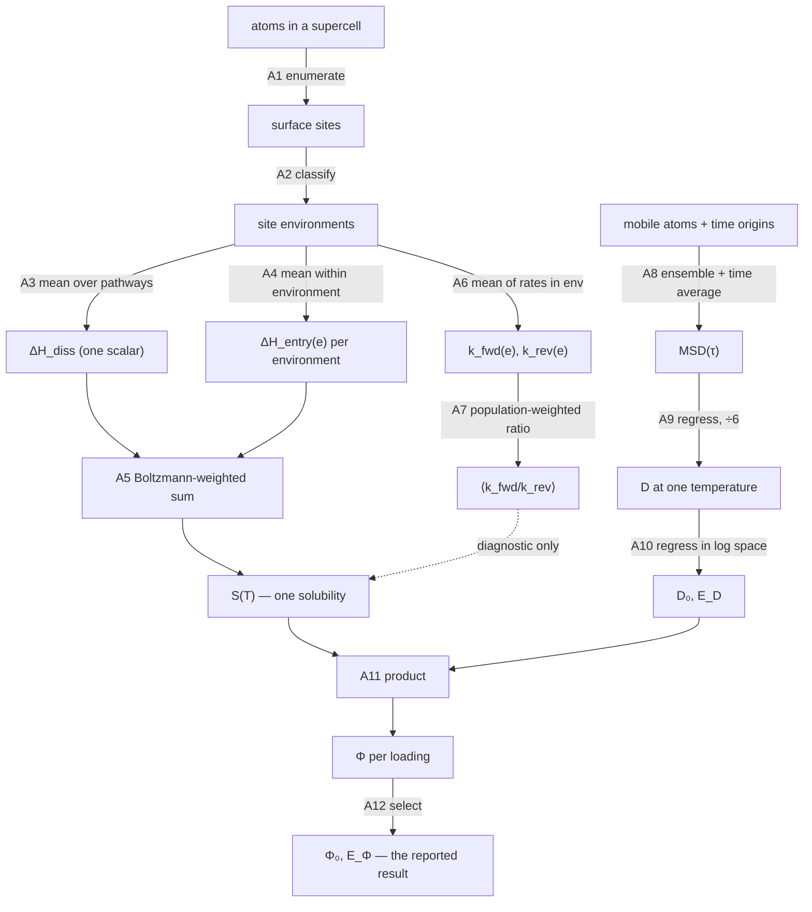
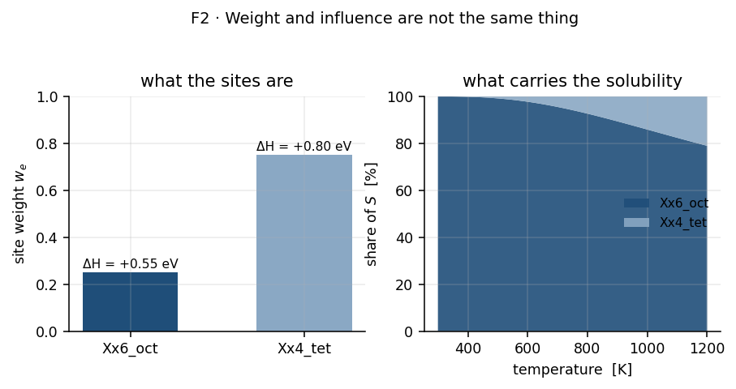

# Part II-B — The aggregation ladder

The workflow starts with thousands of atoms and ends with two numbers,
$\Phi_0$ and $E_\Phi$. This part answers the question that recurs at every
stage in between: **how do many things become one?**

It is collected here rather than spread across the stage sections because the
same question has twelve different answers, using six different mathematical
operators, and the differences between them matter more than any single one.
Each stage section in [`03-stages/`](03-stages/README.md) links to its rung here instead
of re-deriving the collapse.

> [!NOTE]
> **Scope.** Method only; no results from any real run. Equation numbers refer to
> [Part II](02-theory.md).

## Contents

- [1. The ladder](#1-the-ladder)
- [2. The six operators](#2-the-six-operators)
- [3. Three things that are easy to miss](#3-three-things-that-are-easy-to-miss)
- [4. What each rung does to an uncertainty](#4-what-each-rung-does-to-an-uncertainty)

---

## 1. The ladder

**Figure 1.** The twelve collapse points. Follow the two independent chains —
energetics on the left down to $S(T)$, molecular dynamics on the right down to
$D_0, E_D$ — and note that they meet only at **A11**, the final product. The
dashed arrow is a cross-check, not an input.

| # | from → to | operator | weight | code |
|---|---|---|---|---|
| A1 | atoms → surface sites | enumeration + graph | — | [`surface_graph.py`](https://github.com/Azeezakinyemi999/Molecular_Dynamics/blob/main/MHI_Nickel/models/surface_graph.py) |
| A2 | sites → environment labels | classification by neighbour shell | — | [`neb_subsurface.py`](https://github.com/Azeezakinyemi999/Molecular_Dynamics/blob/main/MHI_Nickel/models/neb_subsurface.py) |
| A3 | dissociation pathways → $\Delta H_{\mathrm{diss}}$ | arithmetic mean | uniform | [`permeation_workflow.py`](https://github.com/Azeezakinyemi999/Molecular_Dynamics/blob/main/MHI_Nickel/models/permeation_workflow.py) |
| A4 | entry pathways → $\Delta H_{\mathrm{entry}}(e)$ | arithmetic mean **within** $e$ | uniform within $e$ | [`permeation.py`](https://github.com/Azeezakinyemi999/Molecular_Dynamics/blob/main/MHI_Nickel/models/permeation.py) |
| A5 | environments → $S(T)$ | **Boltzmann-weighted sum** (T14) | $w_e$ | [`permeation.py`](https://github.com/Azeezakinyemi999/Molecular_Dynamics/blob/main/MHI_Nickel/models/permeation.py) |
| A6 | per-site rates → per-environment rates | arithmetic mean of rates | uniform within $e$ | [`tst_rates.py`](https://github.com/Azeezakinyemi999/Molecular_Dynamics/blob/main/MHI_Nickel/models/tst_rates.py) |
| A7 | per-environment rates → $\langle k_f/k_r\rangle$ | population-weighted mean of ratios | grid site counts | [`permeation.py`](https://github.com/Azeezakinyemi999/Molecular_Dynamics/blob/main/MHI_Nickel/models/permeation.py) |
| A8 | atoms + time origins → $\mathrm{MSD}(\tau)$ | **ensemble + time average** (T19) | uniform | [`diffusivity_post_processing.py`](https://github.com/Azeezakinyemi999/Molecular_Dynamics/blob/main/MHI_Nickel/models/diffusivity_post_processing.py) |
| A9 | $\mathrm{MSD}(t)$ → $D(T)$ | linear regression, $\div 6$ (T20) | — | [`diffusivity_post_processing.py`](https://github.com/Azeezakinyemi999/Molecular_Dynamics/blob/main/MHI_Nickel/models/diffusivity_post_processing.py) |
| A10 | $D(T)$ over $T$ → $D_0, E_D$ | log-space regression (T22a) | optionally $1/\sigma^2$ | [`diffusivity_post_processing.py`](https://github.com/Azeezakinyemi999/Molecular_Dynamics/blob/main/MHI_Nickel/models/diffusivity_post_processing.py) |
| A11 | $D \times S$ → $\Phi$ | **product** (T24) | — | [`permeation.py`](https://github.com/Azeezakinyemi999/Molecular_Dynamics/blob/main/MHI_Nickel/models/permeation.py) |
| A12 | $\Phi$ over loadings → headline | **selection**, not averaging | — | [`plots/permeability_plot.py`](https://github.com/Azeezakinyemi999/Molecular_Dynamics/blob/main/MHI_Nickel/models/plots/permeability_plot.py) |

---

## 2. The six operators

Twelve rungs, but only six kinds of operation. Knowing which one a rung uses
tells you what it preserves and what it destroys.

### 2.1 Enumeration and classification (A1, A2)

Not an average at all. These rungs *partition*: every site is assigned to
exactly one environment, and nothing is combined yet. They are listed as rungs
because the choice of partition fixes what every later average is taken over.

A coarser partition makes later averages smoother and less informative; a finer
one leaves environments with too few members for (T30) to mean anything. This
is the first and least visible modelling decision in the chain.

### 2.2 Arithmetic mean (A3, A4, A6)

$$\bar x = \frac1n \sum_{i=1}^{n} x_i \tag{A-1}$$

Used for energies within a group (A3, A4) and for rates within a group (A6).

For rates the choice is deliberate and worth stating: an arithmetic mean of
rates preserves the group's **expected aggregate event rate** over independent
parallel channels, which is what a set of equivalent sites is. The alternative —
averaging the barriers and then exponentiating — gives a different and smaller
answer, because

$$\big\langle e^{-E/k_BT} \big\rangle \;\ge\; e^{-\langle E\rangle/k_BT} \tag{A-2}$$

by convexity. (A-2) is why §7.5 of Part II insists that the rate-based
solubility (T18) is a diagnostic: it averages rates where (T14) averages
Boltzmann factors of energies, and the two cannot agree except in the limit of
identical barriers.

### 2.3 Boltzmann-weighted sum (A5)

$$\langle\,\cdot\,\rangle_{\mathrm{B}} = \sum_e w_e\, e^{-\Delta H(e)/k_BT} \tag{A-3}$$

The only rung where the weighting is non-linear in the quantity being combined.
A difference of a few $k_BT$ between environments translates into orders of
magnitude in contribution, so this rung is where most of the information in the
environment table is discarded — deliberately, because that is what equilibrium
does.

**Figure 2.** Weight against influence. Compare the two panels: the majority environment on the left carries almost none of the solubility on the right, because the exponential outruns the weight. The imbalance eases as temperature rises and $k_BT$ grows. Fictitious data.

> [!IMPORTANT]
> An environment can dominate $S$ while holding a small share of the sites, and
> conversely a majority environment can contribute almost nothing. Reporting
> which environments carry the solubility is therefore not the same as reporting
> which are common, and the two can be nearly opposite.

### 2.4 Ensemble and time average (A8)

$$\mathrm{MSD}(\tau) = \big\langle \lvert\mathbf r(t+\tau)-\mathbf r(t)\rvert^2\big\rangle_{t,\ \text{atoms}} \tag{A-4}$$

Two averages at once, and they are not equivalent. The average over atoms is a
genuine ensemble average and shrinks the variance of $D$ like $1/\sqrt{N}$. The
average over time origins re-uses one trajectory, so its samples are correlated
and it reduces variance far less than its sample count suggests.

> [!IMPORTANT]
> With one mobile atom the ensemble average disappears entirely and only the
> correlated time average remains. The resulting $D$ is a single realisation of
> a random walk, not an expectation value. This is the formal reason a
> single-atom loading is untrustworthy, and it is a property of the **loading**,
> not of the material.

### 2.5 Regression (A9, A10)

Least squares, in linear space for (T20) and in log space for (T22a). A
regression differs from the averages above in that it also *reports its own
uncertainty* — and that uncertainty depends on the number of points through the
degrees of freedom $n-p$.

> [!IMPORTANT]
> A regression never refuses. Fit two points to a straight line and it returns
> the line through them with $R^2 = 1$ and vanishing standard errors. The
> statistic is arithmetic, not evidence. (I9) in Part II exists for this reason.

### 2.6 Product and selection (A11, A12)

$\Phi = D S$ is the simplest rung and the only one that *multiplies* two
independently-derived quantities. It is therefore the only rung where fractional
uncertainties combine (§4).

A12 is not an average at all: one loading is chosen and reported. Averaging
$\Phi$ across loadings would be meaningless, because the loadings are different
physical systems rather than repeated samples of one.

---

## 3. Three things that are easy to miss

### 3.1 Two weightings stack, and they are different in kind

A site's influence on the final $S$ is a product of three factors:

$$\text{influence} \;\propto\; \underbrace{[\text{was a pathway computed for it?}]}_{\text{sampling}} \times \underbrace{w_e}_{\text{pathway fraction}} \times \underbrace{e^{-\Delta H_{\mathrm{sol}}(e)/k_BT}}_{\text{physics}} \tag{A-5}$$

Only the third factor is physics. The first is a consequence of which
calculations were run, and the second is defined *as* the pathway fraction —
not as a crystallographic site fraction. A4 therefore averages over whatever
pathways happen to exist, and A5 then re-weights by how many of them there
were.

> [!IMPORTANT]
> This means the pathway-selection decision made back at A1–A2 propagates all
> the way into $S$, with no stage in between that could correct for it. Sampling
> an environment more heavily raises its weight in (T14) without any physical
> justification. The approximation is deliberate, but it must be stated whenever
> $w_e$ is quoted.

### 3.2 Averaging survives quality filtering

State quality — whether a minimum is really a minimum, whether a saddle is
really a saddle — is assessed per pathway, as invariants (I2) and (I3). But A3
and A4 are means over *the set they are handed*.

Filtering and averaging are therefore separate operations, and the order
matters. A mean taken before the filter silently includes pathways already known
to be unsound; a mean taken after may be left with too few members for (T30).
Where in the chain the filter is applied is the difference between a defensible
composite energy and a contaminated one, and it should be stated explicitly for
every rung that averages.

### 3.3 A zero uncertainty is not a small uncertainty

A4 records the standard error of the mean (T30), which is undefined for a single
member and stored as $0$.

> [!IMPORTANT]
> $\sigma = 0$ from a one-member group means **unmeasurable**, not **precise**.
> It then propagates through (T13) as a zero contribution in quadrature, so a
> composite enthalpy built partly from singleton environments can report a
> smaller uncertainty than one built from well-sampled ones. The quantity to
> check alongside any $\sigma$ from this rung is $n$.

---

## 4. What each rung does to an uncertainty

| rung | operator | uncertainty out |
|---|---|---|
| A1, A2 | partition | none propagated; affects what later rungs average over |
| A3, A4, A6 | arithmetic mean | standard error of the mean (T30); **$0$ when $n=1$** |
| A5 | Boltzmann-weighted sum | weighted combination of the per-environment $\sigma$, dominated by whichever environment dominates the sum |
| A7 | weighted mean of ratios | not propagated — diagnostic rung |
| A8 | ensemble + time average | enters A9 as the scatter of the trace |
| A9 | linear regression | $\sigma_D$ from the fit residuals |
| A10 | log-space regression | $\sigma_{E_D}$ **absolute**; $\sigma_{D_0}$ **fractional** (§10.1) |
| A11 | product | fractional $\sigma$ in quadrature (T29) |
| A12 | selection | none; the reported $\sigma$ is that of the chosen loading alone |

The representation switches at A10. Everything above it carries absolute
energies in eV; the prefactor that comes out of it is log-normal and must be
carried as a fraction or a $\times/\div$ band thereafter. (T28) and the box in
§10.1 of Part II give the reason.
