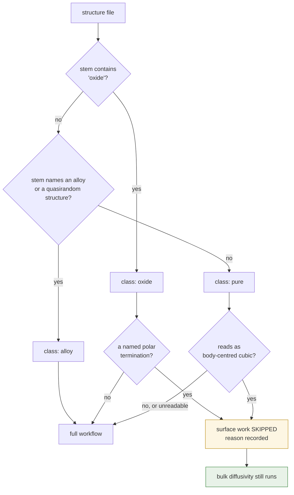

# Stage 1 — Materials and structures

## Purpose

Decide **which** materials the workflow processes, classify each one, and build
the atomic cells every later stage consumes.

Small, cheap, and the place where a mistake is least visible: an error here
produces no exception, only a material that quietly never appears in the
results.

## At a glance

| | |
|---|---|
| **Inputs** | structure files in the input directory |
| **Outputs** | absolute paths, a classification per material, and built bulk cells with hydrogen inserted |
| **Code** | [`models/materials.py`](../../models/materials.py), [`models/structure.py`](../../models/structure.py) |
| **Theory** | [Part II §1](../02-theory.md#1-conventions) for naming |

## Concepts

**Stem.** A material's identity throughout the workflow: the input filename
without its extension. Every output directory, marker and artifact is keyed on
it.

**Classification.** One of *pure*, *alloy* or *oxide*, decided from the stem.
It selects which element and mass table the generated scripts embed, and it
routes slab construction in [Stage 2](02-slabs-and-relaxation.md).

**Skip rule.** A reason a material is excluded from the **surface** half of the
workflow. It does not exclude it from bulk diffusivity.

## Procedure

1. **Read the material list** — one list, in one module.

2. **Classify** each by substring of its stem: *oxide* if the stem says so,
   *alloy* if it names an alloy or a special quasirandom structure, *pure*
   otherwise.

3. **Apply the surface skip rules**, in order:
   1. a named polar-oxide termination;
   2. any pure body-centred-cubic structure, by reading the file.

   The second reads from disk, so it runs last and **tolerates failure**: an
   unreadable structure is *not* skipped, it is left in to fail loudly
   downstream.

4. **Build the bulk cell** and minimise it.

5. **Insert hydrogen** at octahedral interstitial sites, subject to minimum
   separations from the host atoms and from other hydrogens, from a seeded
   random choice.

**Figure 1.** Classification and the skip decision. Two things to note: an
**unreadable** structure takes the "no" branch rather than being skipped, so a
corrupt file fails loudly downstream instead of vanishing silently; and a skip
removes only the *surface* work — bulk diffusivity runs for every material.

## Design choices

### Why the material list is a module and not a literal

The list was once written out four times — once in each of three script
generators and once in the master notebook — along with copies of the
classification function and the skip rules.

> [!IMPORTANT]
> Nothing kept the four copies in agreement, and the failure mode was
> **silent**. Adding a material meant four correct edits, and missing one did
> not raise: the part whose list you forgot simply never generated a script for
> that material, and you noticed only when its results were absent, possibly
> weeks later.

Adding a material is now one edit in one place, and a regression test asserts
that no generator keeps a local copy.

### Why the skip rules apply only to the surface half

The skipped cases fail for reasons that are specifically about **building a
surface**: a polar termination needs a per-structure Miller-index and
termination analysis that does not exist yet, and the body-centred-cubic
surface and subsurface mapping is untested.

Bulk diffusivity builds no surface, so none of that applies. Those materials run
through [Stage 10](10-bulk-diffusivity.md) normally, and a reader looking only
at the diffusivity results would never know a skip rule existed.

### Why an unreadable structure is not skipped

The body-centred-cubic test opens the file, and that can fail for reasons having
nothing to do with the crystal structure. Treating a read failure as "skip"
would turn a corrupt or missing file into a silent omission — exactly the class
of failure this stage is built to avoid.

Returning "do not skip" instead lets the material proceed and fail at the point
where the real problem is visible.

### Why hydrogen insertion is seeded

Insertion picks interstitial sites at random subject to separation constraints.
A fixed seed makes the choice reproducible, so re-running a material produces
the same cell and results can be compared across runs rather than differing by
placement.

## Checks and failure modes

| symptom | meaning | what to do |
|---|---|---|
| a material has no results at all | it was never in the list, or it is skipped for the surface half | check the list and the skip reason, which is printed |
| a material has bulk results but no surface ones | a skip rule applies to it | expected; the reason names the issue |
| generated scripts embed the wrong element table | the classification is wrong for that stem | the classification is substring-based; rename the stem or extend the rule |
| hydrogen placement differs between runs | the seed changed | insertion is seeded for exactly this reason |
| insertion fails to place the requested count | the separation constraints cannot be satisfied at that loading | lower the loading or the minimum separations |

> [!NOTE]
> **Planned:** classification is decided by substrings of the filename. It works
> because the naming is disciplined, but a material named outside the convention
> is classified wrongly with no warning. A declared type per entry would remove
> the guesswork.
