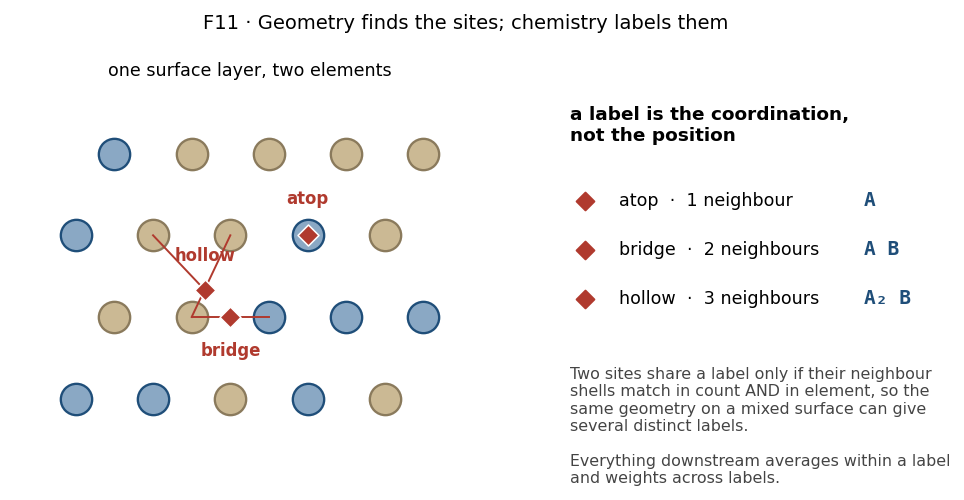

# Stage 3 — Surface site mapping

## Purpose

Find every place a hydrogen atom can sit on the relaxed surface, and give each
one a label describing its local chemistry. Those labels are what the whole
downstream chain keys on.

## At a glance

| | |
|---|---|
| **Inputs** | the relaxed slab from [Stage 2](02-slabs-and-relaxation.md) |
| **Outputs** | a surface-site list with positions, types and environment labels; a graph of the surface |
| **Code** | [`models/surface_graph.py`](https://github.com/Azeezakinyemi999/Molecular_Dynamics/blob/main/MHI_Nickel/models/surface_graph.py), [`models/site_identifier.py`](https://github.com/Azeezakinyemi999/Molecular_Dynamics/blob/main/MHI_Nickel/models/site_identifier.py) |
| **Prior art** | adapted from the surface-graph explainer in `Project2_surface_labeling/`, whose algorithm is unchanged |
| **Figures it writes** | none; the site list is consumed by later stages — see [Appendix C2](../05-appendices.md#c2-figure-catalogue) |

## Concepts

**Adsorption site.** A position on the surface defined by the atoms
coordinating it — atop one atom, bridging two, or hollow over three or more.

**Environment label.** A string naming what surrounds a site: how many
neighbours and of which elements. Two sites with the same label are treated as
equivalent everywhere downstream.

**Surface graph.** Nodes for surface atoms and sites, edges for proximity.
Supports asking what lies in a site's first and second neighbour shells.

## Procedure

1. **Identify the surface layers.** Atoms are grouped into layers by height,
   with a tolerance for the top layer and a chosen number of layers kept. Only
   these participate.

2. **Enumerate candidate sites** geometrically from the surface atoms, with a
   tolerance controlling how nearly-degenerate positions are merged.

3. **Build the graph.** Surface atoms become nodes; an edge joins two atoms
   within a bond cutoff. Sites attach to the atoms that coordinate them.

4. **Label each site** from its neighbour shell: the count and elements of the
   coordinating atoms.

5. **Write the site list**, with position, type and label per site.

Oxides take the same path with separate tolerances throughout — a shorter bond
cutoff, and additional tolerances for detecting planes and judging exposure —
because their interatomic distances and plane spacings differ from a metal's.

**Figure 1.** Sites and the labels they carry. On the left, the three site
types with lines to the atoms that coordinate each one. The right panel states
the general rule rather than reading off the drawing: a label records *what*
coordinates a site, so the same geometry on a mixed surface yields several
distinct labels. Schematic, with two generic elements.

> [!NOTE]
> The graph construction behind this is described at length, with worked
> stages, in `Project2_surface_labeling/Project2_Surface_Graph_Explainer.md`.
> That document is **not** superseded — its algorithm is unchanged, and this
> section adapts it.

## Design choices

### Why a graph rather than a list

A list of sites answers "where can hydrogen sit". The downstream question is
"what does this site have around it", one and two shells out, which is a
connectivity question. Building the graph once makes every later neighbour
query a traversal rather than a fresh geometric search.

### Why site enumeration and site labelling are separate steps

Enumeration is geometry: it depends only on where the atoms are. Labelling is
chemistry: it depends on which elements those atoms are.

Keeping them separate means a pure metal and a disordered alloy with the same
lattice enumerate identically and differ only in their labels — which is what
makes the alloy's many distinct environments fall out of the same code path.

### Why the labels matter more than they look

An environment label is a **string**, and strings are compared exactly
downstream. Two sites with the same label are averaged together at
[rung A4](../02b-aggregation.md#1-the-ladder); two with different labels are
kept apart and weighted separately in the solubility sum.

> [!IMPORTANT]
> The labelling scheme therefore sets the granularity of every later average.
> Coarser labels merge genuinely different sites and smooth away real spread;
> finer labels leave environments with one member each, where the standard error
> is undefined and recorded as zero. Neither failure announces itself.

### Oxides reuse the algorithm with different tolerances

The geometry of finding layers, sites and neighbours is the same. What differs
is scale — bonds are shorter, planes are spaced differently, and an oxide
surface exposes cations and anions at different heights. Separate tolerances
handle that without a separate code path.

## Checks and failure modes

| symptom | meaning | what to do |
|---|---|---|
| far more sites than expected | the merge tolerance is too tight, so near-degenerate positions were kept separate | raise it before anything else |
| far fewer | too loose, so distinct sites were merged | lower it |
| a site has an implausible neighbour count | the bond cutoff does not suit this material's spacing | check the cutoff against the actual nearest-neighbour distance |
| every site carries the same label | the surface is pure, or element information was lost | expected for a pure metal |
| one label dominates an alloy surface | may be real, or may be the random occupation from [Stage 2](02-slabs-and-relaxation.md#why-the-alloy-path-uses-a-template-with-random-occupation) | remember the template assumes no short-range order |
| sites appear below the surface | the layer tolerance admitted a subsurface plane | tighten it |

> [!NOTE]
> **Planned:** the tolerances are defaults that suit the materials tested. None
> is derived, and no sensitivity study is recorded. Since they set the site
> count, and the site count sets the pathway weights, their influence reaches
> the final solubility.
