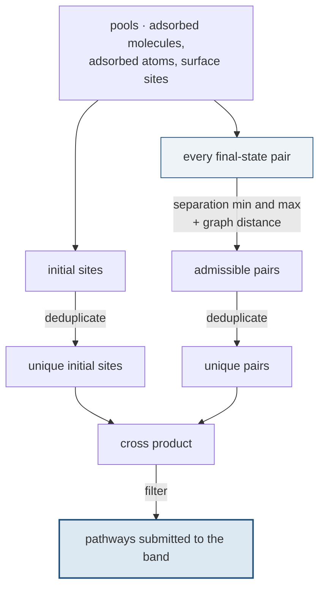

# Stage 5 — Adsorption and pathway enumeration

## Purpose

Place hydrogen on the surface, and decide **which** reaction pathways are worth
computing. Enumeration is the stage that controls the cost of everything after
it: a band is expensive, and the number of bands is set here.

## At a glance

| | |
|---|---|
| **Inputs** | surface and subsurface sites from Stages [3](03-surface-site-mapping.md) and [4](04-subsurface-site-mapping.md) |
| **Outputs** | relaxed adsorbed states; a filtered list of pathways, each an initial/final pair |
| **Code** | [`models/neb_workflow.py`](https://github.com/Azeezakinyemi999/Molecular_Dynamics/blob/main/MHI_Nickel/models/neb_workflow.py), [`models/neb_subsurface.py`](https://github.com/Azeezakinyemi999/Molecular_Dynamics/blob/main/MHI_Nickel/models/neb_subsurface.py) |

## Concepts

**Pathway.** An initial and a final state, to be joined by a band in
[Stage 6](06-neb.md). Three families:

| family | from → to | used for |
|---|---|---|
| dissociation | an adsorbed molecule → two separated atoms | $\Delta H_{\mathrm{diss}}$ |
| entry hop | a surface site → a first-subsurface site | $\Delta H_{\mathrm{entry}}(e)$ and entry rates |
| deeper hop | first → second subsurface | transport rates only, **not** solubility |

**Pool.** The set of candidate states a family draws from.

**Deduplication.** Collapsing candidates that are equivalent by symmetry or
labelling, so one representative is computed rather than all of them.

## Procedure

Dissociation is enumerated in stages, each written to its own directory so the
funnel can be inspected at every step:

1. **Load the pools** — adsorbed molecular states, adsorbed atomic states, and
   the surface sites.

2. **Enumerate final-state pairs.** Every pair of surface sites the two atoms
   could end on, constrained by a minimum and maximum separation and by a
   minimum distance through the surface graph.

3. **Deduplicate those pairs**, then **deduplicate the initial sites**.

4. **Form the cross product** of unique initial sites with unique final pairs.

5. **Filter** the cross product down to the pathways actually submitted.

Hops are enumerated from the connections built in
[Stage 4](04-subsurface-site-mapping.md): each surface-to-first link is an entry
pathway, each first-to-second link a deeper one. The final state of each is
constructed and relaxed before the band is built.

**Figure 1.** The enumeration funnel. Follow the two branches: both input sets
are deduplicated **before** the cross product, not after, so the product is
formed from representatives only. Each box is written to its own directory, so
a surprising final count can be traced to the step that caused it.

## Design choices

### Why enumeration is a funnel with its stages on disk

The cross product is large, and what survives to submission is a small fraction
of it. When the surviving count is surprising, the question is always *which
step removed them* — a pair separation constraint, deduplication, or the final
filter.

Writing each stage separately turns that into reading a directory rather than
re-deriving the logic.

### Why final-state pairs are constrained by separation

Two atoms that land too close have not dissociated; two that land too far apart
describe a pathway that is not one elementary step. Both limits exist to keep
the computed barrier interpretable as a single process.

The graph-distance constraint adds a connectivity requirement on top of the
Euclidean one, so sites that are close in space but far apart across the
surface are excluded.

### Why deduplicate before the cross product, not after

The cross product multiplies. Deduplicating the two input sets first means the
product is formed from representatives only; deduplicating afterwards would
build the full product and then discard most of it.

### Why the deeper hop is enumerated but excluded from solubility

Both hop families are computed, and both produce rates. Only the entry hop
enters $\Delta H_{\mathrm{sol}}$.

> [!IMPORTANT]
> This is the boundary described in [Stage 9](09-solubility.md#why-solubility-stops-at-the-first-subsurface-layer):
> entry is dissolution and belongs to $S$; everything deeper is transport and
> is carried by $D$. Both are computed because the deeper rates are wanted in
> their own right, not because they feed the solubility.

### What enumeration cannot recover from

> [!IMPORTANT]
> A pathway not enumerated here is invisible to every later stage. There is no
> point downstream at which a missing pathway is noticed — it simply does not
> appear, and the averages at [rungs A3 and A4](../02b-aggregation.md#1-the-ladder)
> are taken over what does. Since the pathway count *is* the weight $w_e$, an
> environment under-sampled here is under-weighted in the final solubility,
> silently.

## Checks and failure modes

| symptom | meaning | what to do |
|---|---|---|
| far fewer pathways than expected | a constraint or a deduplication step removed them | read the per-step directories; the funnel shows where |
| far more | deduplication is not collapsing equivalents | check whether the labels distinguish sites that should be equivalent |
| an environment has no pathways at all | no site of that type was connected at [Stage 4](04-subsurface-site-mapping.md) | it will be absent from $w_e$ entirely |
| one environment has many more than the others | may be real multiplicity, or sampling bias | it directly sets that environment's weight; check which |
| a final state will not relax | the pair is too close, or the site does not exist on the relaxed surface | tighten the separation constraint |

> [!NOTE]
> **Planned:** the separation and graph-distance constraints are defaults
> validated on the materials tested. They bound what counts as one elementary
> dissociation step, and no sensitivity study is recorded.
