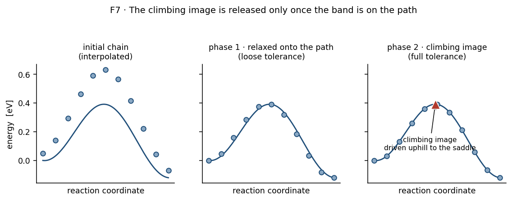

# Stage 6 — Nudged elastic band

## Purpose

Find the minimum-energy path between each enumerated initial and final state,
and the saddle point on it. This produces the barriers and reaction energies
everything else is built from.

## At a glance

| | |
|---|---|
| **Inputs** | initial/final state pairs from [Stage 5](05-adsorption-and-enumeration.md); the frozen-region cutoff from [Stage 2](02-slabs-and-relaxation.md) |
| **Outputs** | a relaxed band per pathway, its barrier, reaction energy, convergence flag and final force; the saddle geometry |
| **Code** | [`models/ase_neb.py`](https://github.com/Azeezakinyemi999/Molecular_Dynamics/blob/main/MHI_Nickel/models/ase_neb.py), [`models/neb_workflow.py`](https://github.com/Azeezakinyemi999/Molecular_Dynamics/blob/main/MHI_Nickel/models/neb_workflow.py) |
| **Theory** | [Part II §3](../02-theory.md#3-energetics) |
| **Figures it writes** | `mep.png` per pathway; `neb_mep_overlay_*.png`; `neb_mep_full_pathway.png` — see [Appendix C2](../05-appendices.md#c2-figure-catalogue) |

## Concepts

**Band.** A chain of intermediate images between two fixed endpoints, coupled
by springs so they stay spread along the path rather than sliding into the
minima.

**Climbing image.** The highest image, released from its springs along the path
and driven *uphill* instead, so it converges onto the saddle rather than near
it.

**Interpolation.** How the initial image chain is generated. The default is
image-dependent pair potential interpolation, which avoids the atom overlaps a
straight-line interpolation produces when atoms must move around each other.

## Procedure

1. **Build the image chain** between the two endpoints — nine intermediate
   images by default, generated by pair-potential interpolation.

2. **Attach a calculator to each image**, with the frozen region held fixed as
   in [Stage 2](02-slabs-and-relaxation.md).

3. **Phase 1 — relax onto the path.** Ordinary band relaxation, with a force
   tolerance **three times looser** than the final one.

4. **Phase 2 — climb to the saddle.** The climbing image is enabled and the
   band is relaxed to the full tolerance, $0.1\ \mathrm{eV/\mathring A}$ by
   default.

5. **Extract** the barrier (T1), the reaction energy (T2), the converged flag
   and the final maximum force; identify and save the saddle geometry for
   [Stage 7](07-vibrations-phva.md).

## Design choices

**Figure 1.** The two phases. Compare the middle and right panels: phase 1 only
has to get the images onto the path, which is why its tolerance is deliberately
loose — once the chain is roughly right, the highest image is near the saddle
and worth driving uphill. Enabling the climb against the left panel would push
the wrong image. Fictitious profile.

### Why two phases instead of one

Enabling the climbing image from the start is counterproductive. Before the band
lies on the path, the highest image is not near the saddle, and driving it
uphill pushes it somewhere unhelpful while the rest of the band is still
rearranging.

Relaxing first at a loose tolerance gets the band onto the path cheaply. Only
then is the climbing image released, with the full tolerance applied to a chain
that is already roughly correct.

The loose first tolerance is deliberate: phase 1 does not need to be converged,
only close enough to put the right image at the top.

### Why pair-potential interpolation rather than a straight line

Linear interpolation moves every atom along a straight line between its
endpoints. When a hydrogen must pass around a host atom, the straight path goes
*through* it, producing images with overlapping atoms, enormous forces, and
often an unrecoverable first step.

Pair-potential interpolation preserves sensible interatomic distances along the
chain, so the initial band is physically reasonable before any relaxation.

### Why the lower slab stays frozen

The same reason as [Stage 2](02-slabs-and-relaxation.md#why-freeze-at-all-and-why-a-third):
the interior must behave as bulk. It also keeps the band's degrees of freedom
down, which matters when a band has eleven images and every one needs forces.

> [!IMPORTANT]
> The frozen region reappears in [Stage 7](07-vibrations-phva.md) as the reason
> spurious low and imaginary modes are expected. The two stages share the
> approximation, and its cost is paid there rather than here.

### Why convergence is recorded rather than enforced

A band that does not converge still produces a barrier — the highest image is
simply not guaranteed to be the saddle. Discarding it outright would lose
information; treating it as converged would be wrong.

So the flag and the final force travel with the result, and the decision is
made downstream with the rest of the context.

> [!IMPORTANT]
> An unconverged band is dropped **before vibrations**, so its pathway is absent
> from the rate table even though its barrier exists in the ranked output. That
> is why a hop can show more ranked pathways than rate entries, and why
> [Stage 8](08-tst-rate-assembly.md) reports the difference rather than leaving
> it to be noticed.

### What a band cannot tell you

A converged band gives a saddle *of the path it was given*. It cannot report
that a lower path exists through a different final state — that possibility was
decided at [Stage 5](05-adsorption-and-enumeration.md), and a band explores
none of it.

## Checks and failure modes

| symptom | meaning | what to do |
|---|---|---|
| not converged, force only slightly above tolerance | the path is probably right, the saddle imprecise | treat the barrier as provisional; it is excluded from rates |
| not converged, force far above tolerance | the band never found a sensible path | check the endpoints before the band settings |
| the path has several maxima | more than one elementary step between the endpoints | the pathway is not a single process; re-enumerate |
| the saddle sits at an endpoint | the reaction is barrierless as posed, or the endpoints are wrong | check that the final state is a distinct minimum |
| barrier is negative | the final state is lower *and* the band found no barrier | check the endpoint energies first |
| the first step fails immediately | overlapping atoms in the initial chain | interpolation; confirm it is the pair-potential scheme |
| a family has many fewer rates than ranked pathways | unconverged bands were dropped before vibrations | expected; the counts are reported |

> [!NOTE]
> **Planned:** the image count, spring constant and tolerance are global
> defaults applied to every pathway of every material. A long dissociation path
> and a short interstitial hop are not obviously equally well served by the same
> image count.
