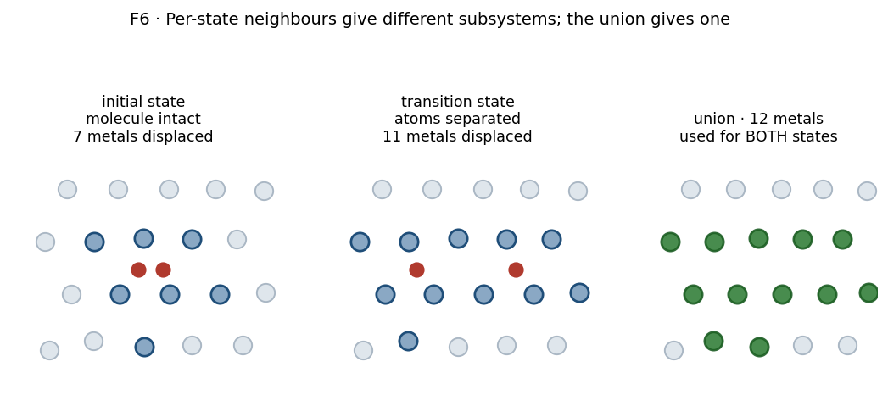

# Stage 7 — Vibrations (partial Hessian)

## Purpose

Turn each stationary geometry into a list of vibrational frequencies, so that
[Stage 8](08-tst-rate-assembly.md) can build zero-point corrections, attempt
frequencies and partition functions from it. This is also the stage that decides
*whether a geometry is the kind of stationary point it was assumed to be* — a
minimum or a saddle — because only the frequencies can tell you.

Everything downstream rests on these numbers, and the approximation made here
shapes what they mean.

## At a glance

| | |
|---|---|
| **Inputs** | one LAMMPS data file per state (IS, TS, FS) from [Stage 6](06-neb.md); a trained interatomic potential |
| **Outputs** | `vib_frequencies.json` per state; `vib.done` marker |
| **Code** | [`models/vibrations.py`](https://github.com/Azeezakinyemi999/Molecular_Dynamics/blob/main/MHI_Nickel/models/vibrations.py) |
| **Runs on** | CPU — the single-point count is too small to saturate a GPU |
| **Theory** | [Part II §4](../02-theory.md#4-vibrational-analysis) |

## Concepts

**Partial Hessian Vibrational Analysis (PHVA).** The full Hessian of a supercell
is a $3N \times 3N$ matrix needing $6N$ single-point force evaluations. For a
few hundred atoms this is unaffordable at every state of every pathway. Instead
a *subset* of atoms is displaced and the rest held fixed, giving a
$3n \times 3n$ block for $n \ll N$.

**Mobile subsystem.** The atoms that are displaced: the hydrogen, plus a cage of
its nearest metal neighbours. What is in this set defines what the frequencies
describe, and — because mode count is $3n$ — it also fixes how many frequencies
come out.

See [Part II §4.1](../02-theory.md#41-what-is-computed) for why this choice
produces spurious low modes, which is the single most important thing to
understand about this stage.

## Procedure

The library does not compute frequencies itself. It **generates a standalone
script** per state, which the scheduler runs on a compute node. The steps below
are what that generated script does, in order.

1. **Read the structure** from its LAMMPS data file and `wrap()` it into the
   cell.

2. **Attach the potential** as an ASE calculator, on CPU, in single precision by
   default.

3. **Choose the mobile subsystem.** Two variants exist, and they differ only
   here:

   - *Single hydrogen* — locate the one H atom, sort all metal atoms by distance
     from it, take the nearest $n_{\mathrm{nbr}}$. Default $n_{\mathrm{nbr}} = 6$,
     giving $1 + 6 = 7$ displaced atoms and $6 \times 7 = 42$ single-point
     evaluations.
   - *Two hydrogens* (dissociation) — the mobile set is **supplied by the
     caller**, not recomputed per state. See [Design choices](#design-choices).

   Setting $n_{\mathrm{nbr}} = 0$ displaces the hydrogen alone, giving exactly
   its three degrees of freedom. This variant exists for the vibrational
   solubility prefactor (T16), which needs the dissolved-atom modes *without*
   the metal cage.

4. **Displace and evaluate.** Finite differences of $\pm\delta$ along each
   Cartesian direction of each mobile atom, with $\delta = 0.01$ Å by default.

5. **Classify each eigenvalue** as real or imaginary. This branch matters more
   than its size suggests:

   | condition | recorded as |
   |---|---|
   | non-negligible imaginary part | imaginary, as a positive magnitude |
   | positive real part | real |
   | **anything else** — near-zero or slightly negative real | **imaginary**, as a positive magnitude |

6. **Write `vib_frequencies.json`** holding the two frequency lists, the
   displaced-atom count, the hydrogen and metal indices, and $\delta$.

7. **Write `vib.done`** — last, only after the JSON is confirmed on disk.

## Design choices

### Why a partial Hessian at all

Cost. The full Hessian scales with the supercell; the partial Hessian scales
with the mobile subsystem, which is the same size no matter how large the cell
is. For a workflow that computes frequencies at three states for every pathway
of every material, this is the difference between feasible and not.

The price is paid in [Part II §4.1](../02-theory.md#41-what-is-computed): the
frozen surroundings cannot absorb the mobile fragment's rigid-body motion, so
pseudo-translation and pseudo-rotation mix into the lowest modes.

> [!IMPORTANT]
> This is why step 5's third branch exists. A rigid-body-like mode has an
> eigenvalue near zero, and numerical noise pushes it to either side. A mode
> recorded as "imaginary at a few $\mathrm{cm^{-1}}$" is almost always one of
> these, not a real instability — which is precisely why
> [Stage 8](08-tst-rate-assembly.md) judges state quality against a
> *significance threshold* rather than counting imaginary modes.

### Why the dissociation variant takes its mobile set from the caller

An intact molecule at the initial state has its two hydrogens close together,
sharing most of their neighbours. At the transition state they have separated,
and their neighbour shells no longer overlap. Computing "nearest six metals per
hydrogen" independently at each state therefore yields **different atom sets** —
and so different mode counts.

**Figure 1.** Why the mobile set is supplied rather than recomputed. Compare
the displaced-atom counts: the two hydrogens share most of their neighbours
when the molecule is intact, and share far fewer once separated, so per-state
selection gives two different subsystems. The union (right) is the smallest set
valid for both. Schematic.

Two things break at once:

- $\mathrm{ZPE_{TS}} - \mathrm{ZPE_{IS}}$ becomes a difference between
  *different subsystems*, which is not a zero-point correction to anything.
- $\prod\tilde\nu^{\mathrm{IS}} / \prod\tilde\nu^{\mathrm{TS}}$ has the wrong
  number of factors, so invariant
  [(I1)](../02-theory.md#11-invariants) fails and (T8) is not a frequency.

The fix is to take the **union**, over all states of one pathway, of each
hydrogen's nearest neighbours, and displace that same set everywhere. It is the
smallest set valid for every state at once.

> [!IMPORTANT]
> The union is only meaningful if the states share one atom ordering, since it
> is a set of *indices*. They do — the endpoints and the relaxed final state are
> all written from the same slab — and the helper enforces it by requiring the
> hydrogen indices to match across the structures it is given. If they do not,
> it refuses rather than returning a union of incomparable indices.

### Why the marker is written last

`vib.done` gates re-runs: the orchestrator skips any state whose marker exists.
Writing it only after the JSON is on disk means a job killed mid-calculation
leaves no marker, and is retried. Writing it first would permanently skip a
state that never produced output.

### Rejected: discarding low modes here

Low-frequency artefacts could be filtered at this stage, before anything is
written. They are not, deliberately. The raw frequency lists are the record of
what the calculation produced; every threshold is applied downstream, where it
is a named parameter whose effect can be changed without recomputing a single
Hessian. See [Part II §4.3](../02-theory.md#43-quasi-harmonic-treatment-of-low-modes).

This has a practical consequence worth knowing: **a change of threshold never
requires re-running this stage.** Re-deriving rates from stored frequencies is
cheap; recomputing Hessians is not.

## Checks and failure modes

| symptom | meaning | what to do |
|---|---|---|
| job fails: wrong number of H atoms | the structure is not the state it was taken for — wrong file, or a pathway whose endpoints were mislabelled | check the structure, not the vibration settings |
| helper refuses: H indices differ between structures | the states do not share an atom ordering, so a union of indices is meaningless | regenerate the states from one slab |
| a minimum has imaginary modes of a few $\mathrm{cm^{-1}}$ | expected PHVA artefact (step 5, third branch) | nothing; the significance threshold in Stage 8 handles it |
| a minimum has a large imaginary mode | the geometry is not relaxed | re-relax before trusting any quantity derived from it |
| a saddle has no imaginary mode, or several | the band did not resolve a single transition state | the barrier does not describe one process; treat it as unresolved |
| `vib.done` present but no JSON | cannot occur by construction — the marker is written last | if seen, the marker was created by hand |
| mode counts differ between two states of one pathway | different mobile subsystems were used | use the union helper; do not rebalance the lists afterwards |

> [!NOTE]
> **Planned:** nothing in this stage records *why* a given
> $n_{\mathrm{nbr}} = 6$ was chosen. Six is the octahedral coordination number,
> so it is the natural cage for an octahedral interstitial, but the choice is
> not justified in code and its sensitivity has not been tested.
