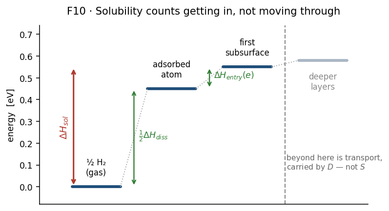

# Stage 9 — Solubility

## Purpose

Turn reaction energies into $S(T)$: how much hydrogen the lattice holds at
equilibrium, per unit of $\sqrt{P}$. This is one of the two factors in the
permeability, and it is the one that carries all of the surface and near-surface
chemistry.

Everything here is an **equilibrium** quantity. Barriers do not appear; only the
energy differences between states do.

## At a glance

| | |
|---|---|
| **Inputs** | ranked dissociation results; the entry-hop rate dictionary; the lattice parameter |
| **Outputs** | `dH_sol_by_env.json` (once per material); $S(T)$ per route, per temperature |
| **Code** | [`models/permeation.py`](https://github.com/Azeezakinyemi999/Molecular_Dynamics/blob/main/MHI_Nickel/models/permeation.py) §3b, [`models/permeation_workflow.py`](https://github.com/Azeezakinyemi999/Molecular_Dynamics/blob/main/MHI_Nickel/models/permeation_workflow.py) |
| **Theory** | [Part II §7](../02-theory.md#7-solubility) |
| **Aggregation** | rungs [A3, A4, A5](../02b-aggregation.md#1-the-ladder) |
| **Figures it writes** | `env_dH_sol.png`, `solubility_arrhenius.png` — see [Appendix C2](../05-appendices.md#c2-figure-catalogue) |

## Concepts

**Environment.** A class of interstitial site sharing a neighbour shell. Sites
within one are averaged; environments are kept separate and summed with weights.
Assigned back at [Stage 4](04-subsurface-site-mapping.md).

**Reference state.** Solubility is quoted with respect to the **first subsurface
layer**. An atom that has dissociated and entered that layer is "dissolved".

**Route.** An independent construction of the prefactor $S_0$. Two are reported
side by side — see [Design choices](#why-two-prefactor-routes-are-reported-rather-than-one).

## Procedure

1. **Obtain the dissociation enthalpy** $\Delta H_{\mathrm{diss}}$, either from
   configuration or by extracting it: the **mean of the reaction energies over
   pathways whose band converged**, with the standard error of that mean when
   there are at least two.

2. **Obtain the entry enthalpy** $\Delta H_{\mathrm{entry}}$ the same way, as the
   mean reaction energy over entry hops. Read from the first temperature's rate
   dictionary; the reaction energy is temperature-independent, so which one is
   used does not matter.

3. **Gate on both being available.** If either could not be determined, the
   permeability stage is skipped **entirely, for every loading**, and says so.
   No placeholder is substituted — see
   [Design choices](#why-a-missing-input-stops-the-stage-instead-of-defaulting).

4. **Build the per-environment table.** Group entry hops by their destination
   environment; within each group average the reaction energy and take its
   standard error; then (T13):

   $$\Delta H_{\mathrm{sol}}(e) = \tfrac12\Delta H_{\mathrm{diss}} + \Delta H_{\mathrm{entry}}(e)$$

   with $w_e$ the fraction of entry pathways in that environment, and the
   uncertainty combining both contributions in quadrature,
   $\sigma = \sqrt{(\tfrac12\sigma_{\mathrm{diss}})^2 + \sigma_{\mathrm{entry}}^2}$.
   Written once per material, because nothing here depends on hydrogen loading.

5. **Build the prefactor** $S_0$, by both routes — geometric (T15) from the site
   density, vibrational (T16) from a partition-function ratio. The lattice
   parameter is taken per temperature where thermal-expansion data exists.

6. **Sum over environments** at each temperature, (T14):

   $$S(T) = S_0 \sum_e w_e \exp\!\left(-\frac{\Delta H_{\mathrm{sol}}(e)}{k_B T}\right)$$

7. **Compute the saturating counterpart** (T17) alongside the dilute result, so
   the two can be compared against the site-density ceiling.

8. **Fit** $S(T)$ to an Arrhenius form to recover $S_0$ and a mean
   $\Delta H_{\mathrm{sol}}$ for use in (T25).

## Design choices

### Why solubility stops at the first subsurface layer

$\Delta H_{\mathrm{sol}}$ counts dissociation and entry, and nothing deeper.
Motion from the first subsurface site onwards is bulk transport, and bulk
transport is already represented by $D$.

**Figure 1.** What the solution enthalpy counts. Follow the red arrow: it spans
only the gas-to-first-subsurface step, built from the two green contributions.
Everything to the right of the dashed line is transport and belongs to $D$.
Fictitious energies.

Including the deeper hop here would count the same physics in both factors of
$\Phi = DS$. The boundary is therefore not arbitrary: it is the line between
*getting in* and *moving through*, and each side belongs to exactly one factor.

### Why two prefactor routes are reported rather than one

The two constructions answer different questions, and neither is a refinement of
the other.

| route | what it counts | what it ignores |
|---|---|---|
| geometric (T15) | available sites per unit volume | the entropy of the gas reservoir entirely |
| vibrational (T16) | the full partition-function ratio | nothing in principle; limited by the mode quality |

They differ by orders of magnitude, with the geometric route the larger, because
it is a pure site count with no entropic penalty for leaving the gas phase. They
are reported **side by side as a bracket, never averaged** — an average of two
numbers that differ by six orders of magnitude is not a better estimate of
either.

### Why a missing input stops the stage instead of defaulting

Both $\Delta H_{\mathrm{diss}}$ and $\Delta H_{\mathrm{entry}}$ sit in an
exponent. A plausible-looking default would produce a plausible-looking
solubility that is pure invention, and nothing downstream could detect it.

The stage therefore sets a readiness flag and skips the whole permeability
calculation for every loading, naming what was missing. An absent result is
recoverable; a fabricated one is not.

### Averaging and filtering are separate here, deliberately

Step 1 averages over pathways whose **band converged**. It does not consult the
vibrational census from [Stage 8](08-tst-rate-assembly.md): a pathway whose
initial state is not a minimum still contributes to
$\Delta H_{\mathrm{diss}}$ if its band converged.

This is defensible — the reaction energy is a difference of endpoint energies and
does not require the frequencies to be sound — but it is worth being explicit
about, because it means **the census does not gate this average**.

> [!IMPORTANT]
> The two filters answer different questions. "Did the band converge?" asks
> whether the endpoint energies are trustworthy, which is what a reaction energy
> needs. "Is this a minimum, and is that a saddle?" asks whether the
> *frequencies* are trustworthy, which is what a rate needs. Applying the rate
> filter to the energy average would discard sound energies; applying neither
> would contaminate both.

### Why the weight is a pathway fraction

$w_e$ counts computed entry pathways, not crystallographic sites. This is a
deliberate approximation, and its consequence is that pathway selection acts as
an implicit weight on top of the Boltzmann factor —
[(A-5)](../02b-aggregation.md#31-two-weightings-stack-and-they-are-different-in-kind).

Sampling one environment more heavily raises its weight in (T14) with no
physical justification. The alternative, weighting by site multiplicity from the
structural analysis, would decouple the weight from the sampling but would also
weight environments for which no pathway was computed at all.

## Checks and failure modes

| symptom | meaning | what to do |
|---|---|---|
| stage reports the permeability skipped for every loading | an enthalpy could not be determined | check that the dissociation ranking and the entry rate dictionary exist and hold converged entries |
| one environment carries almost all of $S$ while holding few sites | normal — the Boltzmann factor is exponential | report which environments carry $S$, not which are common |
| the two routes differ by orders of magnitude | expected; they measure different things | quote both as a bracket |
| $S$ above the site-density ceiling | the dilute expression has been pushed past saturation | use the saturating counterpart from step 7 |
| an environment's uncertainty is exactly zero | it holds one pathway, so the standard error is undefined and stored as zero | read it as *unmeasurable*; check $n$ alongside any $\sigma$ |
| $S(T)$ Arrhenius fit has $R^2 < 1$ | expected — (T14) is a *sum* of exponentials, so curvature is physical | do not read $R^2$ here as an error |
| a reaction energy is missing from a ranked entry | it contributes **zero** to the mean rather than being excluded | verify the ranked file is complete before trusting $\Delta H_{\mathrm{diss}}$ |

> [!IMPORTANT]
> The last row is a real trap. A missing reaction energy is read with a default
> of zero and averaged in, so an incomplete input biases
> $\Delta H_{\mathrm{diss}}$ towards zero rather than raising an error. The count
> of contributing pathways is printed when the value is extracted; compare it
> against the number of converged pathways you expect.
