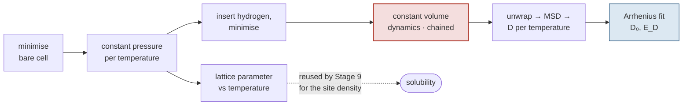

# Stage 10 — Bulk diffusivity

## Purpose

Measure how fast dissolved hydrogen moves through the lattice: $D(T)$ from
molecular dynamics, reduced to the two Arrhenius parameters $D_0$ and $E_D$.

This is the other factor in $\Phi = DS$, and it is **independent of
[Stage 9](09-solubility.md)** — no surface, no barriers, no transition states.
The two chains meet only at [Stage 11](11-permeability-assembly.md).

## At a glance

| | |
|---|---|
| **Inputs** | a bulk cell; a hydrogen count; a temperature list |
| **Outputs** | `lattice_params_vs_T.json`; MSD traces; `diffusivity_arrhenius.json` per loading |
| **Code** | [`models/diffusivity_workflow.py`](https://github.com/Azeezakinyemi999/Molecular_Dynamics/blob/main/MHI_Nickel/models/diffusivity_workflow.py), [`models/diffusivity_post_processing.py`](https://github.com/Azeezakinyemi999/Molecular_Dynamics/blob/main/MHI_Nickel/models/diffusivity_post_processing.py) |
| **Runs on** | GPU, chained scheduler jobs — by far the most expensive stage |
| **Theory** | [Part II §8](../02-theory.md#8-diffusion) |
| **Aggregation** | rungs [A8, A9, A10](../02b-aggregation.md#1-the-ladder) |
| **Figures it writes** | `msd_vs_time.png`, `diffusivity_vs_invT.png`, `arrhenius.png`, the all-concentration overlays, `thermal_expansion.png` — see [Appendix C2](../05-appendices.md#c2-figure-catalogue) |

## Concepts

**Loading.** The number of hydrogen atoms in the simulation box, reported as
atomic percent (T23). Each loading is a **separate physical system**, not a
repeated sample of one.

**Lag time.** The interval $\tau$ over which a displacement is measured. The
mean-squared displacement is a function of lag, not of absolute time.

**Time origin.** A frame from which a displacement is measured. Many origins are
averaged at each lag, which is what *multi-origin* averaging means.

**Fit window.** The fraction of the lag range over which the slope is taken,
$0.2$ to $0.8$ by default.

## Procedure

Four phases, the first three on the scheduler.

1. **Minimise the bare cell.** Relax the host lattice before anything is added.

2. **Equilibrate at constant pressure, per temperature.** This yields the
   lattice parameter as a function of temperature, written once per material
   and reused by [Stage 9](09-solubility.md) for the site density. Hydrogen is
   then inserted into the equilibrated cell and the result minimised.

   > Hydrogen is inserted **after** the host has equilibrated, so the host
   > thermal expansion is not contaminated by the solute.

3. **Run constant-volume dynamics**, one chained job per temperature, with a
   $0.5\ \mathrm{fs}$ timestep by default. Chaining exists so a run that exceeds
   a wall-clock limit resumes from a restart rather than starting over; a
   sentinel beside the job script marks completion.

4. **Post-process**, in this order:

   1. **Unwrap** the trajectory through the periodic boundary. A crossing
      otherwise registers as a box-length displacement.
   2. **Accumulate the mean-squared displacement** (T19) over lags up to half
      the trajectory length, averaging at each lag over **both** all valid time
      origins and all mobile atoms.
   3. **Fit the slope** over the interior fit window and divide by six (T20).
   4. **Fit the Arrhenius law** across temperatures in log space (T22a),
      weighted by inverse variance.

**Figure 1.** The four phases and their two outputs. Note that the
constant-pressure phase feeds *two* consumers — the hydrogen-loaded cell, and
the lattice parameter that Stage 9 needs. The red box is where essentially all
the cost sits, and it is gated by a marker separate from the fit that follows
it.

## Design choices

### Why the lag range stops at half the trajectory

The number of available time origins falls as the lag grows: a lag of $\tau$
frames leaves $n - \tau$ origins in an $n$-frame trajectory. At the longest lags
only a handful remain, and the mean-squared displacement there is dominated by
whichever few trajectory segments happen to be included.

Capping lags at half the trajectory keeps at least half the frames contributing
at every lag reported.

### Why the slope is taken over an interior window

The trace is not linear everywhere, and the two ends fail for opposite reasons.

| region | behaviour | why it is excluded |
|---|---|---|
| early | ballistic — atoms have not yet collided | $\mathrm{MSD}\propto t^2$, not $t$; the Einstein relation does not hold |
| late | few origins remain | statistically noisy regardless of physics |

The default window of $0.2$–$0.8$ is a compromise between excluding both and
retaining enough points to fit.

### Why convergence is judged by halves, not by $R^2$

A mean-squared displacement that is still curving can fit a straight line
extremely well. The diagnostic actually used splits the fit window in half and
compares the two slopes (T21): a trace in the diffusive regime gives a ratio
near one, while a trace that is still plateauing or still accelerating does not.

> [!IMPORTANT]
> A per-temperature $R^2$ above $0.99$ is routinely achieved by a visibly curved
> trace. $R^2$ measures how well a line fits the points, not whether a line is
> the right model. Judge by (T21).

> [!NOTE]
> **Planned:** the accepted band for (T21) is a chosen tolerance with no
> recorded derivation. It decides which points are trustworthy, so it deserves
> either a justification or exposure as a configurable setting.

### Why both averages in the MSD are taken at once

Step 4.2 averages over origins and atoms in a single operation. They are not
statistically equivalent, and the distinction matters for how far the result can
be trusted:

| average | independence | effect on variance |
|---|---|---|
| over atoms | genuinely independent walkers | shrinks as $1/\sqrt{N}$ |
| over time origins | overlapping segments of one trajectory | correlated; reduces variance far less than the origin count suggests |

> [!IMPORTANT]
> With a single mobile atom the ensemble average disappears and only the
> correlated time average remains. The resulting $D$ is one realisation of a
> random walk rather than an expectation value. This is a property of the
> **loading**, not of the material, and it is why a single-atom run is excluded
> from analysis by default.

### Why each loading is kept separate

$D$ depends on hydrogen content; $S$ does not. Every loading therefore produces
its own $D_0$ and $E_D$, and its own $\Phi$.

Loadings are **not** averaged together. They are different physical systems —
different hydrogen–hydrogen interaction strengths, different available site
fractions — so averaging them would blend distinct states rather than reduce
noise on one. Rung A12 selects; it does not average.

### The tension that cannot be designed away

The dilute limit that [Part II §9.4](../02-theory.md#94-validity) requires is
one hydrogen atom. One hydrogen atom is exactly the case whose mean-squared
displacement is least converged, per the box above.

> [!IMPORTANT]
> **No loading is simultaneously dilute and well sampled.** Raising the loading
> buys statistics at the cost of the dilute assumption; lowering it does the
> reverse. There is no setting that resolves this, so the honest course is to
> state which compromise a reported number represents.

## Checks and failure modes

| symptom | meaning | what to do |
|---|---|---|
| half-vs-half ratio outside the band | the trace is not in the diffusive regime at that temperature | lengthen the run or raise the loading; do not re-fit a different window to force it |
| $D$ negative at a temperature | the fitted slope is negative — a flat trace with noise fitted through it | the atom is not hopping on this trajectory; the point carries no information |
| $D$ barely changes between temperatures | in-cage rattling that plateaus, not diffusion | same cause as above; longer sampling is the only fix |
| Arrhenius $R^2 = 1$ exactly | the fit has two points and zero degrees of freedom | the statistic is arithmetic, not evidence; check the point count |
| $E_D$ near zero or negative | almost always a two-point fit through near-equal values | inspect the per-temperature $D$ before quoting it |
| $D_0 - \sigma_{D_0} < 0$ | the prefactor was reported as a symmetric interval | report it as a fraction or a $\times/\div$ band ([Part II §10.1](../02-theory.md#101-representation)) |
| trajectory shows huge isolated jumps | unwrapping did not happen or used the wrong box | check step 4.1 before anything else |
| a loading has no Arrhenius file | the post-processing phase did not run for it | the molecular dynamics may be complete; only the fit is missing |

> [!IMPORTANT]
> The last row is worth checking before re-running anything expensive. The
> dynamics and the fit are gated by **separate** markers, so a loading can have
> complete trajectories and no fit. Re-deriving the fit costs seconds; repeating
> the dynamics costs GPU-days.
