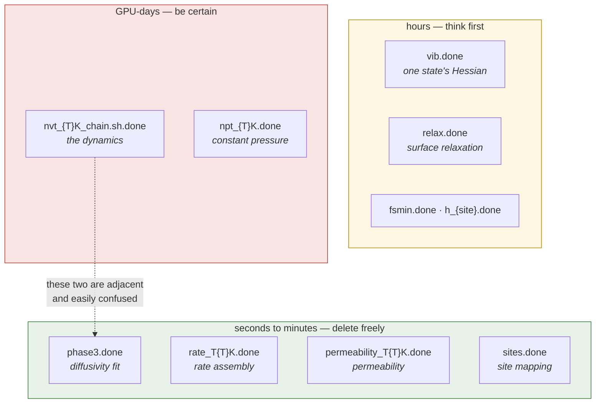

# Part IV — Practical

Working with the codebase: diagnosing a problem, adapting it to a new material,
reproducing a result, and finding the code.

> [!NOTE]
> **Scope.** Method and mechanics only; no numbers from any real run.

## Contents

- [1. Troubleshooting](#1-troubleshooting)
- [2. Adding a new material](#2-adding-a-new-material)
- [3. Re-running: the marker inventory](#3-re-running-the-marker-inventory)
- [4. Reproducibility checklist](#4-reproducibility-checklist)
- [5. Code map](#5-code-map)
- [6. Planned improvements](#6-planned-improvements)

---

## 1. Troubleshooting

Symptoms are grouped by where they appear, not by where the cause is — those
differ more often than not.

### Nothing was produced for a material

| symptom | cause | fix |
|---|---|---|
| no results of any kind | it is not in the material list | add it, in the one place ([Stage 1](03-stages/01-materials-and-structures.md)) |
| bulk results but no surface ones | a surface skip rule applies | expected; the reason is printed |
| permeability skipped for every loading | a solution enthalpy could not be determined | check that dissociation ranking and entry rates exist and hold converged entries |
| one loading absent from permeability | its diffusivity fit is missing or non-finite | complete [Stage 10](03-stages/10-bulk-diffusivity.md) for it |

### A number looks wrong

| symptom | cause | fix |
|---|---|---|
| attempt frequency orders of magnitude off | mismatched mobile subsystems, or a low mode dominating the product | check the degrees-of-freedom warning first, the floor second |
| reverse barrier suspiciously mirrors the forward one | the final state was unavailable and the initial state was used | check the recorded source field |
| diffusivity negative at a temperature | a flat trace fitted through noise | that point carries no information |
| activation energy near zero with $R^2 = 1$ | a two-point fit with zero degrees of freedom | check how many positive points the fit used |
| prefactor minus its uncertainty is negative | a log-normal quantity written as a symmetric interval | report a fraction or a $\times/\div$ band |
| solubility above the site-density ceiling | the dilute expression pushed past saturation | use the saturating counterpart |
| rate-based and energy-based solubility disagree | the averaging artefact, as expected | quote the energy-based routes |

### A job failed

| symptom | cause | fix |
|---|---|---|
| band fails on its first step | overlapping atoms in the interpolated chain | confirm pair-potential interpolation, not linear |
| vibration job: wrong number of hydrogens | the structure is not the state it was taken for | check the file, not the settings |
| a stage re-runs work that was finished | its marker was deleted, or never written | see [§3](#3-re-running-the-marker-inventory) |
| a stage skips work that is not finished | a marker exists without its output | markers are written last; a hand-made one defeats that |
| submission fails immediately | a cluster path or partition in the configuration does not exist here | nothing validates these; check them by hand |

### Something is silently missing

The hardest class, because nothing raises.

| symptom | cause |
|---|---|
| an environment absent from the solubility table | no site of that type was connected at [Stage 4](03-stages/04-subsurface-site-mapping.md) |
| fewer rate entries than ranked pathways | unconverged bands are dropped before vibrations |
| a dissociation enthalpy that drifts toward zero | a ranked entry is missing its reaction energy, which defaults to zero in the mean |
| an environment with zero uncertainty | it holds one pathway; the standard error is undefined, not small |

## 2. Adding a new material

1. Put the structure file in the input directory.
2. Append its filename to the material list — **one place**, nowhere else.
3. Check the classification its stem implies (*pure*, *alloy* or *oxide*); it is
   decided by substring, so a name outside the convention is classified wrongly
   without warning.
4. Decide whether a surface skip rule should apply.
5. Set the hydrogen loadings and temperatures.
6. Check the Miller index, layer count and vacuum suit the material.
7. For an alloy, set the composition.
8. Run Parts 1 and 3; they are independent and can go at once.
9. Run Part 2 once both are complete.

> [!IMPORTANT]
> Steps 3 and 6 are where a new material most often goes wrong, and neither
> fails loudly. A misclassification embeds the wrong element table; an
> unsuitable Miller index produces a slab that relaxes into something that is
> not the surface you wanted.

## 3. Re-running: the marker inventory

Every expensive stage writes a marker **after** its output. Deleting one forces
that stage to repeat; deleting none means a re-run is nearly free.

| marker | where | deleting it re-runs |
|---|---|---|
| `slab.done` | slab directory | slab construction |
| `relax.done` | slab directory | surface relaxation |
| `sites.done` | sites directory | site mapping |
| `h_{site}.done` | adsorption directory | that site's adsorption relaxation |
| `fsmin.done` | hop directory | final-state minimisation |
| `vib.done` | each state directory | that state's vibrations |
| `phase1a.done` | material results | bare-cell minimisation |
| `npt_{T}K.done` | material results | constant-pressure run at that temperature, and the lattice parameter |
| `minh.done` | per-temperature structures | hydrogen insertion and minimisation |
| `nvt_{T}K_chain.sh.done` | per-temperature job directory | **the dynamics** at that temperature |
| `phase3.done` | analysis directory | the diffusivity fit only |
| `rate_T{T}K.done` | material results | rate assembly at that temperature |
| `permeability_T{T}K.done` | per-loading results | permeability at that temperature |

> [!IMPORTANT]
> The last two rows of the diffusivity group are the pair to know. The chain
> marker gates **GPU-days** of dynamics; `phase3.done` gates **seconds** of
> fitting. They are separate, so a loading can hold complete trajectories and
> no fit. Delete the wrong one and you repeat the expensive half for nothing.

**Figure 1.** Markers grouped by what deleting one costs. Look at the dashed
link: the dynamics marker and the fit marker belong to the *same* stage and the
same loading, but differ in cost by about five orders of magnitude. Deleting
the wrong one is the most expensive mistake available here.

Two stages check a marker **and** its output, and re-run unless both are
present: rate assembly and permeability. The rest check the marker only.

## 4. Reproducibility checklist

- [ ] Record the commit the run was made from.
- [ ] Record the potential file and its head, not just its name.
- [ ] Record library versions — the equation checks pin the constants, not the libraries.
- [ ] Confirm the random seeds for alloy occupation and hydrogen insertion are unchanged.
- [ ] Confirm the temperature list and loadings match what is being compared against.
- [ ] Note which loading was selected as the headline, and the spread across the others.
- [ ] Note the route each quoted solubility and permeability came from.
- [ ] Note whether any quoted fit used fewer than three points.
- [ ] Re-run the equation checks; they take seconds and catch constant drift.

> [!IMPORTANT]
> Seeds matter more than they look. Alloy site occupation and hydrogen
> insertion are both seeded, so a changed seed changes the structure, the
> environments found in it, and therefore the weights in the solubility sum —
> without changing a single setting you would think to record.

## 5. Code map

| file | role |
|---|---|
| [`config.py`](../models/config.py) | cluster paths, potential, and every numeric default |
| [`materials.py`](../models/materials.py) | the material list, classification, skip rules |
| [`structure.py`](../models/structure.py) | bulk cells, slabs, hydrogen insertion, freeze cutoff |
| [`surface_graph.py`](../models/surface_graph.py) | surface layers, sites, graph, labels |
| [`subsurface_graph.py`](../models/subsurface_graph.py) | Voronoi interstitials, classification |
| [`neb_subsurface.py`](../models/neb_subsurface.py) | layer connections, hop final states, environment labels |
| [`ase_neb.py`](../models/ase_neb.py) | band construction and two-phase relaxation |
| [`vibrations.py`](../models/vibrations.py) | partial-Hessian scripts, mobile-set selection |
| [`tst_rates.py`](../models/tst_rates.py) | zero-point, prefactors, rates, quality census |
| [`energetics.py`](../models/energetics.py) | barriers, reaction energies, ranking |
| [`permeation.py`](../models/permeation.py) | solubility, permeability, flux, error propagation |
| [`diffusivity_post_processing.py`](../models/diffusivity_post_processing.py) | unwrapping, mean-squared displacement, fits |
| [`*_workflow.py`](../models/) | generate and submit the per-material scripts |
| [`lammps_script.py`](../models/lammps_script.py) | dynamics and minimisation input decks |
| [`create_slurm.py`](../models/create_slurm.py) | job scripts, chaining, retries, sentinels |
| [`parsers.py`](../models/parsers.py) | reading logs, dumps and trajectories |
| [`plots/`](../models/plots/) | analysis and figures; shared run discovery |

> [!IMPORTANT]
> A module named for a stage usually **generates** that stage rather than
> performing it. The procedure to follow is in the body of the generated
> script, not in the function that wrote it.

## 6. Planned improvements

Recorded where they were found, collected here.

| # | item | why it matters |
|---|---|---|
| 1 | rename the four frequency thresholds | two still share a parameter name with different meanings; the most likely misreading in the codebase |
| 2 | justify or expose the convergence band | it decides which diffusivity points are trustworthy and has no recorded derivation |
| 3 | declare material type explicitly | classification by filename substring misfires silently on an unconventional name |
| 4 | test coverage for the analysis layer | it has none, and the single-hydrogen exclusion default shipped unguarded |
| 5 | exclude missing reaction energies rather than defaulting them to zero | an incomplete input currently biases a mean without raising |
| 6 | sensitivity study on the site-mapping tolerances | they set the site count, which sets the pathway weights, which reach the solubility |
| 7 | per-pathway band settings | one image count serves a long dissociation path and a short hop equally |
